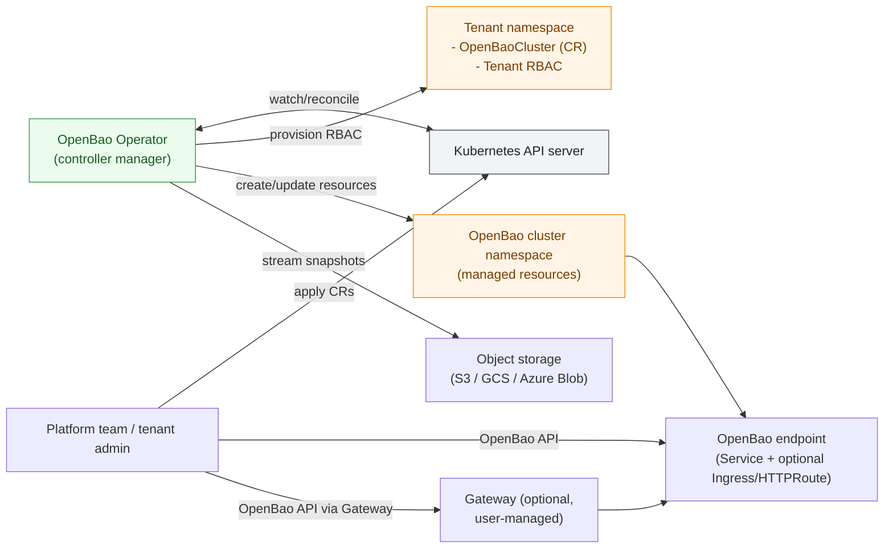
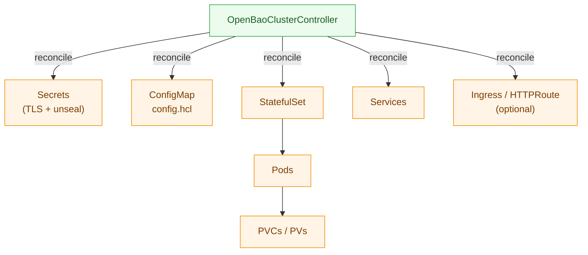

# OpenBao Supervisor Operator

The OpenBao Supervisor Operator manages the full lifecycle of OpenBao clusters on Kubernetes. It adopts a **Supervisor Pattern**, delegating data consistency to OpenBao (Raft) while managing the external ecosystem (PKI, Upgrades, Backups).

## Architecture Overview




## Key Features

  * **Automated PKI:** Manages internal Root CA, rotates certificates, and triggers hot-reloads.
  * **Raft-Aware Upgrades:** Orchestrates safe, step-down based rolling upgrades.
  * **Disaster Recovery:** Streams snapshots directly to S3/GCS/Azure without disk buffering.
  * **Secure by Default:** Rootless, read-only filesystem, strict NetworkPolicies, and auto-unseal.
  * **Multi-Tenant:** Namespace-scoped isolation with strict RBAC boundaries.

## Quick Start

**Prerequisites**: Kubernetes v1.33+ (see `docs/compatibility.md`), `kubectl`, `helm` (optional).

### 1. Install the Operator

```sh
make install
make deploy IMG=ghcr.io/openbao/openbao-operator:latest
```

### 2. Deploy a Cluster

If you are running in multi-tenant mode, provision your target namespace first (recommended):

```sh
kubectl create namespace default || true
kubectl apply -f - <<'YAML'
apiVersion: openbao.org/v1alpha1
kind: OpenBaoTenant
metadata:
  name: default-tenant
  namespace: openbao-operator-system
spec:
  targetNamespace: default
YAML
```

Create a minimal `OpenBaoCluster`:

```yaml
apiVersion: openbao.org/v1alpha1
kind: OpenBaoCluster
metadata:
  name: dev-cluster
  namespace: default
spec:
  version: "2.4.4"
  image: "openbao/openbao:2.4.4"
  replicas: 3
  tls:
    enabled: true
    mode: OperatorManaged
    rotationPeriod: "720h"
  storage:
    size: "10Gi"
```

```sh
kubectl apply -f config/samples/dev-cluster.yaml
kubectl get pods -l openbao.org/cluster=dev-cluster -w
```

## Documentation

  * [Docs Index](docs/README.md)
  * [User Guide](docs/user-guide/README.md): Configuration, Backups, Upgrades, and Day 2 Ops.
  * [Security & RBAC](docs/security.md): Threat model, RBAC design, and hardening guide.
  * [Architecture](docs/architecture.md): Internal controller design and state machines.
  * [Contributing](docs/contributing.md): Build instructions and testing strategy.

## Contributing

We welcome issues and pull requests. When contributing:

- Follow the coding guidelines in `AGENTS.md`.
- Ensure `go test ./...` and `golangci-lint` pass locally.
- Keep documentation in sync with any non-trivial behavior changes.

**NOTE:** Run `make help` for more information on all potential `make` targets

More information can be found via the [Kubebuilder Documentation](https://book.kubebuilder.io/introduction.html)

## License

Copyright 2025.

Licensed under the Apache License, Version 2.0 (the "License");
you may not use this file except in compliance with the License.
You may obtain a copy of the License at

    http://www.apache.org/licenses/LICENSE-2.0

Unless required by applicable law or agreed to in writing, software
distributed under the License is distributed on an "AS IS" BASIS,
WITHOUT WARRANTIES OR CONDITIONS OF ANY KIND, either express or implied.
See the License for the specific language governing permissions and
limitations under the License.
