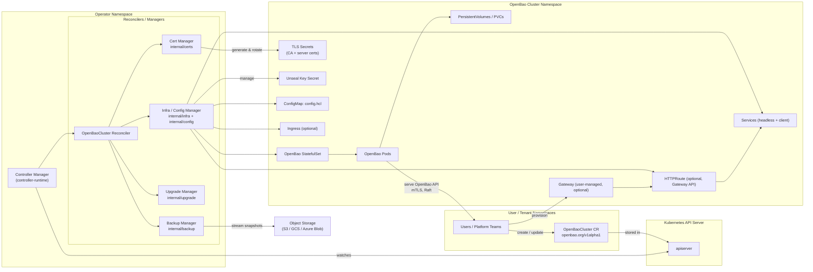
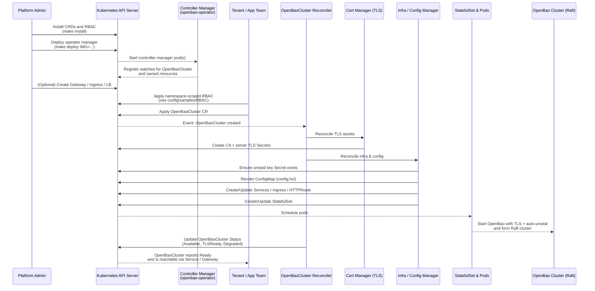

# OpenBao Supervisor Operator

The OpenBao Supervisor Operator manages the full lifecycle of OpenBao clusters on Kubernetes.
It provisions TLS, renders secure configuration, manages StatefulSets and Services, and orchestrates
safe upgrades and backups based on the `OpenBaoCluster` Custom Resource.

## Description

At a high level, the Operator:

- Exposes a `OpenBaoCluster` CRD (`openbao.org/v1alpha1`) that describes an OpenBao Raft cluster.
- Generates and rotates per-cluster TLS assets (Root CA and server certificates).
- Creates and maintains a headless StatefulSet, ConfigMap-based `config.hcl`, and Services/Ingress.
- Manages static auto-unseal using a per-cluster unseal key Secret.
- Provides hooks for safe, Raft-aware rolling upgrades and snapshot-based backups.

## Getting Started

### Prerequisites
- go version v1.25.5+
- docker version 28.3.3+.
- kubectl version v1.11.3+.
- Access to a Kubernetes v1.11.3+ cluster.

You should also have:

- Permissions to install CRDs and cluster-scoped RBAC.
- A default `StorageClass` for StatefulSet PVCs.

### To Deploy on the cluster
**Build and push your image to the location specified by `IMG`:**

```sh
make docker-build docker-push IMG=<some-registry>/openbao-operator:tag
```

**NOTE:** This image ought to be published in the personal registry you specified.
And it is required to have access to pull the image from the working environment.
Make sure you have the proper permission to the registry if the above commands don’t work.

**Install the CRDs into the cluster:**

```sh
make install
```

**Deploy the Manager to the cluster with the image specified by `IMG`:**

```sh
make deploy IMG=<some-registry>/openbao-operator:tag
```

> **NOTE**: If you encounter RBAC errors, you may need to grant yourself cluster-admin
privileges or be logged in as admin.

**Create instances of your solution**
You can apply the samples (examples) from the config/sample:

```sh
kubectl apply -k config/samples/
kubectl get openbaoclusters.openbao.org -A
```

>**NOTE**: Ensure that the samples has default values to test it out.

For a more detailed walkthrough of the `OpenBaoCluster` spec, lifecycle,
and common operations (pause, delete, backups), see `docs/usage-guide.md`.

### To Uninstall
**Delete the instances (CRs) from the cluster:**

```sh
kubectl delete -k config/samples/
```

**Delete the APIs(CRDs) from the cluster:**

```sh
make uninstall
```

**UnDeploy the controller from the cluster:**

```sh
make undeploy
```

## Project Distribution

Following the options to release and provide this solution to the users.

### By providing a bundle with all YAML files

1. Build the installer for the image built and published in the registry:

```sh
make build-installer IMG=<some-registry>/openbao-operator:tag
```

**NOTE:** The makefile target mentioned above generates an 'install.yaml'
file in the dist directory. This file contains all the resources built
with Kustomize, which are necessary to install this project without its
dependencies.

2. Using the installer

Users can just run 'kubectl apply -f <URL for YAML BUNDLE>' to install
the project, i.e.:

```sh
kubectl apply -f https://raw.githubusercontent.com/<org>/openbao-operator/<tag or branch>/dist/install.yaml
```

### By providing a Helm Chart

1. Build the chart using the optional helm plugin

```sh
kubebuilder edit --plugins=helm/v2-alpha
```

2. See that a chart was generated under 'dist/chart', and users
can obtain this solution from there.

**NOTE:** If you change the project, you need to update the Helm Chart
using the same command above to sync the latest changes. Furthermore,
if you create webhooks, you need to use the above command with
the '--force' flag and manually ensure that any custom configuration
previously added to 'dist/chart/values.yaml' or 'dist/chart/manager/manager.yaml'
is manually re-applied afterwards.

## Architecture Overview

## Day 1 Flow (Install and First Cluster)


## Day 2 / Day N Flow (Upgrades & Backups)

```mermaid
sequenceDiagram
  participant U as User / Platform Team
  participant K as Kubernetes API Server
  participant OC as OpenBaoCluster Reconciler
  participant Upg as Upgrade Manager
  participant Bkp as Backup Manager
  participant STS as StatefulSet & Pods
  participant OB as OpenBao Cluster (Raft)
  participant Obj as Object Storage

  rect rgb(53, 52, 52)
    Note over U,OB: Day 2 – Cluster Upgrade
    U->>K: Update OpenBaoCluster<br/>spec.version / spec.image
    K-->>OC: Event: OpenBaoCluster updated
    OC->>K: Get OpenBaoCluster

    OC->>Upg: Reconcile upgrade state
    Upg->>K: Verify StatefulSet & pods are Ready
    Upg->>OB: (Optional) Trigger pre-upgrade backup<br/>if spec.backup.preUpgradeSnapshot = true
    Upg->>STS: Orchestrate Raft-aware rolling update<br/>(partition, leader step-down, one pod at a time)
    STS-->>OB: Pods restart with new version,<br/>rejoin Raft and reach Ready
    Upg->>K: Update Status.Upgrade and CurrentVersion
    OC->>K: Refresh status Conditions<br/>(Available, Upgrading, Degraded)
    K-->>U: OpenBaoCluster shows upgrade progress<br/>and final Running phase
  end

  rect rgb(53, 52, 52)
    Note over U,Obj: Day N – Scheduled Backups
    U->>K: Configure spec.backup.schedule,<br/>target, retention, token
    loop Each cron tick
      Bkp->>K: List OpenBaoCluster with backup enabled
      Bkp->>K: Resolve leader pod & TLS CA
      Bkp->>OB: Stream Raft snapshot<br/>(GET /v1/sys/storage/raft/snapshot)
      OB-->>Bkp: Snapshot stream
      Bkp->>Obj: Upload snapshot to object storage<br/>with deterministic key prefix
      Bkp->>K: Update Status.Backup<br/>(LastBackupTime, Size, Duration, NextScheduledBackup)
      Bkp->>K: Apply retention policy<br/>(MaxCount / MaxAge)
    end
  end
```


## Contributing
We welcome issues and pull requests. When contributing:

- Follow the coding guidelines in `AGENTS.md`.
- Ensure `go test ./...` and `golangci-lint` pass locally.
- Keep `docs/high-level-design.md`, `docs/technical-design-document.md`,
  and `docs/implementation-plan.md` in sync with any non-trivial behavior changes.

**NOTE:** Run `make help` for more information on all potential `make` targets

More information can be found via the [Kubebuilder Documentation](https://book.kubebuilder.io/introduction.html)

## License

Copyright 2025.

Licensed under the Apache License, Version 2.0 (the "License");
you may not use this file except in compliance with the License.
You may obtain a copy of the License at

    http://www.apache.org/licenses/LICENSE-2.0

Unless required by applicable law or agreed to in writing, software
distributed under the License is distributed on an "AS IS" BASIS,
WITHOUT WARRANTIES OR CONDITIONS OF ANY KIND, either express or implied.
See the License for the specific language governing permissions and
limitations under the License.
