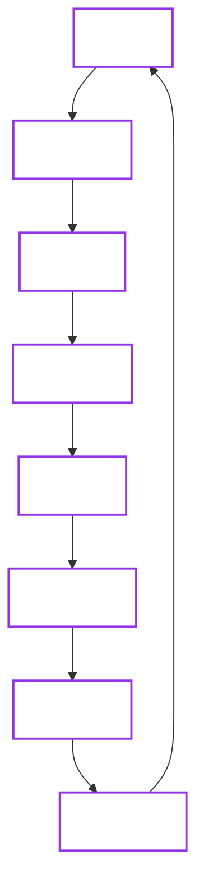

# Software Development Lifecycle (SDLC)

The OpenBao Operator follows a secure-by-default SDLC, integrating security checks, automated verification, and provenance at every stage.

## 1. Lifecycle Overview

## 2. Phase Detail

The lifecycle maps directly to our documentation and toolchain.

- **Plan & Design**

    ---

    Define requirements and architecture.

      - [Compatibility Policy](/docs/reference/compatibility)
      - [Architecture Overview](/docs/architecture)
      - [Components](/docs/architecture/components)

- **Code & Implement**

    ---

    Write code adhering to strict standards.

      - [Coding Standards](standards/index.md)
      - [Dev Setup](getting-started/development.md)
      - [Project Conventions](standards/project-conventions.md)

- **Secure & Verify**

    ---

    Automated gates ensure quality and safety.

      - [Security Practices](standards/security-practices.md)
      - [CI Pipeline](ci.md)
      - [Supply Chain Security](supply-chain-security.md)
      - [Threat Model](/docs/security/fundamentals/threat-model)

- **Release & Deploy**

    ---

    Build once, sign, and promote.

      - [Release Process](release-management.md)
      - [Artifact Verification](release-management.md#5-verifying-artifacts)
      - [Helm Charts](https://github.com/dc-tec/openbao-operator/tree/main/charts/openbao-operator)

- **Operate & Monitor**

    ---

    Run reliably in production.

      - [User Guides](/docs/get-started)
      - [Security Posture](/docs/security)
      - [Troubleshooting](/docs/recover/no-leader)

## 3. Secure by Design

Security is not a separate phase; it is injected into every step of the process.

| Phase | Tooling | Check |
| :--- | :--- | :--- |
| **Code** | `golangci-lint` | Static analysis for bugs and style |
| **Deps** | `dependabot` | Automated dependency updates |
| **Build Inputs** | Go vendoring (`-mod=vendor`) | Deterministic dependency resolution in CI/release paths |
| **Verify** | `govulncheck` | Known vulnerability scanning |
| **Build** | `trivy` | Container filesystem scanning |
| **Release** | `cosign` | Keyless signing of images, chart, and release checksum subject |
| **Publish** | `gh attestation` | Enforced provenance verification gates before release publication |
| **Reproducibility** | `verify-byte-reproducibility` + report workflow | Byte-for-byte checks across images, chart, manifests, checksums, and SBOMs |
