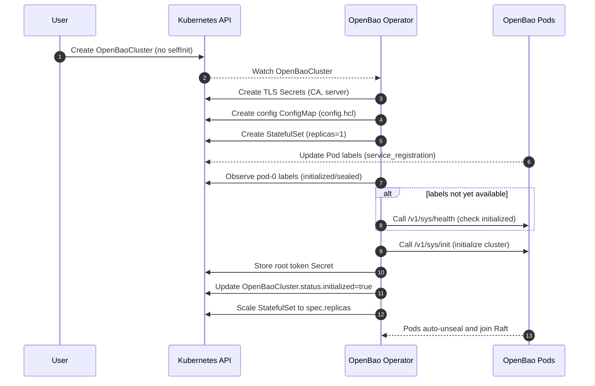
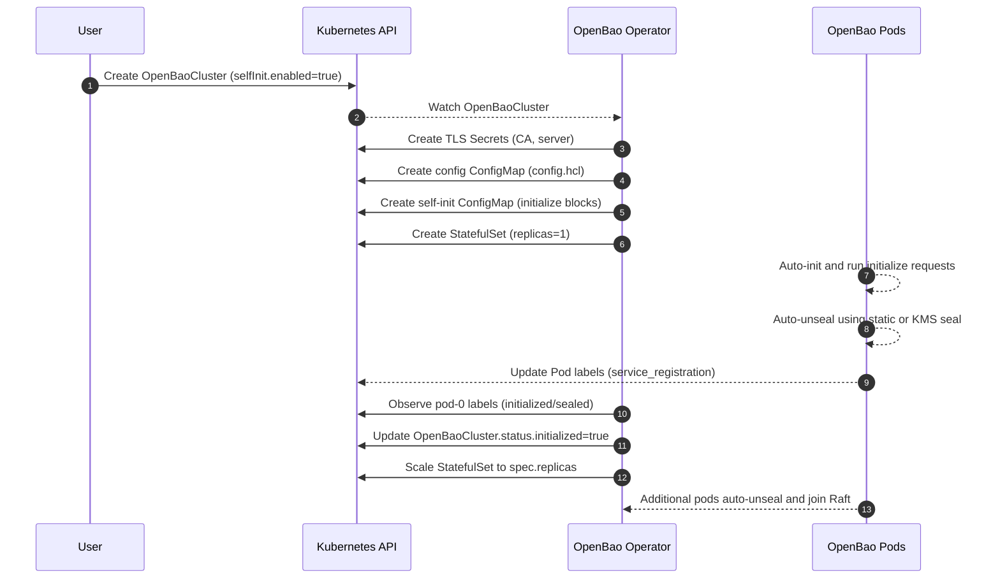
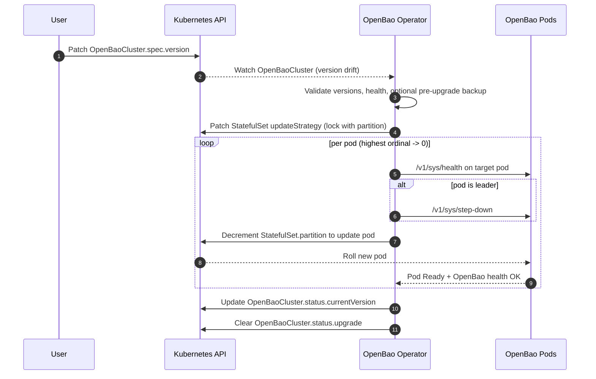
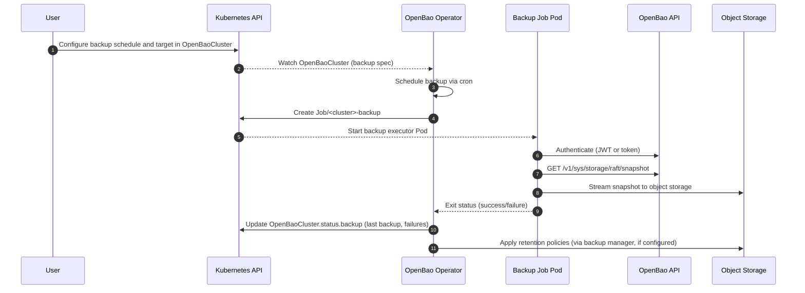

# Architecture: OpenBao Supervisor Operator

This document provides a comprehensive overview of the OpenBao Operator's architecture, internal design, and implementation details. It merges the high-level design and technical design documentation into a single reference for contributors.

## 1. Architecture Overview

The OpenBao Operator acts as an autonomous administrator for OpenBao clusters on Kubernetes. Unlike legacy operators that attempt to micro-manage internal consensus (Raft), this Operator adopts a **Supervisor Pattern**. It delegates data consistency to the OpenBao binary (via `retry_join` and static auto-unseal) while managing the external ecosystem: PKI lifecycle, Infrastructure state, and Safe Version Upgrades.

The design is intentionally **cloud-agnostic** and **multi-tenant**:

- **Cloud-agnostic**: The Operator relies only on standard Kubernetes APIs and generic HTTP/S-compatible object storage, without hard-coding provider-specific features.
- **Multi-tenant**: A single Operator instance manages multiple `OpenBaoCluster` resources across namespaces, while ensuring isolation and independence between clusters.

### 1.1 System Components

At a high level, the architecture consists of:

- **Operator Controller Manager:** Runs multiple reconcilers (Cert, Config, StatefulSet, Upgrade, Backup) in a single process.
- **OpenBao StatefulSets:** One StatefulSet per `OpenBaoCluster` providing Raft storage and HA.
- **Persistent Volumes:** Provided by the cluster's StorageClass for durable Raft data.
- **Object Storage:** Generic HTTP/S-compatible object storage for snapshots (S3/GCS/Azure Blob or compatible endpoints).
- **Users / Tenants:** Developers and platform teams who create and manage `OpenBaoCluster` resources in their own namespaces.
- **Static Auto-Unseal Key:** A per-cluster unseal key managed by the Operator and stored in a Kubernetes Secret, used by OpenBao's static auto-unseal mechanism.
- **RBAC Architecture (Least-Privilege Model):**
  - **Provisioner ServiceAccount (`openbao-operator-provisioner`):** Has minimal cluster-wide permissions to manage `OpenBaoTenant` CRDs and create Roles/RoleBindings in tenant namespaces. Cannot access workload resources directly. Does not have `list` or `watch` permissions on namespaces, preventing cluster topology enumeration.
  - **OpenBaoCluster Controller ServiceAccount (`openbao-operator-controller`):** Has NO cluster-wide permissions. Receives permissions only via namespace-scoped Roles created by the Provisioner in tenant namespaces.
  - **Namespace Provisioner Controller:** Watches `OpenBaoTenant` CRDs that explicitly declare target namespaces for provisioning. Creates namespace-scoped Roles and RoleBindings that grant the OpenBaoCluster Controller ServiceAccount the permissions needed to manage OpenBaoCluster resources in those namespaces.

The Operator treats `OpenBaoCluster.Spec` as the declarative source of truth and continuously reconciles Kubernetes resources and OpenBao state to match this desired state.

### 1.2 Component Interaction

1. **User:** Submits `OpenBaoCluster` Custom Resource (CR).
2. **CertController:** Observes CR, generates CA and Leaf Certs into Kubernetes Secrets.
3. **ConfigController:** Generates the `config.hcl` (ConfigMap) injecting TLS paths and `retry_join` stanzas.
4. **StatefulSetController:** Ensures the StatefulSet exists, matches the desired version, and mounts the Secrets/ConfigMaps.
5. **UpgradeController:** Intercepts version changes to perform Raft-aware rolling updates.
6. **OpenBao Pods:** Boot up, mount certs, read config, and auto-join the cluster using the K8s API peer discovery.

### 1.3 Assumptions and Non-Goals

**Assumptions:**

- The Kubernetes cluster provides:
  - A default StorageClass for persistent volumes.
  - Working DNS for StatefulSet pod and service names.
  - A mechanism to provide credentials for object storage (e.g., Secrets, workload identity).
- **OpenBao Version:** The Operator uses static auto-unseal, which requires **OpenBao v2.4.0 or later**. Versions below 2.4.0 do not support the `seal "static"` configuration and will fail to start.
- Platform teams are responsible for:
  - Deploying and upgrading the Operator itself (or enabling an optional self-managed mode).
  - Wiring the Operator and OpenBao telemetry into their observability stack.

**Non-Goals (v0.1):**

- Cross-cluster or multi-region OpenBao federation.
- Automated disaster **restore** flows (restore may be manual for v0.1).
- Deep integration with provider-specific IAM mechanisms (e.g., IRSA); these can be layered on by platform teams.
- Provider-specific integrations (e.g., native AWS/GCP/Azure APIs); these can be added as optional extensions.

## 2. Key Flows (Day 0, Day 2, Day N)

### 2.1 Cluster Creation (Day 0) - Standard Initialization

1. User creates an `OpenBaoCluster` CR in a namespace (without `spec.selfInit`).
2. CertController bootstraps PKI (CA + leaf certs).
3. If image verification is enabled (`spec.imageVerification.enabled`), the operator verifies the container image signature using Cosign before proceeding.
4. Infrastructure/ConfigController ensures a per-cluster auto-unseal configuration:
   - If `spec.unseal` is omitted or `spec.unseal.type` is `"static"`, creates a static auto-unseal key Secret (`<cluster>-unseal-key`) if missing.
   - If `spec.unseal.type` is an external KMS provider (`awskms`, `gcpckms`, `azurekeyvault`, `transit`), configures the seal with the provided options and credentials (if specified).
5. ConfigController renders `config.hcl` with TLS, Raft storage, `retry_join`, `service_registration "kubernetes"`, and the appropriate `seal` stanza (static or external KMS).
   - The Operator injects `BAO_K8S_NAMESPACE` into the OpenBao container environment so service registration can determine the Pod namespace.
6. StatefulSetController creates the StatefulSet with **1 replica initially** (regardless of `spec.replicas`), mounting TLS and unseal Secrets (if using static seal) or KMS credentials (if using external KMS).
7. InitController waits for pod-0 to be running, then:
   - Prefers Kubernetes service registration Pod labels (`openbao-initialized`, `openbao-sealed`) when available.
   - Falls back to the HTTP health endpoint (`GET /v1/sys/health`) when labels are not yet available.
   - If not, calls the HTTP initialization endpoint (`PUT /v1/sys/init`) against pod-0 to initialize the cluster.
   - Stores the root token in a per-cluster Secret (`<cluster>-root-token`).
   - Sets `Status.Initialized = true`.
8. Once initialized, InfrastructureController scales the StatefulSet to the desired `spec.replicas`.
9. Additional OpenBao pods start, auto-unseal using the static key, join the Raft cluster via `retry_join`, and become Ready.

#### 2.1.1 Day 0 Sequence (Standard Initialization)



### 2.2 Cluster Creation (Day 0) - Self-Initialization

When `spec.selfInit.enabled = true`, the cluster uses OpenBao's native self-initialization feature:

1. User creates an `OpenBaoCluster` CR with `spec.selfInit` configured.
2. CertController bootstraps PKI (CA + leaf certs).
3. If image verification is enabled, the operator verifies the container image signature before proceeding.
4. Infrastructure/ConfigController ensures a per-cluster auto-unseal configuration (static seal by default, or external KMS if configured).
5. ConfigController renders `config.hcl` with TLS, Raft storage, `retry_join`, `service_registration "kubernetes"`, and the appropriate `seal` stanza.
   - The init container appends the self-init `initialize` stanzas (rendered from `spec.selfInit.requests[]`) to the rendered config for pod-0 only.
6. StatefulSetController creates the StatefulSet with **1 replica initially**.
7. OpenBao automatically initializes itself on first start using the `initialize` stanzas:
   - Auto-unseals using the static key.
   - Executes all configured `initialize` requests (audit, auth, secrets, policies).
   - **The root token is NOT returned and is automatically revoked after use.**
8. InitController detects initialization via Kubernetes service registration labels (preferred) and sets `Status.Initialized = true`.
9. InfrastructureController scales the StatefulSet to the desired `spec.replicas`.
10. Additional OpenBao pods start, auto-unseal, and join the Raft cluster.

**Note:** Self-initialization requires an auto-unseal mechanism (which the Operator provides via static auto-unseal by default, or external KMS if configured). No root token Secret is created when self-init is enabled.

**Note:** The static auto-unseal feature requires **OpenBao v2.4.0 or later**. Earlier versions do not support the `seal "static"` configuration. External KMS seals may have different version requirements depending on the provider.

#### 2.2.1 Day 0 Sequence (Self-Initialization)



### 2.3 Cluster Operations / Upgrades (Day 2)

1. User configures upgrade authentication:
   - **JWT Auth (Preferred):** Set `spec.upgrade.jwtAuthRole` and configure the role in OpenBao (binds to `<cluster-name>-upgrade-serviceaccount`, automatically created by operator)
   - **Static Token (Alternative):** Set `spec.upgrade.tokenSecretRef` pointing to a token Secret
   - **Important:** Upgrade authentication must be explicitly configured; there is no fallback to backup authentication
2. User updates `OpenBaoCluster.Spec.Version` and/or `Spec.Image`.
3. UpgradeController detects version drift and performs pre-upgrade validation:
   - Validates semantic versioning (blocks downgrades by default).
   - Verifies all pods are Ready and quorum is healthy.
   - Optionally triggers a pre-upgrade backup if `spec.upgrade.preUpgradeSnapshot` is enabled.
4. UpgradeController orchestrates Raft-aware rolling updates:
   - Locks StatefulSet updates using partitioning.
   - Iterates pods in reverse ordinal order.
   - Forces leader step-down before updating leader pod.
   - Waits for pod Ready, OpenBao health, and Raft sync after each update.
5. Upgrade progress is persisted in `Status.Upgrade`, allowing resumption after Operator restart.
6. On completion, `Status.CurrentVersion` is updated and `Status.Upgrade` is cleared.

#### 2.3.1 Day 2 Sequence (Upgrade Flow)



**Note:** Upgrades are designed to be safe and resumable. Downgrades are blocked by default. If an upgrade fails, it halts and sets `Degraded=True`; automated rollback is not supported. Root tokens are not used for upgrade operations.

### 2.4 Maintenance / Manual Recovery

1. User sets `OpenBaoCluster.Spec.Paused = true` to enter maintenance mode.
2. All reconcilers for that cluster short-circuit and stop mutating resources, allowing manual actions (e.g., manual restore from snapshot).
3. If an upgrade was in progress, it is paused but state is preserved in `Status.Upgrade`.
4. After maintenance, user sets `Paused = false` to resume normal reconciliation (including any paused upgrade).

### 2.5 Backups (Day N)

1. User configures backup schedule (`spec.backup.schedule`) and target object storage in the `OpenBaoCluster` spec.
2. User configures authentication method:
   - **JWT Auth (Preferred):** Set `spec.backup.jwtAuthRole` and configure the role in OpenBao
   - **Static Token (Fallback):** For all clusters, set `spec.backup.tokenSecretRef` pointing to a backup token Secret (root tokens are not used)
3. BackupController schedules backups using cron expressions (e.g., `"0 3 * * *"` for daily at 3 AM).
4. On schedule, BackupController:
   - Creates a Kubernetes Job with the backup executor container
   - Job uses `<cluster-name>-backup-serviceaccount` (automatically created by operator)
   - Backup executor:
     - Authenticates to OpenBao using JWT Auth (via projected ServiceAccount token) or static token
     - Discovers the current Raft leader via OpenBao API
     - Streams `GET /v1/sys/storage/raft/snapshot` directly to object storage (no disk buffering)
     - Names backups predictably: `<prefix>/<namespace>/<cluster>/<timestamp>-<uuid>.snap`
     - Verifies upload completion
5. Backup status is recorded in `Status.Backup`:
   - `LastBackupTime`, `NextScheduledBackup` for visibility
   - `ConsecutiveFailures` for alerting
6. Optional retention policies (`spec.backup.retention`) automatically delete old backups:
   - `MaxCount`: Keep only the N most recent backups
   - `MaxAge`: Delete backups older than a specified duration

**Note:** Backups are skipped during upgrades to avoid inconsistent snapshots. Backups are optional for all clusters. If backups are enabled, either `jwtAuthRole` or `tokenSecretRef` must be configured. Root tokens are not used for backup operations.

#### 2.5.1 Day N Sequence (Backup Flow)



## 3. Controller Design

The Operator runs a single `OpenBaoCluster` controller which delegates to four specific internal "Managers" to separate concerns.

All controllers MUST honor `spec.paused`:

- When `OpenBaoCluster.Spec.Paused == true`, reconcilers SHOULD short-circuit early and avoid mutating cluster resources, allowing safe manual maintenance (e.g., manual restore).
- Finalizers and deletion handling MAY still proceed to ensure cleanup when the CR is deleted.

### 3.1 The CertManager (TLS Lifecycle)

**Responsibility:** Bootstrap PKI and Rotate Certificates (or wait for external Secrets in External mode, or skip reconciliation in ACME mode).

The CertManager supports three modes controlled by `spec.tls.mode`:

#### OperatorManaged Mode (Default)

When `spec.tls.mode` is `OperatorManaged` (or omitted), the operator generates and manages certificates:

- **Logic Flow:**
  1. **Reconcile:** Check if `Secret/<cluster>-tls-ca` exists.
  2. **Bootstrap:** If missing, generate ECDSA P-256 Root CA. Store PEM in Secret.
  3. **Issue:** Check if `Secret/<cluster>-tls-server` exists and is valid (for example, expiry > configured rotation window).
  4. **Rotate:** If the server certificate is within the rotation window, regenerate it using the CA and update the Secret atomically.
  5. **Trigger:** Compute a SHA256 hash of the active server certificate and annotate OpenBao pods with it (for example, `openbao.org/tls-cert-hash`) so the operator and in-pod components can track which certificate each pod is using.
  6. **Hot Reload:** When the hash changes, the operator uses a `ReloadSignaler` to update the annotation on each ready OpenBao pod. A wrapper binary running as PID 1 in the OpenBao container watches the mounted TLS certificate file and sends `SIGHUP` to the OpenBao process when it detects changes, avoiding the need for `pods/exec` privileges in the operator and eliminating the need for `ShareProcessNamespace`.

#### External Mode

When `spec.tls.mode` is `External`, the operator does not generate or rotate certificates:

- **Logic Flow:**
  1. **Wait:** Check if `Secret/<cluster>-tls-ca` exists. If missing, log "Waiting for external TLS CA Secret" and return (no error).
  2. **Wait:** Check if `Secret/<cluster>-tls-server` exists. If missing, log "Waiting for external TLS server Secret" and return (no error).
  3. **Monitor:** When both secrets exist, compute the SHA256 hash of the server certificate.
  4. **Hot Reload:** Trigger hot-reload via `ReloadSignaler` when the certificate hash changes (enables seamless rotation by cert-manager or other external providers).
  5. **No Rotation:** Do not check expiry or attempt to rotate certificates; assume the external provider handles this.

#### ACME Mode

When `spec.tls.mode` is `ACME`, OpenBao manages certificates internally via its native ACME client:

- **Logic Flow:**
  1. **Skip Reconciliation:** The operator does not generate, rotate, or monitor certificates. OpenBao handles certificate lifecycle internally.
  2. **Configuration:** The operator renders ACME parameters (`tls_acme_ca_directory`, `tls_acme_domains`, `tls_acme_email`) directly in the listener configuration.
  3. **No Secrets:** No TLS Secrets are created or mounted. Certificates are stored in-memory (or cached per `tls_acme_cache_path`) by OpenBao.
  4. **No Wrapper Needed:** No TLS reload wrapper is needed, and `ShareProcessNamespace` is disabled for better container isolation.
  5. **Automatic Rotation:** OpenBao automatically handles certificate acquisition and rotation via the ACME protocol.

**Reconciliation Semantics:**

- **Idempotency:** Re-running reconciliation with the same Spec MUST lead to the same Secrets and annotations.
- **Backoff:** Transient errors (e.g., failed Secret update due to concurrent modification) are retried with exponential backoff.
- **Conditions:** Failures update a `TLSReady=False` condition with a clear reason and message.
- **External Mode:** The operator waits gracefully for external Secrets without erroring, allowing cert-manager or other tools time to provision certificates.

### 3.2 The InfrastructureManager (Config & StatefulSet)

**Responsibility:** Render configuration and maintain the StatefulSet.

- **Configuration Strategy:**
  - We do not use a static ConfigMap. We generate it dynamically based on the cluster topology and merge in user-supplied configuration where safe.
  - **Injection:** We explicitly inject the `listener "tcp"` block:
    - For `OperatorManaged` and `External` modes: Points to mounted TLS Secrets at `/etc/bao/tls`.
    - For `ACME` mode: Includes ACME parameters (`tls_acme_ca_directory`, `tls_acme_domains`, etc.) and no file paths.
- **Discovery Strategy:**
  - **Bootstrap:** During initial cluster creation, we configure a single `retry_join` with `leader_api_addr` pointing to the deterministic DNS name of pod-0 (for example, `cluster-0.cluster-name.namespace.svc`). This ensures a stable leader for Day 0 initialization.
  - **Post-Initialization:** After the cluster is marked initialized, we switch to a Kubernetes go-discover based `retry_join` that uses `auto_join = "provider=k8s namespace=<ns> label_selector=\"openbao.org/cluster=<cluster-name>\""` so new pods can join dynamically based on labels rather than a static peer list.

- **Auto-Unseal Integration:**
  - **Static Seal (Default):** If `spec.unseal` is omitted or `spec.unseal.type` is `"static"`:
    - On first reconcile, checks for the existence of `Secret/<cluster>-unseal-key` (per-cluster name).
    - If missing, generates 32 cryptographically secure random bytes and stores them as the unseal key in the Secret.
    - Mounts this Secret into the StatefulSet PodSpec at `/etc/bao/unseal/key`.
    - Injects a `seal "static"` stanza into `config.hcl`.
  - **External KMS Seal:** If `spec.unseal.type` is set to `"awskms"`, `"gcpckms"`, `"azurekeyvault"`, or `"transit"`:
    - Does NOT create the `<cluster>-unseal-key` Secret.
    - Renders a `seal "<type>"` block with options from `spec.unseal.options`.
    - If `spec.unseal.credentialsSecretRef` is provided, mounts the credentials Secret at `/etc/bao/seal-creds`.
    - For GCP Cloud KMS (`gcpckms`), sets `GOOGLE_APPLICATION_CREDENTIALS` environment variable pointing to the mounted credentials file.

- **Image Verification (Supply Chain Security):**
  - If `spec.imageVerification.enabled` is `true`, the operator verifies the container image signature using Cosign before creating or updating the StatefulSet.
  - The verification uses the public key provided in `spec.imageVerification.publicKey`.
  - Verification results are cached in-memory to avoid redundant network calls for the same image digest.
  - **Failure Policy:**
    - `Block` (default): If verification fails, sets `ConditionDegraded=True` with `Reason=ImageVerificationFailed` and blocks StatefulSet updates.
    - `Warn`: If verification fails, logs an error and emits a Kubernetes Event but proceeds with StatefulSet updates.

**Reconciliation Semantics:**

- Watches `OpenBaoCluster` and all owned resources (StatefulSet, Services, ConfigMaps, Secrets, ServiceAccounts, Ingresses, NetworkPolicies).
- Ensures the rendered `config.hcl` and StatefulSet template are consistent with Spec (including multi-tenant naming conventions).
- Performs image signature verification before StatefulSet creation/updates when `spec.imageVerification.enabled` is `true`.
- Automatically creates NetworkPolicies to enforce cluster isolation.
- Uses controller-runtime patch semantics to apply only necessary changes.
- Updates `Available`/`Degraded` conditions based on StatefulSet readiness.
- **OwnerReferences:** All created resources have `OwnerReferences` pointing to the parent `OpenBaoCluster`, enabling automatic garbage collection when the cluster is deleted.

### 3.3 The InitManager (Cluster Initialization)

**Responsibility:** Automate initial cluster initialization and root token management.

The InitManager handles the bootstrapping of a new OpenBao cluster, including initial Raft leader election and storing the root token securely.

- **Initialization Workflow:**
  1. **Single-Pod Bootstrap:** During initial cluster creation, the InfrastructureManager starts with 1 replica (regardless of `spec.replicas`) until initialization completes.
  2. **Wait for Container:** The InitManager waits for the pod-0 container to be running (not necessarily ready, since the readiness probe may fail until OpenBao is initialized).
  3. **Check Status (Preferred):** Read OpenBao's Kubernetes service registration labels on pod-0 (`openbao-initialized`, `openbao-sealed`).
  4. **Check Status (Fallback):** If labels are not yet available, query OpenBao via the HTTP health endpoint (`GET /v1/sys/health`) using the per-cluster TLS CA.
  5. **Initialize:** If not initialized, call the HTTP initialization endpoint (`PUT /v1/sys/init`) against pod-0 using the Operator's in-cluster OpenBao client (no `pods/exec` or CLI dependencies).
  6. **Store Root Token:** Parse the initialization response and store the root token in a per-cluster Secret (`<cluster>-root-token`).
  7. **Mark Initialized:** Set `Status.Initialized = true` to signal the InfrastructureManager to scale up to the desired replica count.

**Reconciliation Semantics:**

- The InitManager only runs when `Status.Initialized == false`.
- Once `Status.Initialized` is true, the InitManager short-circuits and performs no operations.
- Errors during initialization (e.g., network issues, pod not ready) cause requeues with backoff; the cluster remains at 1 replica until successful initialization.
- The initialization response (which contains sensitive unseal keys and root token) is NEVER logged.

### 3.4 The UpgradeManager (The State Machine)

**Responsibility:** Safe rolling updates with Raft-aware leader handling.

The UpgradeManager uses **StatefulSet Partitioning** to control exactly which Pods are updated by Kubernetes, rather than letting Kubernetes update them all at once.

**The Algorithm:**

1. **Trigger:** User changes `Spec.Version` to `2.1.0`. `Status.CurrentVersion` is `2.0.0`.
2. **Set Strategy:** Operator patches StatefulSet `updateStrategy` to `RollingUpdate` with `partition: <replicas>`. (This pauses K8s updates).
3. **Identify Leader:** Operator prefers OpenBao's Kubernetes service registration label `openbao-active=true` to identify the leader pod (falls back to `GET /v1/sys/health` if labels are unavailable).
   - *Result:* Pod-0 (Follower), Pod-1 (Leader), Pod-2 (Follower).
4. **Update Followers (Reverse Ordinal):**
   - Operator decrements partition to `2`. Pod-2 updates.
   - Operator waits for Pod-2 `Ready` check + OpenBao Health check.
   - **Revised Logic (The Step-Down):** We cannot skip indices in a StatefulSet. Therefore, **we must force a step-down BEFORE the update reaches the leader's index.**
   - Target: Pod-1. Is it Leader? **Yes.**
   - **Action:** Send `PUT /v1/sys/step-down` to Pod-1. Wait for leadership to transfer to Pod-0 or Pod-2.
   - Once Pod-1 is a follower, decrement partition to allow K8s to update Pod-1.
   - Repeat for Pod-0.

**Upgrade State Machine:**

1. **Detect Drift:** `Spec.Version` != `Status.CurrentVersion` AND `Status.Upgrade == nil`.
2. **Pre-upgrade Snapshot:** If `spec.backup.preUpgradeSnapshot == true`, trigger a backup and wait for completion.
3. **Initialize Upgrade State:**
   - Create `Status.Upgrade` with `TargetVersion`, `FromVersion`, `StartedAt`.
   - Set `Status.Phase = Upgrading`.
   - Set `Upgrading=True` condition.
4. **Lock StatefulSet:** Patch StatefulSet `updateStrategy.rollingUpdate.partition` to `Replicas` (pauses all updates).

**Pod-by-Pod Update (Reverse Ordinal):**

For each pod from highest ordinal to 0:

1. **Check Leadership:**
   - Prefer `openbao-active=true` on the target pod (service registration).
   - Fall back to `GET /v1/sys/health` on the target pod if labels are unavailable.
   - If the pod is leader:
     - Call `PUT /v1/sys/step-down` with empty body.
     - Wait up to `StepDownTimeout` (default: 30s) for leadership to transfer.
     - Record `Status.Upgrade.LastStepDownTime`.
     - If timeout: Set `Degraded=True` with `Reason=StepDownTimeout`, halt upgrade.

2. **Allow Pod Update:**
   - Decrement partition to allow Kubernetes to update the target pod.
   - Patch StatefulSet with new partition value.

3. **Wait for Pod Ready:**
   - Wait for pod to be recreated and reach `Ready` state.
   - Timeout: `PodReadyTimeout` (default: 5 minutes).

4. **Wait for OpenBao Health:**
   - Poll `GET /v1/sys/health` until `initialized: true` AND `sealed: false`.
   - Polling interval: 5 seconds.
   - Timeout: `HealthCheckTimeout` (default: 2 minutes).

5. **Wait for Raft Sync:**
   - Compare pod's `raft_committed_index` with leader's index.
   - Wait until pod is within acceptable lag (default: 100 entries).
   - Timeout: `RaftSyncTimeout` (default: 2 minutes).

6. **Record Progress:**
   - Add pod ordinal to `Status.Upgrade.CompletedPods`.
   - Update `Status.Upgrade.CurrentPartition`.

**Finalization:**

1. Update `Status.CurrentVersion` to match `Spec.Version`.
2. Clear `Status.Upgrade` (set to nil).
3. Set `Status.Phase = Running`.
4. Set `Upgrading=False` condition with `Reason=UpgradeComplete`.

**Resumability and Restart Handling:**

Upgrades are designed to survive Operator restarts:

- All upgrade state is stored in `Status.Upgrade`.
- On Operator restart (or requeue), if `Status.Upgrade != nil`:
  1. Verify upgrade is still needed (`Spec.Version == Status.Upgrade.TargetVersion`).
  2. If user changed `Spec.Version` mid-upgrade, clear `Status.Upgrade` and start fresh.
  3. Otherwise, resume from `Status.Upgrade.CurrentPartition`.
  4. Re-verify health of already-upgraded pods before continuing.

### 3.5 The BackupManager (Snapshots to Object Storage)

**Responsibility:** Schedule and execute Raft snapshots, stream them to object storage, and manage retention.

**Backup Execution Flow:**

Backups are executed using Kubernetes Jobs that run the `bao-backup` executor container. This design keeps the operator stateless and allows backups to run independently.

1. **Pre-flight Checks:**
   - Verify cluster is healthy (`Phase == Running`).
   - Verify no upgrade is in progress (`Status.Upgrade == nil`).
   - Verify no other backup is in progress (`BackingUp` condition is False).
   - Verify authentication is configured (JWT Auth role or token Secret).

2. **Create Backup Job:**
   - Create a Kubernetes Job with a unique name: `backup-<cluster-name>-<timestamp>`
   - Job runs the backup executor image (`spec.backup.executorImage`)
   - Job Pod uses the backup ServiceAccount
   - Job Pod mounts TLS CA certificate and storage credentials

3. **Backup Executor Workflow:**
   - Authenticates to OpenBao (JWT Auth via projected token or static token)
   - Discovers the Raft leader
   - Streams `GET /v1/sys/storage/raft/snapshot` directly to object storage (no disk buffering)
   - Verifies upload completion

4. **Process Job Result:**
   - On success: Update `Status.Backup` fields
   - On failure: Increment `ConsecutiveFailures` and set `LastFailureReason`

5. **Apply Retention:**
   - If retention policy is configured, delete old backups after successful upload

**Backup Naming Convention:**

Backups are named predictably: `<pathPrefix>/<namespace>/<cluster>/<timestamp>-<short-uuid>.snap`

**Backup Scheduling:**

- Uses `github.com/robfig/cron/v3` for cron parsing and scheduling.
- One scheduler instance per `OpenBaoCluster`.
- `Status.Backup.NextScheduledBackup` stores the next scheduled time.
- On Operator restart, the next schedule is recalculated from the cron expression.

## 4. Configuration Generation

### 4.1 The `config.hcl` Template

The Operator generates the OpenBao configuration file dynamically:

```hcl
ui = true
disable_mlock = true

listener "tcp" {
  address = "0.0.0.0:8200"
  cluster_address = "0.0.0.0:8201"
  # Operator injects paths to the Secret it manages
  tls_cert_file = "/etc/bao/tls/tls.crt"
  tls_key_file  = "/etc/bao/tls/tls.key"
  tls_client_ca_file = "/etc/bao/tls/ca.crt"
}

seal "static" {
  current_key    = "file:///etc/bao/unseal/key"
  current_key_id = "operator-generated-v1"
}

storage "raft" {
  path = "/bao/data"

  # Bootstrap retry_join targeting pod-0
  retry_join {
    leader_api_addr = "https://prod-cluster-0.prod-cluster.security.svc:8200"
    leader_ca_cert_file = "/etc/bao/tls/ca.crt"
    leader_client_cert_file = "/etc/bao/tls/tls.crt"
    leader_client_key_file = "/etc/bao/tls/tls.key"
  }

  # Post-initialization dynamic join
  retry_join {
    auto_join               = "provider=k8s namespace=security label_selector=\"openbao.org/cluster=prod-cluster\""
    leader_ca_cert_file     = "/etc/bao/tls/ca.crt"
    leader_client_cert_file = "/etc/bao/tls/tls.crt"
    leader_client_key_file  = "/etc/bao/tls/tls.key"
  }
}
```

**Note:** We use a hybrid approach. A deterministic bootstrap `retry_join` to pod-0 avoids split-brain during Day 0, while the post-initialization `auto_join` with the Kubernetes provider (`provider=k8s`) enables dynamic, label-driven scaling without editing the ConfigMap.

### 4.2 Configuration Ownership and Merging

- The Operator owns the critical `listener "tcp"` and `storage "raft"` stanzas to guarantee mTLS and Raft stability.
- Users may provide additional non-protected configuration settings via `spec.config` as key/value pairs, but attempts to override protected stanzas are rejected by validation enforced at admission time:
  - CRD-level CEL rules block obvious misuse (for example, top-level `listener`, `storage`, `seal` keys).
  - A validating admission webhook performs deeper, semantic checks and enforces additional constraints on `spec.config` keys and values.
- The ConfigController merges user attributes into an operator-generated template in a deterministic, idempotent way, skipping any operator-owned keys.

## 5. Cross-Cutting Concerns

### 5.1 Error Handling & Rate Limiting

All Managers (Cert, Infrastructure, Upgrade, Backup) share the following error-handling and reconciliation semantics:

- External operations (Kubernetes API, OpenBao API, object storage SDKs) MUST:
  - Accept `context.Context` as the first parameter.
  - Use time-bounded contexts so that calls respect reconciliation deadlines and cancellation.
- Transient errors (e.g., network timeouts, optimistic concurrency conflicts) are retried via the controller-runtime workqueue rate limiter rather than custom `time.Sleep` loops.
- Per-controller `MaxConcurrentReconciles` values are configured to:
  - Prevent a single noisy `OpenBaoCluster` from starving others.
  - Support at least 10 concurrent `OpenBaoCluster` resources under normal load.
- Persistent failures MUST:
  - Surface as typed `Conditions` (e.g., `ConditionDegraded`, `ConditionUpgrading`, `ConditionBackingUp`) with clear reasons and messages.
  - Avoid hot reconcile loops by relying on exponential backoff from the rate limiter.
- Audit logging:
  - Critical operations (initialization, leader step-down) MUST emit structured audit logs tagged with `audit=true` and `event_type` for security monitoring.

### 5.2 Observability & Metrics

The Operator exposes metrics suitable for Prometheus-style scraping and emits structured audit logs for critical operations.

**Core Metrics:**

- `openbao_cluster_ready_replicas` - Number of Ready replicas
- `openbao_cluster_phase` - Current cluster phase
- `openbao_reconcile_duration_seconds` - Reconciliation duration
- `openbao_reconcile_errors_total` - Reconciliation errors

**Upgrade Metrics:**

- `openbao_upgrade_status` - Upgrade status
- `openbao_upgrade_duration_seconds` - Total upgrade duration
- `openbao_upgrade_stepdown_total` - Total leader step-down operations

**Backup Metrics:**

- `openbao_backup_last_success_timestamp` - Timestamp of last successful backup
- `openbao_backup_success_total` - Total successful backups
- `openbao_backup_failure_total` - Total backup failures

**TLS Metrics:**

- `openbao_tls_cert_expiry_timestamp` - Unix timestamp when the current server certificate expires (per `namespace`, `name`, `type`)
- `openbao_tls_rotation_total` - Total number of server certificate rotations per cluster

**Logging:**

- Structured logs include: `namespace`, `name`, `controller`, `reconcile_id`
- Log levels: Error (failures), Warn (recoverable issues), Info (normal operations), Debug (detailed operations)
- **Sensitive Data:** The following MUST NEVER be logged:
  - Root tokens or any authentication tokens
  - Unseal keys or key material
  - Backup contents or snapshot data
  - Credentials for object storage

## 6. API Specification

The `OpenBaoCluster` Custom Resource Definition defines the desired state and observed status of an OpenBao cluster.

### 6.1 Spec (Desired State)

Key fields include:

- `version`: Semantic OpenBao version (e.g., "2.1.0")
- `image`: Container image to run
- `replicas`: Number of replicas (default: 3)
- `paused`: If true, reconciliation is paused
- `tls`: TLS configuration (enabled, mode, rotationPeriod)
- `storage`: Storage configuration (size, storageClassName)
- `backup`: Backup schedule and target configuration
- `selfInit`: Self-initialization configuration
- `gateway`: Gateway API configuration
- `deletionPolicy`: Behavior when CR is deleted (Retain, DeletePVCs, DeleteAll)

### 6.2 Status (Observability)

Key fields include:

- `phase`: High-level summary (Initializing, Running, Upgrading, BackingUp, Failed)
- `activeLeader`: Current Raft Leader pod name
- `readyReplicas`: Number of Ready replicas
- `currentVersion`: Current OpenBao version running
- `initialized`: Whether cluster has been initialized
- `selfInitialized`: Whether cluster was initialized using self-init
- `upgrade`: Upgrade progress state
- `backup`: Backup status
- `conditions`: Kubernetes-style conditions (Available, TLSReady, Upgrading, Degraded, etc.)

## 7. Development Roadmap

Since TLS is the foundation, here is the immediate execution order:

1. **Scaffold:** `kubebuilder init --domain openbao.org --repo github.com/openbao/operator`
2. **API:** Define `OpenBaoCluster` struct (focus on Spec.TLS).
3. **Controller (Cert Manager):**
   - Implement `CreateCA` (generates Secret).
   - Implement `CreateCert` (generates Secret signed by CA).
4. **Controller (Infra):**
   - Implement `ReconcileStatefulSet`.
   - Hardcode a basic ConfigMap with bootstrap `retry_join` pointing to pod-0 and TLS certs, then extend it with a Kubernetes go-discover based `auto_join` for post-initialization scaling.
5. **Test:** Apply CRD. Does the cluster form? Can you `kubectl exec` and see `openbao operator raft list-peers` showing 3 nodes?
