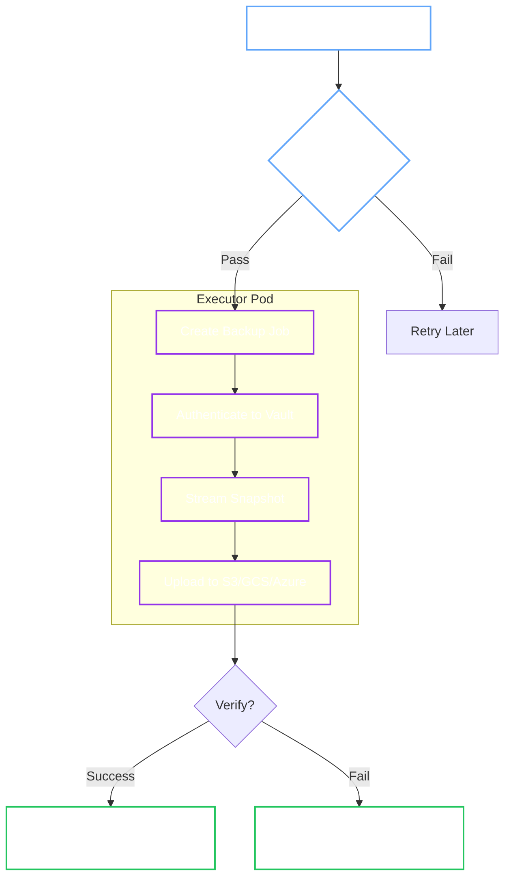

# BackupManager (Snapshots to Object Storage)

!!! abstract "Responsibility"
    Schedule and execute Raft snapshots, stream them to object storage, and manage retention.

!!! tip "User Guide"
    For operational instructions, see the [Backups User Guide](../user-guide/openbaocluster/operations/backups.md) and [Restore User Guide](../user-guide/openbaorestore/restore.md).

## 1. Backup Workflow

The Manager uses a **stateless executor pattern**: the Operator only schedules Kubernetes Jobs; it does not handle data itself.



## 2. Execution Phases

### Phase 1: Pre-flight Checks

Before spawning a Job, the Operator verifies the cluster is stable:

1. **Healthy:** Cluster Phase must be `Running`.
2. **Stable:** No Upgrade (`Status.Upgrade == nil`) or Restore (`Status.Restore == nil`) in progress.
3. **Exclusive:** No other backup is currently running.

### Phase 2: The Executor Job

The Operator creates a Kubernetes Job named `backup-<cluster>-<timestamp>`. This Job:

- Runs the specialized `bao-backup` binary.
- Connects to the active Leader.
- **Streams** the snapshot directly to object storage (no local disk buffering required).

## 3. Configuration & Authentication

The BackupManager supports multiple authentication methods for object storage.

=== "Static Credentials"

    **Best for:** On-prem S3, MinIO, or simple setups.

    Mounts a Kubernetes Secret containing access keys.

    ```yaml
    spec:
      backup:
        target:
          credentialsSecretRef:
            name: my-s3-keys
    ```

    The Secret must contain keys appropriate for the provider (e.g., `AWS_ACCESS_KEY_ID`, `AWS_SECRET_ACCESS_KEY`).

=== "Web Identity (IRSA)"

    **Best for:** AWS EKS (Production).

    Uses a ServiceAccount with an IAM Role annotation. No long-lived secrets are stored in the cluster.

    ```yaml
    spec:
      backup:
        target:
          roleArn: arn:aws:iam::123456789012:role/openbao-backup
    ```

    The Operator projects the ServiceAccount token into the backup Job, and the AWS SDK uses it to assume the role.

## 4. Scheduling & Retention

- **Cron:** Uses standard cron syntax (e.g., `0 2 * * *` for daily at 2 AM).
- **Retention:**
  - If using **Static Credentials**, the Operator can enforce a `retentionPolicy` (e.g., "keep last 5").
  - If using **Web Identity**, we recommend using bucket-native lifecycle policies (e.g., S3 Lifecycle Rules) for better efficiency.

## 5. Naming Convention

Backups are stored with a predictable path structure for easy retrieval during disaster recovery:

```text
<pathPrefix>/<namespace>/<cluster>/<timestamp>-<short-uuid>.snap
```
