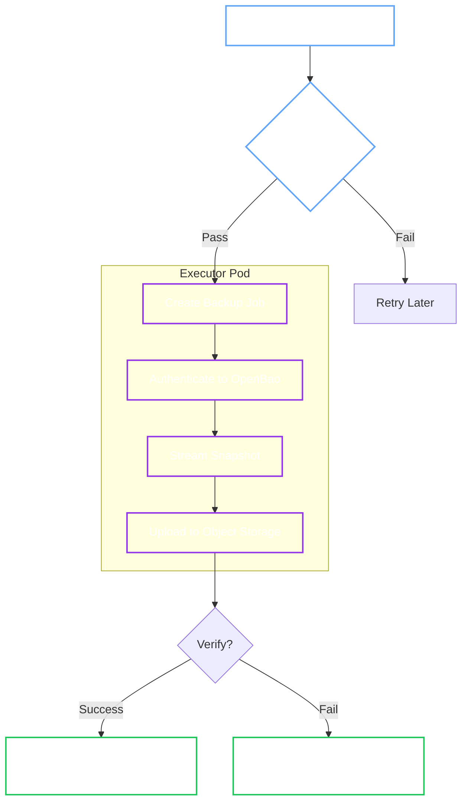

# BackupManager (Snapshots to Object Storage)

!!! abstract "Responsibility"
    Schedule and execute Raft snapshots, stream them to object storage, and manage retention.

!!! tip "User Guide"
    For operational instructions, see the [Backups User Guide](../user-guide/openbaocluster/operations/backups.md) and [Restore User Guide](../user-guide/openbaorestore/restore.md).

## 1. Backup Workflow

The Manager uses a **stateless executor pattern**: the Operator only schedules Kubernetes Jobs; it does not handle data itself.



## 2. Execution Phases

### Phase 1: Pre-flight Checks

Before spawning a Job, the Operator verifies the cluster is stable:

1. **Healthy:** Cluster Phase must be `Running`.
2. **Stable:** No Upgrade (`Status.Upgrade == nil`) or Restore (`Status.Restore == nil`) in progress.
3. **Exclusive:** No other backup is currently running.

### Phase 2: The Executor Job

The Operator creates a Kubernetes Job named `backup-<cluster>-<timestamp>`. This Job:

- Runs the specialized `bao-backup` binary.
- Connects to the active Leader.
- **Streams** the snapshot directly to object storage (no local disk buffering required).

## 3. Storage Providers

The BackupManager supports multiple object storage providers:

=== "S3 (AWS, MinIO, etc.)"

    **Configuration:**
    ```yaml
    spec:
      backup:
        target:
          provider: s3
          endpoint: "https://s3.amazonaws.com"
          bucket: "openbao-backups"
          region: "us-east-1"
          credentialsSecretRef:
            name: s3-credentials
    ```

    **Authentication:**
    - **Static Credentials:** Secret with `accessKeyId` and `secretAccessKey`
    - **Web Identity (IRSA):** Set `roleArn` for AWS EKS (no Secret required)

=== "GCS (Google Cloud Storage)"

    **Configuration:**
    ```yaml
    spec:
      backup:
        target:
          provider: gcs
          bucket: "openbao-backups"
          gcs:
            project: "my-gcp-project"
          credentialsSecretRef:
            name: gcs-credentials
    ```

    **Authentication:**
    - **Service Account Key:** Secret with `credentials.json` (service account JSON)
    - **Application Default Credentials (ADC):** Omit `credentialsSecretRef` when using Workload Identity or GKE

=== "Azure Blob Storage"

    **Configuration:**
    ```yaml
    spec:
      backup:
        target:
          provider: azure
          bucket: "openbao-backups"
          azure:
            storageAccount: "mystorageaccount"
          credentialsSecretRef:
            name: azure-credentials
    ```

    **Authentication:**
    - **Account Key:** Secret with `accountKey`
    - **Connection String:** Secret with `connectionString`
    - **Managed Identity:** Omit `credentialsSecretRef` when using AKS pod identity

## 4. Scheduling & Retention

- **Cron:** Uses standard cron syntax (e.g., `0 2 * * *` for daily at 2 AM).
- **Retention:** The Operator enforces retention policies configured in `spec.backup.retention`:
  - `maxCount`: Keep only the N most recent backups
  - `maxAge`: Delete backups older than a specified duration
  - Applies to all storage providers (S3, GCS, Azure)

## 5. Naming Convention

Backups are stored with a predictable path structure for easy retrieval during disaster recovery:

```text
<pathPrefix>/<namespace>/<cluster>/<timestamp>-<short-uuid>.snap
```
