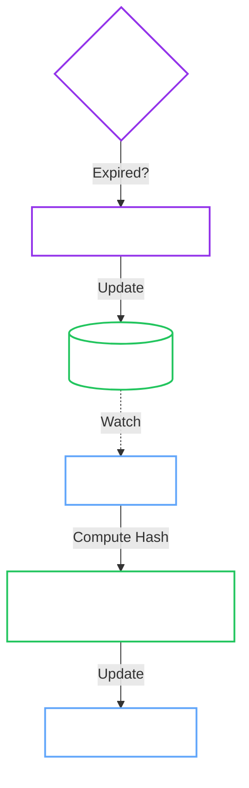
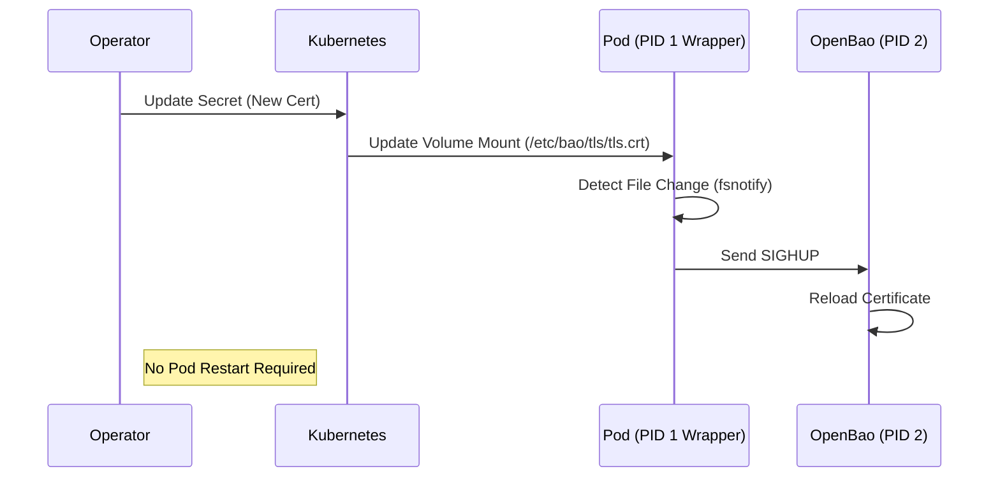

# Cert Manager (TLS Lifecycle)

**Responsibility:** Bootstrap PKI, Rotate Certificates, and signal Hot Reloads.

The CertManager ensures that OpenBao always has valid TLS certificates without requiring manual intervention or pod restarts.

## 1. Operating Modes

Controlled by `spec.tls.mode`.

| Feature | OperatorManaged (Default) | External | ACME |
| :--- | :--- | :--- | :--- |
| **CA Source** | Generated Self-Signed Root CA | User provided Secret | Let's Encrypt / ACME |
| **Server Cert** | Operator Generated (ECDSA P-256) | User provided Secret | OpenBao Internal |
| **Rotation** | **Automatic** (Operator) | External (cert-manager) | **Automatic** (OpenBao) |
| **Reload** | **Automatic** (Signal) | **Automatic** (Signal) | Internal |

---

## 2. Architecture

### TLS Rotation Loop (`OperatorManaged`)

allows the operator to rotate certificates **atomically** without downtime.

### Hot Reload Mechanism

We avoid `ShareProcessNamespace` or `exec` privileges by using a lightweight wrapper process (PID 1).

---

## 3. Implementation Details

=== "OperatorManaged"

    **Best for:** Most users, development, and self-contained environments.

    1.  **Bootstrap:** Checks for `Secret/<cluster>-tls-ca`. If missing, generates a 10-year ECDSA P-256 Root CA.
    2.  **Issuance:** Checks `Secret/<cluster>-tls-server`. If missing or near expiry (default < 24h), signs a new certificate using the CA.
    3.  **Trust:** The CA is automatically mounted to all OpenBao pods and exported to a `ConfigMap` for clients.

=== "External"

    **Best for:** Production environments using `cert-manager` or external PKI.

    1.  **Passive:** The operator stops generating secrets.
    2.  **Wait:** It waits for `Secret/<cluster>-tls-ca` and `Secret/<cluster>-tls-server` to be created by an external tool.
    3.  **Signaling:** It continues to monitor the *content* of these secrets. When your external tool rotates the cert, the operator detects the hash change and triggers the hot-reload signal.

=== "ACME"

    **Best for:** Public-facing clusters needing trusted browser certificates.

    1.  **Passthrough:** The operator renders ACME configuration (`tls_acme_...`) directly into `config.hcl`.
    2.  **No Secrets:** Kubernetes Secrets are NOT used. OpenBao stores certs internally (or in a persistent cache).
    3.  **No Reload:** The Operator is effectively bypassed for TLS logic. OpenBao handles its own rotation loop.
