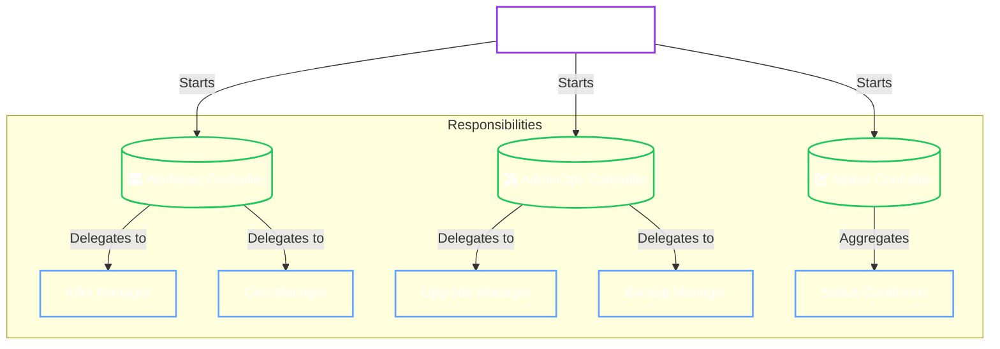
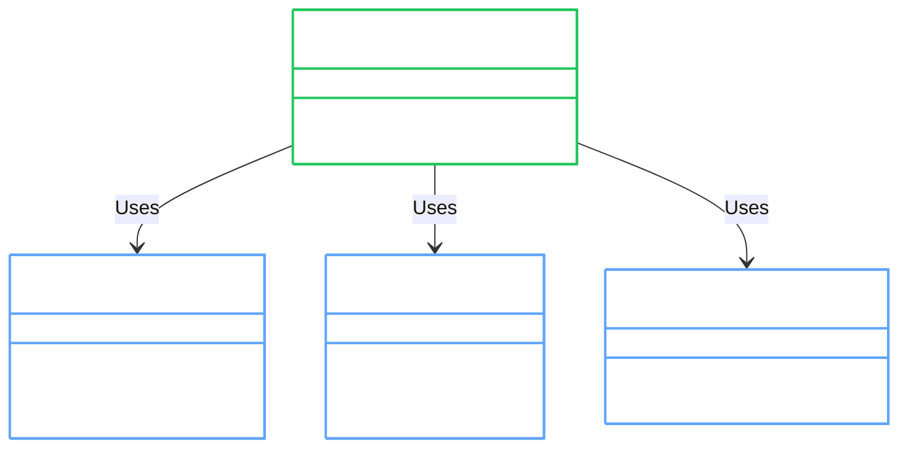

# Component Design

The OpenBao Operator uses a **Split-Controller Architecture**. Instead of a single monolithic reconciliation loop, we divide responsibilities across three specialized controllers per `OpenBaoCluster`.

## 1. Controller Hierarchy

We separate **Workload** (Pod churn), **Operations** (Upgrades/Backups), and **Status** (Updates) to prevent head-of-line blocking and status write contention.

---

## 2. Controllers

| Controller | Role | Why Separate? |
| :--- | :--- | :--- |
| **Workload** | Reconciles StatefulSet, Services, ConfigMaps, and Secrets. | High churn. Needs to react fast to Pod failures. |
| **AdminOps** | Handles Upgrades, Backups, and Restores. | Long-running operations. Should not block Pod recovery. |
| **Status** | Aggregates status from other controllers and writes to API. | Prevents `ResourceVersion` conflicts by serializing status updates. |

---

## 3. Internal Managers

Controllers delegate complex business logic to specialized **Internal Managers**.

### Domain Managers

- **[Infrastructure Manager](infra-manager.md)**: The "heart" of the operator. Generates `config.hcl` and manages the `StatefulSet`.
- **[Cert Manager](cert-manager.md)**: Handles TLS interactions. Supports `OperatorManaged` (internal CA), `ACME` (LetsEncrypt), and `External` (Bring your own).
- **[Init Manager](init-manager.md)**: Auto-initializes new clusters, handling the `sys/init` call and root token encryption.
- **[Upgrade Manager](upgrade-manager.md)**: Powering both **Rolling** and **Blue/Green** upgrades. Manages the state machine for complex transitions.
- **[Backup Manager](backup-manager.md)**: Runs snapshot jobs on a Cron schedule.

### Shared Libraries

- **`internal/provisioner`**: Handles RBAC and Namespace creation for Tenants.
- **`internal/config`**: A pure-functional HCL generator that renders OpenBao configuration.
