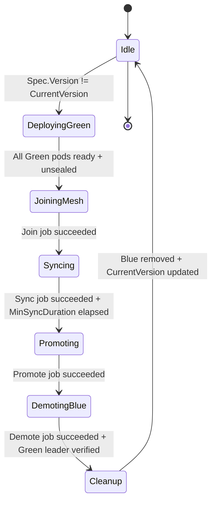

# Controller Design

The Operator runs a single `OpenBaoCluster` controller which delegates to four specific internal "Managers" to separate concerns.

All controllers MUST honor `spec.paused`:

- When `OpenBaoCluster.Spec.Paused == true`, reconcilers SHOULD short-circuit early and avoid mutating cluster resources, allowing safe manual maintenance (e.g., manual restore).
- Finalizers and deletion handling MAY still proceed to ensure cleanup when the CR is deleted.

## 1. The CertManager (TLS Lifecycle)

**Responsibility:** Bootstrap PKI and Rotate Certificates (or wait for external Secrets in External mode, or skip reconciliation in ACME mode).

The CertManager supports three modes controlled by `spec.tls.mode`:

### OperatorManaged Mode (Default)

When `spec.tls.mode` is `OperatorManaged` (or omitted), the operator generates and manages certificates:

- **Logic Flow:**
  1. **Reconcile:** Check if `Secret/<cluster>-tls-ca` exists.
  2. **Bootstrap:** If missing, generate ECDSA P-256 Root CA. Store PEM in Secret.
  3. **Issue:** Check if `Secret/<cluster>-tls-server` exists and is valid (for example, expiry > configured rotation window).
  4. **Rotate:** If the server certificate is within the rotation window, regenerate it using the CA and update the Secret atomically.
  5. **Trigger:** Compute a SHA256 hash of the active server certificate and annotate OpenBao pods with it (for example, `openbao.org/tls-cert-hash`) so the operator and in-pod components can track which certificate each pod is using.
  6. **Hot Reload:** When the hash changes, the operator uses a `ReloadSignaler` to update the annotation on each ready OpenBao pod. A wrapper binary running as pid 1 in the OpenBao container watches the mounted TLS certificate file and sends `SIGHUP` to the OpenBao process when it detects changes, avoiding the need for `pods/exec` privileges in the operator and eliminating the need for `ShareProcessNamespace`.

### External Mode

When `spec.tls.mode` is `External`, the operator does not generate or rotate certificates:

- **Logic Flow:**
  1. **Wait:** Check if `Secret/<cluster>-tls-ca` exists. If missing, log "Waiting for external TLS CA Secret" and return (no error).
  2. **Wait:** Check if `Secret/<cluster>-tls-server` exists. If missing, log "Waiting for external TLS server Secret" and return (no error).
  3. **Monitor:** When both secrets exist, compute the SHA256 hash of the server certificate.
  4. **Hot Reload:** Trigger hot-reload via `ReloadSignaler` when the certificate hash changes (enables seamless rotation by cert-manager or other external providers).
  5. **No Rotation:** Do not check expiry or attempt to rotate certificates; assume the external provider handles this.

### ACME Mode

When `spec.tls.mode` is `ACME`, OpenBao manages certificates internally via its native ACME client:

- **Logic Flow:**
  1. **Skip Reconciliation:** The operator does not generate, rotate, or monitor certificates. OpenBao handles certificate lifecycle internally.
  2. **Configuration:** The operator renders ACME parameters (`tls_acme_ca_directory`, `tls_acme_domains`, `tls_acme_email`) directly in the listener configuration.
  3. **No Secrets:** No TLS Secrets are created or mounted. Certificates are stored in-memory (or cached per `tls_acme_cache_path`) by OpenBao.
  4. **No Wrapper Needed:** No TLS reload wrapper is needed, and `ShareProcessNamespace` is disabled for better container isolation.
  5. **Automatic Rotation:** OpenBao automatically handles certificate acquisition and rotation via the ACME protocol.

**Reconciliation Semantics:**

- **Idempotency:** Re-running reconciliation with the same Spec MUST lead to the same Secrets and annotations.
- **Backoff:** Transient errors (e.g., failed Secret update due to concurrent modification) are retried with exponential backoff.
- **Conditions:** Failures update a `TLSReady=False` condition with a clear reason and message.
- **External Mode:** The operator waits gracefully for external Secrets without erroring, allowing cert-manager or other tools time to provision certificates.

## 2. The InfrastructureManager (Config & StatefulSet)

**Responsibility:** Render configuration and maintain the StatefulSet.

- **Configuration Strategy:**
  - We do not use a static ConfigMap. We generate it dynamically based on the cluster topology and merge in user-supplied configuration where safe.
  - **Injection:** We explicitly inject the `listener "tcp"` block:
    - For `OperatorManaged` and `External` modes: Points to mounted TLS Secrets at `/etc/bao/tls`.
    - For `ACME` mode: Includes ACME parameters (`tls_acme_ca_directory`, `tls_acme_domains`, etc.) and no file paths.
- **Discovery Strategy:**
  - **Bootstrap:** During initial cluster creation, we configure a single `retry_join` with `leader_api_addr` pointing to the deterministic DNS name of pod-0 (for example, `cluster-0.cluster-name.namespace.svc`). This ensures a stable leader for Day 0 initialization.
  - **Post-Initialization:** After the cluster is marked initialized, we switch to a Kubernetes go-discover based `retry_join` that uses `auto_join = "provider=k8s namespace=<ns> label_selector=\"openbao.org/cluster=<cluster-name>\""` so new pods can join dynamically based on labels rather than a static peer list.

- **Auto-Unseal Integration:**
  - **Static Seal (Default):** If `spec.unseal` is omitted or `spec.unseal.type` is `"static"`:
    - On first reconcile, checks for the existence of `Secret/<cluster>-unseal-key` (per-cluster name).
    - If missing, generates 32 cryptographically secure random bytes and stores them as the unseal key in the Secret.
    - Mounts this Secret into the StatefulSet PodSpec at `/etc/bao/unseal/key`.
    - Injects a `seal "static"` stanza into `config.hcl`.
  - **External KMS Seal:** If `spec.unseal.type` is set to `"awskms"`, `"gcpckms"`, `"azurekeyvault"`, `"transit"`, `"kmip"`, `"ocikms"`, or `"pkcs11"`:
    - Does NOT create the `<cluster>-unseal-key` Secret.
    - Renders a `seal "<type>"` block with structured configuration from the corresponding seal config (e.g., `spec.unseal.transit`, `spec.unseal.awskms`, etc.).
    - If `spec.unseal.credentialsSecretRef` is provided, mounts the credentials Secret at `/etc/bao/seal-creds`.
    - For GCP Cloud KMS (`gcpckms`), sets `GOOGLE_APPLICATION_CREDENTIALS` environment variable pointing to the mounted credentials file.

- **Image Verification (Supply Chain Security):**
  - If `spec.imageVerification.enabled` is `true`, the operator verifies the container image signature using Cosign before creating or updating the StatefulSet.
  - The verification uses the public key provided in `spec.imageVerification.publicKey`.
  - Verification results are cached in-memory to avoid redundant network calls for the same image digest.
  - **Failure Policy:**
    - `Block` (default): If verification fails, sets `ConditionDegraded=True` with `Reason=ImageVerificationFailed` and blocks StatefulSet updates.
    - `Warn`: If verification fails, logs an error and emits a Kubernetes Event but proceeds with StatefulSet updates.

**Reconciliation Semantics:**

- Watches `OpenBaoCluster` and all owned resources (StatefulSet, Services, ConfigMaps, Secrets, ServiceAccounts, Ingresses, NetworkPolicies).
- Ensures the rendered `config.hcl` and StatefulSet template are consistent with Spec (including multi-tenant naming conventions).
- Performs image signature verification before StatefulSet creation/updates when `spec.imageVerification.enabled` is `true`.
- Automatically creates NetworkPolicies to enforce cluster isolation.
- Uses controller-runtime patch semantics to apply only necessary changes.
- Updates `Available`/`Degraded` conditions based on StatefulSet readiness.
- **OwnerReferences:** All created resources have `OwnerReferences` pointing to the parent `OpenBaoCluster`, enabling automatic garbage collection when the cluster is deleted.

### Configuration Generation

#### The `config.hcl` Template

The Operator generates the OpenBao configuration file dynamically:

```hcl
ui = true

listener "tcp" {
  address = "0.0.0.0:8200"
  cluster_address = "0.0.0.0:8201"
  # Operator injects paths to the Secret it manages
  tls_cert_file = "/etc/bao/tls/tls.crt"
  tls_key_file  = "/etc/bao/tls/tls.key"
  tls_client_ca_file = "/etc/bao/tls/ca.crt"
}

seal "static" {
  current_key    = "file:///etc/bao/unseal/key"
  current_key_id = "operator-generated-v1"
}

storage "raft" {
  path = "/bao/data"

  # Bootstrap retry_join targeting pod-0
  retry_join {
    leader_api_addr = "https://prod-cluster-0.prod-cluster.security.svc:8200"
    leader_ca_cert_file = "/etc/bao/tls/ca.crt"
    leader_client_cert_file = "/etc/bao/tls/tls.crt"
    leader_client_key_file = "/etc/bao/tls/tls.key"
  }

  # Post-initialization dynamic join
  retry_join {
    auto_join               = "provider=k8s namespace=security label_selector=\"openbao.org/cluster=prod-cluster\""
    leader_ca_cert_file     = "/etc/bao/tls/ca.crt"
    leader_client_cert_file = "/etc/bao/tls/tls.crt"
    leader_client_key_file  = "/etc/bao/tls/tls.key"
  }
}
```

**Note:** We use a hybrid approach. A deterministic bootstrap `retry_join` to pod-0 avoids split-brain during Day 0, while the post-initialization `auto_join` with the Kubernetes provider (`provider=k8s`) enables dynamic, label-driven scaling without editing the ConfigMap.

#### Configuration Ownership and Merging

- The Operator owns the critical `listener "tcp"` and `storage "raft"` stanzas to guarantee mTLS and Raft stability.
- Users may provide additional non-protected configuration settings via `spec.config` as key/value pairs, but attempts to override protected stanzas are rejected by validation enforced at admission time:
  - CRD-level CEL rules block obvious misuse (for example, top-level `listener`, `storage`, `seal` keys).
  - A `ValidatingAdmissionPolicy` performs deeper, semantic checks and enforces additional constraints on `spec.config` keys and values.
- The ConfigController merges user attributes into an operator-generated template in a deterministic, idempotent way, skipping any operator-owned keys.

## 3. The InitManager (Cluster Initialization)

**Responsibility:** Automate initial cluster initialization and root token management.

The InitManager handles the bootstrapping of a new OpenBao cluster, including initial Raft leader election and storing the root token securely.

- **Initialization Workflow:**
  1. **Single-Pod Bootstrap:** During initial cluster creation, the InfrastructureManager starts with 1 replica (regardless of `spec.replicas`) until initialization completes.
  2. **Wait for Container:** The InitManager waits for the pod-0 container to be running (not necessarily ready, since the readiness probe may fail until OpenBao is initialized).
  3. **Check Status (Preferred):** Read OpenBao's Kubernetes service registration labels on pod-0 (`openbao-initialized`, `openbao-sealed`).
  4. **Check Status (Fallback):** If labels are not yet available, query OpenBao via the HTTP health endpoint (`GET /v1/sys/health`) using the per-cluster TLS CA.
  5. **Initialize:** If not initialized, call the HTTP initialization endpoint (`PUT /v1/sys/init`) against pod-0 using the Operator's in-cluster OpenBao client (no `pods/exec` or CLI dependencies).
  6. **Store Root Token:** Parse the initialization response and store the root token in a per-cluster Secret (`<cluster>-root-token`).
  7. **Mark Initialized:** Set `Status.Initialized = true` to signal the InfrastructureManager to scale up to the desired replica count.

**Reconciliation Semantics:**

- The InitManager only runs when `Status.Initialized == false`.
- Once `Status.Initialized` is true, the InitManager short-circuits and performs no operations.
- Errors during initialization (e.g., network issues, pod not ready) cause requeues with backoff; the cluster remains at 1 replica until successful initialization.
- The initialization response (which contains sensitive unseal keys and root token) is NEVER logged.

## 4. The UpgradeManager (The State Machine)

**Responsibility:** Safe rolling updates with Raft-aware leader handling.

The UpgradeManager uses **StatefulSet Partitioning** to control exactly which Pods are updated by Kubernetes, rather than letting Kubernetes update them all at once.

**The Algorithm:**

1. **Trigger:** User changes `Spec.Version` to `2.1.0`. `Status.CurrentVersion` is `2.0.0`.
2. **Set Strategy:** Operator patches StatefulSet `updateStrategy` to `RollingUpdate` with `partition: <replicas>`. (This pauses K8s updates).
3. **Identify Leader:** Operator prefers OpenBao's Kubernetes service registration label `openbao-active=true` to identify the leader pod (falls back to `GET /v1/sys/health` if labels are unavailable).
   - *Result:* Pod-0 (Follower), Pod-1 (Leader), Pod-2 (Follower).
4. **Update Followers (Reverse Ordinal):**
   - Operator decrements partition to `2`. Pod-2 updates.
   - Operator waits for Pod-2 `Ready` check + OpenBao Health check.
   - **Revised Logic (The Step-Down):** We cannot skip indices in a StatefulSet. Therefore, **we must force a step-down BEFORE the update reaches the leader's index.**
   - Target: Pod-1. Is it Leader? **Yes.**
   - **Action:** Send `PUT /v1/sys/step-down` to Pod-1. Wait for leadership to transfer to Pod-0 or Pod-2.
   - Once Pod-1 is a follower, decrement partition to allow K8s to update Pod-1.
   - Repeat for Pod-0.

**Upgrade State Machine:**

1. **Detect Drift:** `Spec.Version` != `Status.CurrentVersion` AND `Status.Upgrade == nil`.
2. **Pre-upgrade Snapshot:** If `spec.backup.preUpgradeSnapshot == true`, trigger a backup and wait for completion.
3. **Initialize Upgrade State:**
   - Create `Status.Upgrade` with `TargetVersion`, `FromVersion`, `StartedAt`.
   - Set `Status.Phase = Upgrading`.
   - Set `Upgrading=True` condition.
4. **Lock StatefulSet:** Patch StatefulSet `updateStrategy.rollingUpdate.partition` to `Replicas` (pauses all updates).

**Pod-by-Pod Update (Reverse Ordinal):**

For each pod from highest ordinal to 0:

1. **Check Leadership:**
   - Prefer `openbao-active=true` on the target pod (service registration).
   - Fall back to `GET /v1/sys/health` on the target pod if labels are unavailable.
   - If the pod is leader:
     - Call `PUT /v1/sys/step-down` with empty body.
     - Wait up to `StepDownTimeout` (default: 30s) for leadership to transfer.
     - Record `Status.Upgrade.LastStepDownTime`.
     - If timeout: Set `Degraded=True` with `Reason=StepDownTimeout`, halt upgrade.

2. **Allow Pod Update:**
   - Decrement partition to allow Kubernetes to update the target pod.
   - Patch StatefulSet with new partition value.

3. **Wait for Pod Ready:**
   - Wait for pod to be recreated and reach `Ready` state.
   - Timeout: `PodReadyTimeout` (default: 5 minutes).

4. **Wait for OpenBao Health:**
   - Poll `GET /v1/sys/health` until `initialized: true` AND `sealed: false`.
   - Polling interval: 5 seconds.
   - Timeout: `HealthCheckTimeout` (default: 2 minutes).

5. **Wait for Raft Sync:**
   - Compare pod's `raft_committed_index` with leader's index.
   - Wait until pod is within acceptable lag (default: 100 entries).
   - Timeout: `RaftSyncTimeout` (default: 2 minutes).

6. **Record Progress:**
   - Add pod ordinal to `Status.Upgrade.CompletedPods`.
   - Update `Status.Upgrade.CurrentPartition`.

**Finalization:**

1. Update `Status.CurrentVersion` to match `Spec.Version`.
2. Clear `Status.Upgrade` (set to nil).
3. Set `Status.Phase = Running`.
4. Set `Upgrading=False` condition with `Reason=UpgradeComplete`.

**Resumability and Restart Handling:**

Upgrades are designed to survive Operator restarts:

- All upgrade state is stored in `Status.Upgrade`.
- On Operator restart (or requeue), if `Status.Upgrade != nil`:
  1. Verify upgrade is still needed (`Spec.Version == Status.Upgrade.TargetVersion`).
  2. If user changed `Spec.Version` mid-upgrade, clear `Status.Upgrade` and start fresh.
  3. Otherwise, resume from `Status.Upgrade.CurrentPartition`.
  4. Re-verify health of already-upgraded pods before continuing.

### Blue/Green Upgrade Strategy

When `spec.updateStrategy.type` is `BlueGreen`, the operator uses a parallel cluster upgrade approach instead of rolling updates.

**Architecture:**

The Blue/Green strategy is implemented in the `internal/upgrade/bluegreen/` subpackage:

- `manager.go` - Main upgrade orchestrator (`bluegreen.Manager`)
- `actions.go` - Executor action constants
- `job.go` - Upgrade executor Job creation
- `constants.go` - Condition reason strings

**7-Phase State Machine:**

```text
Idle → DeployingGreen → JoiningMesh → Syncing → Promoting → DemotingBlue → Cleanup → Idle
```

| Phase | Description |
| :--- | :--- |
| **Idle** | No upgrade in progress, `CurrentVersion == Spec.Version` |
| **DeployingGreen** | Creates Green StatefulSet with new version, waits for all pods to be running, ready, and unsealed |
| **JoiningMesh** | Runs executor Job to join Green pods to Raft as non-voters |
| **Syncing** | Runs executor Job to verify Green pods have replicated data, respects `minSyncDuration` if configured |
| **Promoting** | Runs executor Job to promote Green pods to voters |
| **DemotingBlue** | Runs executor Job to demote Blue pods to non-voters, verifies Green leader election |
| **Cleanup** | Runs executor Job to remove Blue peers from Raft, deletes Blue StatefulSet |

**Blue/Green State Machine Flow:**



**Key Design Decisions:**

1. **Revision-based naming**: StatefulSets are named `<cluster>-<revision>` where revision is a hash of version+image+replicas.
2. **Shared headless service**: Blue and Green StatefulSets share the same headless service for Raft discovery.
3. **Executor Jobs**: Long-running Raft operations run in isolated Jobs to avoid blocking the controller.
4. **Automatic abort**: If Green pods fail health checks, the upgrade can be aborted and Blue cluster remains active.

**Upgrade Executor Jobs:**

Each phase transition that requires Raft operations creates an upgrade executor Job:

- `ActionJoinGreenNonVoters` - Adds Green pods as Raft non-voters
- `ActionWaitGreenSynced` - Verifies replication is complete
- `ActionPromoteGreenVoters` - Promotes Green pods to Raft voters
- `ActionDemoteBlueNonVotersStepDown` - Demotes Blue pods, triggers leader step-down
- `ActionRemoveBluePeers` - Removes Blue pods from Raft peer list

**Reconciliation Semantics:**

- All state is stored in `Status.BlueGreen` for resumability.
- Phase transitions are idempotent; re-running returns the same result.
- The manager requeues (returns `true`) when waiting for external state changes.
- Executor Jobs are owned by the OpenBaoCluster for automatic cleanup.

## 5. The BackupManager (Snapshots to Object Storage)

**Responsibility:** Schedule and execute Raft snapshots, stream them to object storage, and manage retention.

**Backup Execution Flow:**

Backups are executed using Kubernetes Jobs that run the `bao-backup` executor container. This design keeps the operator stateless and allows backups to run independently.

1. **Pre-flight Checks:**
   - Verify cluster is healthy (`Phase == Running`).
   - Verify no upgrade is in progress (`Status.Upgrade == nil`).
   - Verify no other backup is in progress (`BackingUp` condition is False).
   - Verify authentication is configured (JWT Auth role or token Secret).

2. **Create Backup Job:**
   - Create a Kubernetes Job with a unique name: `backup-<cluster-name>-<timestamp>`
   - Job runs the backup executor image (`spec.backup.executorImage`)
   - Job Pod uses the backup ServiceAccount
   - Job Pod mounts TLS CA certificate and configures object storage access:
     - Static credentials via `spec.backup.target.credentialsSecretRef` (Secret volume mount), or
     - Web Identity via `spec.backup.target.roleArn` (projected ServiceAccount token + AWS SDK env vars)
   - Job passes `spec.backup.target.region` to the executor for S3-compatible clients

3. **Backup Executor Workflow:**
   - Authenticates to OpenBao (JWT Auth via projected token or static token)
   - Discovers the Raft leader
   - Streams `GET /v1/sys/storage/raft/snapshot` directly to object storage (no disk buffering)
   - Verifies upload completion

4. **Process Job Result:**
   - On success: Update `Status.Backup` fields
   - On failure: Increment `ConsecutiveFailures` and set `LastFailureReason`

5. **Apply Retention:**
   - If retention policy is configured and static credentials are used, delete old backups after successful upload
   - When Web Identity is used (`spec.backup.target.roleArn`), prefer storage-native lifecycle policies for retention

**Backup Naming Convention:**

Backups are named predictably: `<pathPrefix>/<namespace>/<cluster>/<timestamp>-<short-uuid>.snap`

**Backup Scheduling:**

- Uses `github.com/robfig/cron/v3` for cron parsing and scheduling.
- One scheduler instance per `OpenBaoCluster`.
- `Status.Backup.NextScheduledBackup` stores the next scheduled time.
- On Operator restart, the next schedule is recalculated from the cron expression.
