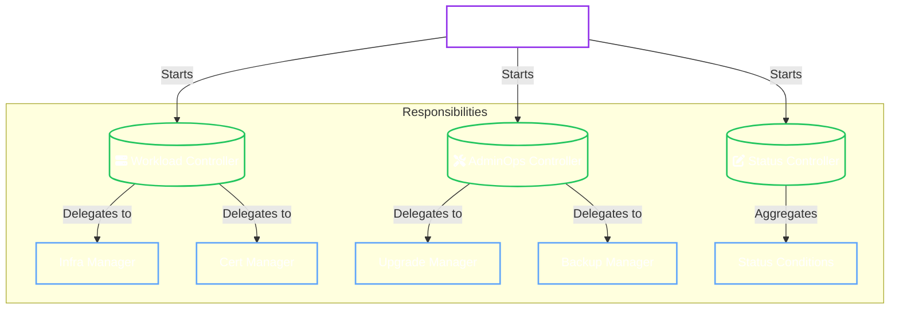
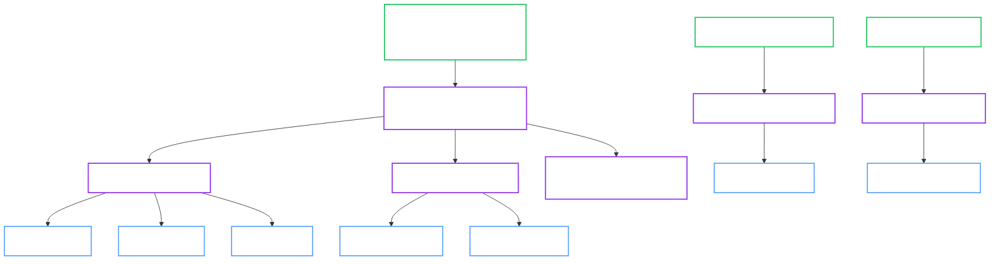

# Component Design

The OpenBao Operator uses a **Split-Controller Architecture**. Instead of a single monolithic reconciliation loop, we divide responsibilities across three specialized controllers per `OpenBaoCluster`.

In addition:

- Multi-tenant deployments run a separate **Provisioner** controller that reconciles `OpenBaoTenant`.
- The controller manager also runs the **OpenBaoRestore** controller that reconciles `OpenBaoRestore`.

## 1. Controller Hierarchy

We separate **Workload** (Pod churn), **Operations** (Upgrades/Backups), and **Status** (Updates) to prevent head-of-line blocking and status write contention.

```mermaid
graph TD
    Manager[Manager Process] -->|Starts| Workload[("fa:fa-server Workload Controller")]
    Manager -->|Starts| Admin[("fa:fa-tools AdminOps Controller")]
    Manager -->|Starts| Status[("fa:fa-pen-to-square Status Controller")]

    subgraph Roles ["Responsibilities"]
        Workload -->|Delegates to| Infra[Infra Manager]
        Workload -->|Delegates to| Cert[Cert Manager]
        
        Admin -->|Delegates to| Upgrade[Upgrade Manager]
        Admin -->|Delegates to| Backup[Backup Manager]
        
        Status -->|Aggregates| Conditions[Status Conditions]
    end
    
    classDef process fill:transparent,stroke:#9333ea,stroke-width:2px,color:#fff;
    classDef write fill:transparent,stroke:#22c55e,stroke-width:2px,color:#fff;
    classDef read fill:transparent,stroke:#60a5fa,stroke-width:2px,color:#fff;
    
    class Manager process;
    class Workload,Admin,Status write;
    class Infra,Cert,Upgrade,Backup,Conditions read;
```

---

## 2. Controllers

| Controller | Role | Why Separate? |
| :--- | :--- | :--- |
| **Workload** | Reconciles StatefulSet, Services, ConfigMaps, and Secrets. | High churn. Needs to react fast to Pod failures. |
| **AdminOps** | Handles Upgrades and Backups. | Long-running operations. Should not block Pod recovery. |
| **Status** | Aggregates status from other controllers and writes to API. | Prevents `ResourceVersion` conflicts by serializing status updates. |

!!! note "Restore Controller"
    Restores are reconciled via the separate `OpenBaoRestore` controller, which orchestrates restore Jobs and acquires the cluster operation lock.

---

## 3. App Orchestration and Managers

Controllers delegate orchestration to `internal/app/*` packages first. The app layer then coordinates domain managers, shared lifecycle services, and focused subpackages.

```mermaid
graph TD
    OBC["OpenBaoCluster controllers (workload/adminops/status)"] --> OBCApp["internal/app/openbaocluster facade"]
    OBR["OpenBaoRestore controller"] --> OBRApp["internal/app/openbaorestore"]
    Prov["Provisioner controller"] --> ProvApp["internal/app/provisioner"]

    OBCApp --> Workload["Workload orchestration"]
    OBCApp --> AdminOps["AdminOps orchestration"]
    OBCApp --> StatusOps["Status and deletion orchestration"]

    Workload --> Infra["Infra Manager"]
    Workload --> Cert["Cert Manager"]
    Workload --> Init["Init Manager"]
    AdminOps --> Upgrade["Upgrade Manager"]
    AdminOps --> Backup["Backup Manager"]

    OBRApp --> Restore["Restore Manager"]
    ProvApp --> ProvMgr["Provisioner Manager"]

    classDef process fill:transparent,stroke:#9333ea,stroke-width:2px,color:#fff;
    classDef write fill:transparent,stroke:#22c55e,stroke-width:2px,color:#fff;
    classDef read fill:transparent,stroke:#60a5fa,stroke-width:2px,color:#fff;

    class OBC,OBR,Prov write;
    class OBCApp,OBRApp,ProvApp,Workload,AdminOps,StatusOps process;
    class Infra,Cert,Init,Upgrade,Backup,Restore,ProvMgr read;
```

!!! note "Boundary Contract"
    Controller import surfaces are intentionally narrow and enforced by generated architecture-boundary rules from `.ast-grep/policy/architecture-boundaries.yml`.

### Domain Managers

- **[Infrastructure Manager](infra-manager.md)**: The "heart" of the operator. Generates `config.hcl` and manages the `StatefulSet`.
- **[Cert Manager](cert-manager.md)**: Handles TLS interactions. Supports `OperatorManaged` (internal CA), `ACME` (LetsEncrypt), and `External` (Bring your own).
- **[Init Manager](init-manager.md)**: Initializes new clusters (when self-init is disabled), handling `PUT /v1/sys/init` and storing the root token in a Secret.
- **[Upgrade Manager](upgrade-manager.md)**: Powering both **Rolling** and **Blue/Green** upgrades. Manages the state machine for complex transitions.
- **[Backup Manager](backup-manager.md)**: Runs snapshot jobs on a Cron schedule.
- **[Restore Manager](restore-manager.md)**: Coordinates restore Jobs and lock lifecycle for `OpenBaoRestore`.
- **[Provisioner Manager](provisioner-manager.md)**: Reconciles tenant namespace RBAC, Secret allowlists, Pod Security labels, and quota scaffolding for `OpenBaoTenant`.

### Shared Coordination Services

- **[Operation Lifecycle Coordination](operation-lifecycle.md)**: Provides shared operation-lock, retry, and phase-transition helpers used by backup, restore, and upgrade flows.

### Supporting Libraries

- **`internal/adapter/config`**: A pure-functional HCL generator that renders OpenBao configuration.
