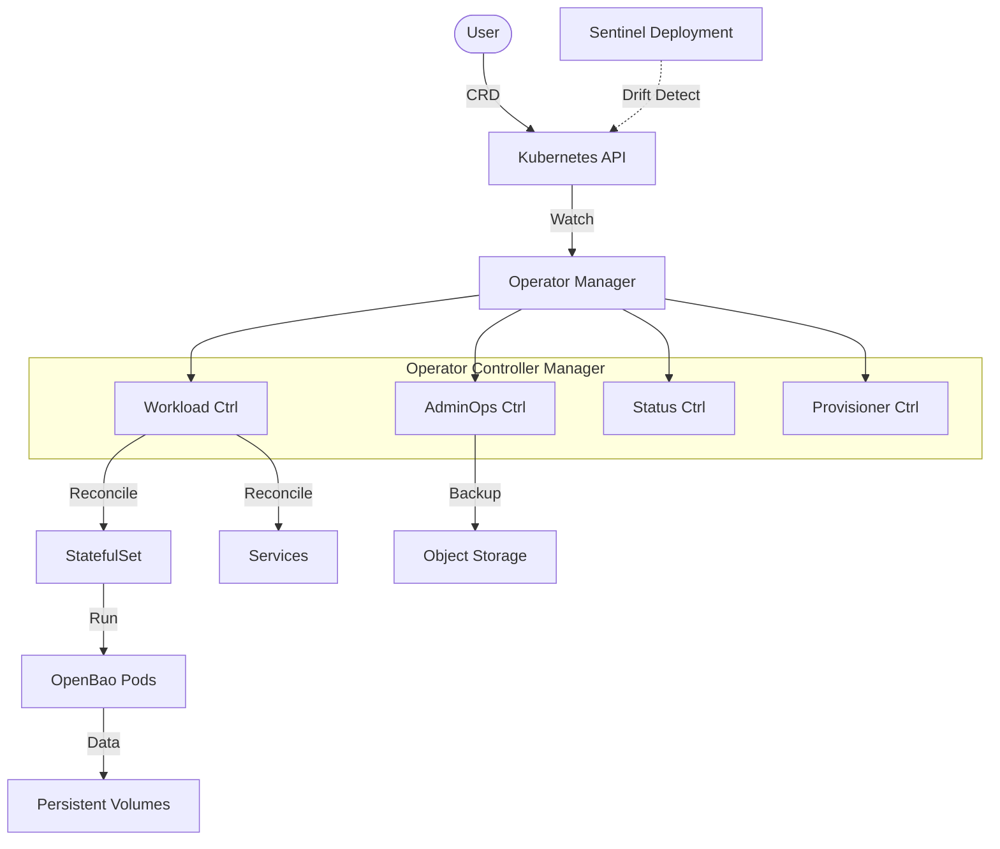
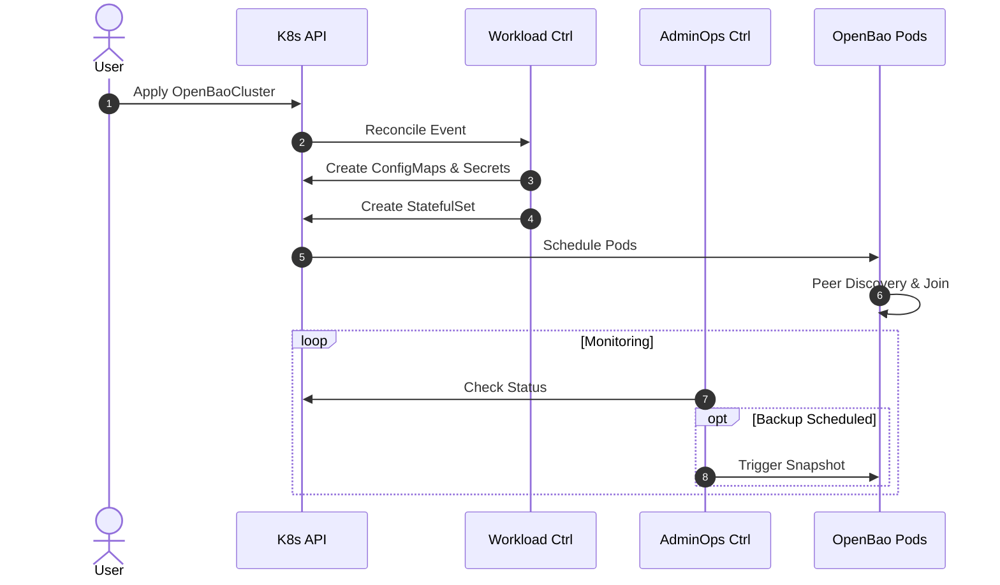

# Architecture: OpenBao Supervisor Operator

This document provides a comprehensive overview of the OpenBao Operator's architecture.

<div class="grid cards" markdown>

- :material-view-dashboard-outline: **Overview**

    ---

    High-level design and supervisor pattern.

    [:material-arrow-down: Jump to Overview](#1-architecture-overview)

- :material-cogs: **Components**

    ---

    Controller manager, interacting controllers, and state.

    [:material-arrow-down: Jump to Components](#11-system-components)

- :material-shield-key: **Security**

    ---

    Least-privilege RBAC and zero-trust model.

    [:material-arrow-right: Security Docs](../security/index.md)

- :material-api: **API Spec**

    ---

    CRD specification and status fields.

    [:material-arrow-down: Jump to API](#api-specification)

</div>

## 1. Architecture Overview

The OpenBao Operator adopts a **Supervisor Pattern**. It delegates data consistency to the OpenBao binary while managing the external ecosystem: PKI lifecycle, Infrastructure state, and Safe Version Upgrades.

### 1.1 System Components



### 1.2 Component Interaction



### 1.3 Assumptions

!!! note "Core Assumptions"
    - **Storage**: Default StorageClass available.
    - **Network**: Working DNS for StatefulSet identity.
    - **Version**: OpenBao v2.4.0+ (required for static auto-unseal).

## Cross-Cutting Concerns

### Observability

| Metric | Description |
| :--- | :--- |
| `openbao_cluster_ready_replicas` | Number of Ready replicas |
| `openbao_reconcile_duration_seconds` | Reconciliation duration |
| `openbao_upgrade_status` | Upgrade status (0=Idle, 1=Upgrading) |

## API Specification

The `OpenBaoCluster` CRD defines the desired state.

### Spec (Desired State)

```yaml
apiVersion: openbao.org/v1alpha1
kind: OpenBaoCluster
spec:
  version: "2.4.4"       # (1)!
  image: "openbao:2.4.4" # (2)!
  replicas: 3            # (3)!
  tls:
    enabled: true        # (4)!
  unseal:
    type: awskms         # (5)!
  profile: Hardened      # (6)!
```

1. Semantic OpenBao version.
2. Container image reference.
3. Number of replicas (default: 3).
4. Enable Operator-managed TLS.
5. Auto-unseal mechanism (static or external).
6. Security posture (`Hardened` or `Development`).

### Status (Observability)

```yaml
status:
  phase: Running  # (1)!
  activeLeader: pod-0  # (2)!
  readyReplicas: 3  # (3)!
  conditions:  # (4)!
    - Type: Available
      Status: True
```

1. High-level lifecycle phase.
2. Current Raft leader.
3. Number of ready pods.
4. Standard Kubernetes conditions.
