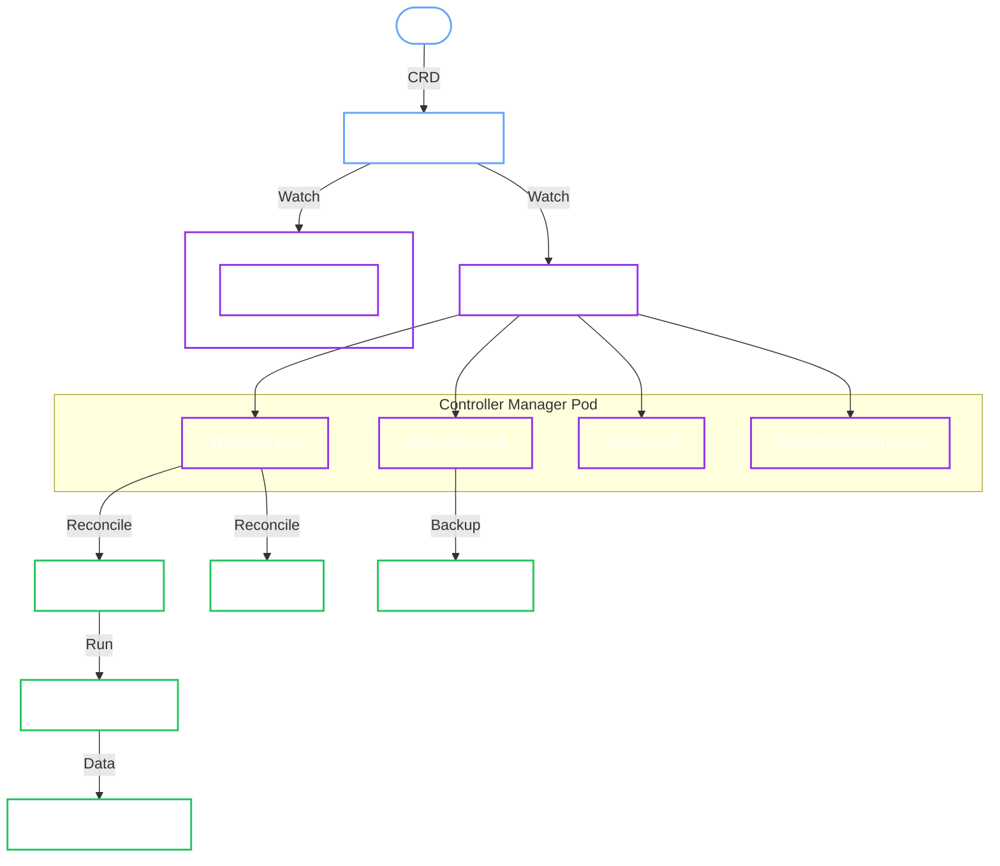
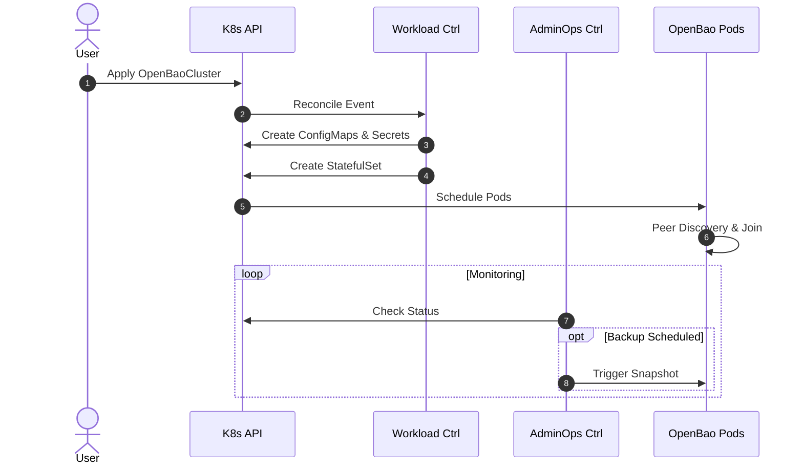

# Architecture: OpenBao Supervisor Operator

This document provides a comprehensive overview of the OpenBao Operator's architecture.

<div class="grid cards" markdown>

- :material-view-dashboard-outline: **Overview**

    ---

    High-level design and supervisor pattern.

    [:material-arrow-down: Jump to Overview](#1-architecture-overview)

- :material-cogs: **Components**

    ---

    Controller manager, interacting controllers, and state.

    [:material-arrow-down: Jump to Components](#12-system-components)

- :material-shield-key: **Security**

    ---

    Least-privilege RBAC and zero-trust model.

    [:material-arrow-right: Security Docs](../security/index.md)

- :material-api: **API Spec**

    ---

    CRD specification and status fields.

    [:material-arrow-down: Jump to API](#api-specification)

</div>

## 1. Architecture Overview

The OpenBao Operator adopts a **Supervisor Pattern**. It delegates data consistency to the OpenBao binary while managing the external ecosystem: PKI lifecycle, Infrastructure state, and Safe Version Upgrades.

### 1.1 Tenancy Models

The operator supports two architectural modes:

1. **Multi-Tenant (Default)**: Uses a **Provisioner** controller to manage RBAC and namespaces dynamically. Adopts a Zero-Trust model where the Controller has limited permissions.
2. **Single-Tenant**: Designed for direct embedding. The **Provisioner** is disabled, and the Controller manages the target namespace directly with full permissions.

### 1.2 System Components


```mermaid
graph TD
    User([User]) -->|CRD| API[Kubernetes API]
    
    subgraph ControllerMgr ["Controller Manager Pod"]
        Workload[Workload Ctrl]
        AdminOps[AdminOps Ctrl]
        Status[Status Ctrl]
        Restore[OpenBaoRestore Ctrl]
    end

    subgraph ProvisionerMgr ["Provisioner Pod"]
        Provisioner[Provisioner Ctrl]
    end

    API -->|Watch| Operator[Operator Manager]
    Operator --> Workload & AdminOps & Status & Restore
    API -->|Watch| ProvisionerMgr
    
    Workload -->|Reconcile| STS[StatefulSet]
    Workload -->|Reconcile| Svc[Services]
    AdminOps -->|Backup| ObjStore[Object Storage]
    
    STS -->|Run| Pods[OpenBao Pods]
    Pods -->|Data| PVC[Persistent Volumes]

    classDef read fill:transparent,stroke:#60a5fa,stroke-width:2px,color:#fff;
    classDef write fill:transparent,stroke:#22c55e,stroke-width:2px,color:#fff;
    classDef process fill:transparent,stroke:#9333ea,stroke-width:2px,color:#fff;

    class User,API read;
    class Operator,Workload,AdminOps,Status,Restore,Provisioner,ProvisionerMgr process;
    class STS,Svc,ObjStore,Pods,PVC write;
```

### 1.3 Code Package Model

The runtime code is organized into layered packages to keep controller plumbing, orchestration, and integration code separated.

| Layer | Purpose | Current package roots |
| :--- | :--- | :--- |
| `L0` | API types | `api/v1alpha1` |
| `L1` | Entrypoints/bootstrap | `cmd/controller`, `cmd/provisioner`, `cmd/bao-backup`, `cmd/bao-upgrade`, `cmd/bao-probe`, `internal/platform/entrypoint` |
| `L2` | Controller plumbing | `internal/controller/openbaocluster`, `internal/controller/openbaorestore`, `internal/controller/provisioner` |
| `L3` | App orchestration | `internal/app/openbaocluster` (facade + `statusops`, `deletionops`, `adminops`), `internal/app/openbaorestore`, `internal/app/provisioner` |
| `L4` | Services/managers | `internal/service/backup`, `internal/service/restore`, `internal/service/upgrade`, `internal/service/infra`, `internal/service/certs`, `internal/service/init`, `internal/service/provisioner`, `internal/service/opslifecycle` |
| `L5` | Ports/contracts | `internal/port/auth`, `internal/port/backup`, `internal/port/blobstore`, `internal/port/imageverify`, `internal/port/infra`, `internal/port/initmanager`, `internal/port/openbao`, `internal/port/security` |
| `L6` | Adapters/integrations | `internal/adapter/{kube,openbao,storage,auth,raft,security,storageenv,cluster,config,operationlock,probe,revision}` |
| `L7` | Platform/cross-cutting | `internal/platform/{admission,constants,entrypoint,errors,logging,observability,predicates,reconcile,testutil}` |

The authoritative layer inventory lives in `.ast-grep/policy/architecture-boundaries.yml`.
App packages stay independent from adapters, ports stay contract-only, service packages own domain behavior and may depend on focused adapters or ports, and adapters never depend upward on app or service packages.

### 1.4 Component Interaction


```mermaid
sequenceDiagram
    autonumber
    actor User
    participant API as K8s API
    participant Workload as Workload Ctrl
    participant AdminOps as AdminOps Ctrl
    participant Pods as OpenBao Pods

    User->>API: Apply OpenBaoCluster
    API->>Workload: Reconcile Event
    Workload->>API: Create ConfigMaps & Secrets
    Workload->>API: Create StatefulSet
    API->>Pods: Schedule Pods
    Pods->>Pods: Peer Discovery & Join
    
    loop Monitoring
        AdminOps->>API: Check Status
        opt Backup Scheduled
            AdminOps->>Pods: Trigger Snapshot
        end
    end
```

### 1.5 Architectural Guardrails

Architecture boundaries are enforced from policy and verified in CI.

- Policy source of truth: `.ast-grep/policy/architecture-boundaries.yml`
- Generated architecture-boundary rules: `.ast-grep/rules/generated/architecture-boundary/`
- Dependency graph/report tooling: `make report-internal-deps`

Run the local architecture checks:

```sh
make generate-ast-rules
make verify-arch-policy
make report-internal-deps
make lint-ast
```

### 1.6 Assumptions

!!! note "Core Assumptions"
    - **Storage**: Default StorageClass available.
    - **Network**: Working DNS for StatefulSet identity.
    - **Version**: OpenBao v2.4.0+ (required for static auto-unseal).

## Cross-Cutting Concerns

### Observability

| Metric | Description |
| :--- | :--- |
| `openbao_cluster_ready_replicas` | Number of Ready replicas |
| `openbao_reconcile_duration_seconds` | Reconciliation duration |
| `openbao_upgrade_status` | Upgrade status (0=None, 1=Running, 2=Success, 3=Failed) |

## API Specification

The `OpenBaoCluster` CRD defines the desired state.

!!! note "Additional CRDs"
    The operator also reconciles `OpenBaoTenant` (Provisioner) and `OpenBaoRestore` (Restore lifecycle). This section focuses on the primary `OpenBaoCluster` architecture surface.

### Spec (Desired State)

```yaml
apiVersion: openbao.org/v1alpha1
kind: OpenBaoCluster
spec:
  version: "2.4.4"       # (1)!
  image: "openbao:2.4.4" # (2)!
  replicas: 3            # (3)!
  tls:
    enabled: true        # (4)!
  unseal:
    type: awskms         # (5)!
  profile: Hardened      # (6)!
```

1. Semantic OpenBao version.
2. Container image reference.
3. Number of replicas (default: 3).
4. Enable Operator-managed TLS.
5. Auto-unseal mechanism (static or external).
6. Security posture (`Hardened` or `Development`).

### Status (Observability)

```yaml
status:
  phase: Running  # (1)!
  activeLeader: pod-0  # (2)!
  readyReplicas: 3  # (3)!
  conditions:  # (4)!
    - Type: Available
      Status: True
```

1. High-level lifecycle phase.
2. Current Raft leader.
3. Number of ready pods.
4. Standard Kubernetes conditions.
