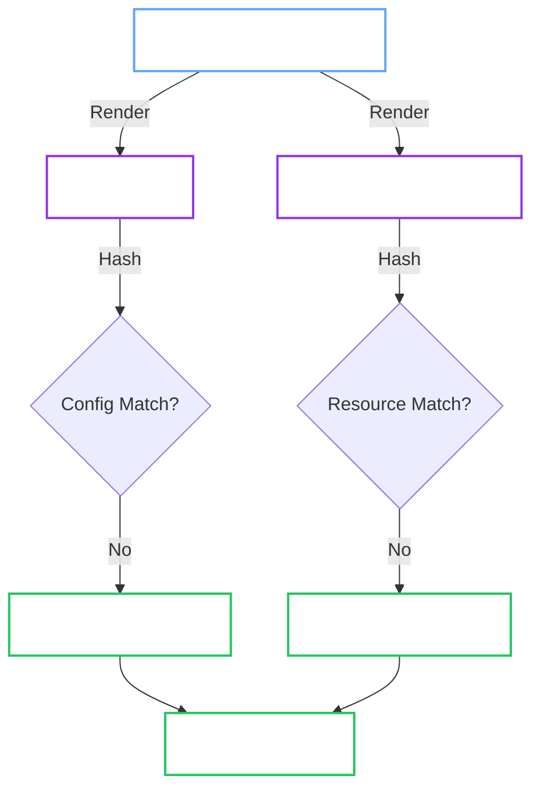
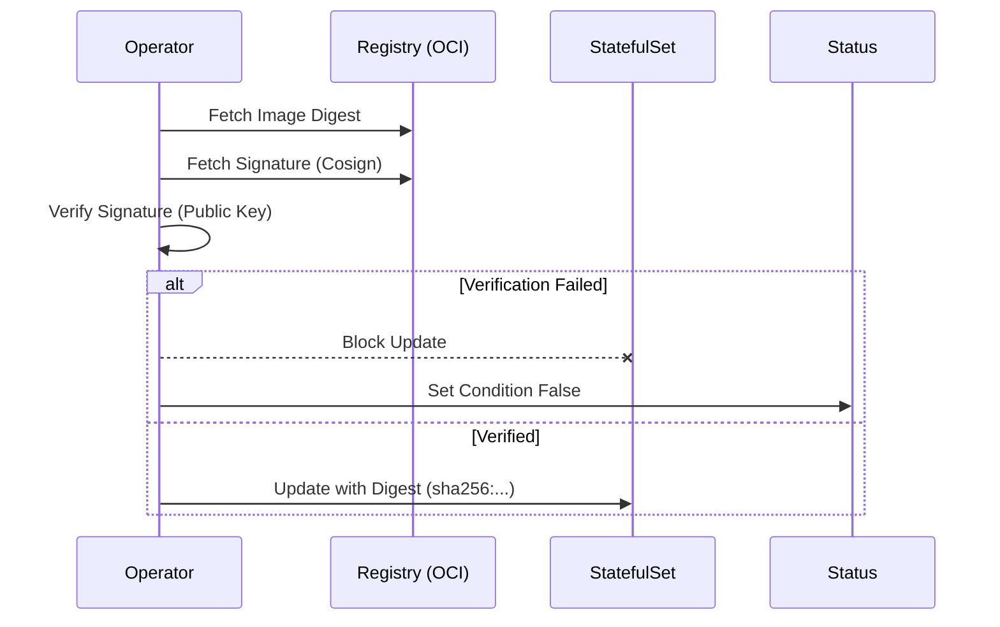

# InfrastructureManager (Config & StatefulSet)

**Responsibility:** The "Heart" of the operator. It translates the high-level `OpenBaoCluster` spec into a running `StatefulSet` with a valid `config.hcl`.

## 1. Reconciliation Pipeline

The Manager follows a strict **Render-Then-Apply** pipeline to ensure configuration consistency.



## 2. Configuration Generation

We do not use a static ConfigMap. We generate it dynamically from the Spec.

```hcl
ui = true

listener "tcp" {
  address = "0.0.0.0:8200"
  cluster_address = "0.0.0.0:8201"
  
  # Injected: Points to Secret mounts
  tls_cert_file = "/etc/bao/tls/tls.crt" # (1)!
  tls_key_file  = "/etc/bao/tls/tls.key"
}

storage "raft" {
  path = "/bao/data"
  node_id = "${HOSTNAME}"

  retry_join {
    # Injected: Discovery via Kubernetes Labels
    auto_join = "provider=k8s label_selector=\"openbao.org/cluster=prod-cluster\"" # (2)!
    leader_tls_servername = "openbao-cluster-prod-cluster.local"
  }
}

service_registration "kubernetes" {} # (3)!
```

1. Paths are automatically adjusted based on `spec.tls.mode` (e.g., ACME mode removes these).
2. Enables automatic peer discovery without manual `join` commands.
3. Ensures Pods register themselves as endpoints.

## 3. Auto-Unseal Integration

The Manager automatically configures the `seal` stanza based on `spec.unseal`.

=== "Static (Default)"

    If `spec.unseal` is omitted, the operator manages the unseal keys.

    1.  **Generate:** Creates 32 random bytes.
    2.  **Store:** Saves to `Secret/<cluster>-unseal-key`.
    3.  **Mount:** Mounts at `/etc/bao/unseal/key`.
    4.  **Config:**
        ```hcl
        seal "static" {
          current_key    = "file:///etc/bao/unseal/key"
          current_key_id = "operator-generated-v1"
        }
        ```

=== "External KMS"

    If `spec.unseal.type` is set (e.g., `awskms`, `gcpckms`), the operator delegates to the provider.

    1.  **No Secret:** Does NOT create an unseal key Secret.
    2.  **Mount Creds:** Mounts `spec.unseal.credentialsSecretRef` to `/etc/bao/seal-creds`.
    3.  **Config:** Renders the specific seal block:
        ```hcl
        seal "awskms" {
          region     = "us-east-1"
          kms_key_id = "alias/my-key"
        }
        ```

## 4. Image Verification (Cosign)

When `spec.imageVerification.enabled` is `true`, we enforce supply chain security.



| Policy | Behavior |
| :--- | :--- |
| `Block` (Default) | **Stops** reconciliation. No unsafe image runs. |
| `Warn` | Logs error, emits Event, but **Allows** the update. |

## 5. Reconciliation Semantics

- **OwnerReferences**: All resources (ConfigMaps, Services, StatefulSets) are owned by the `OpenBaoCluster` CR. Deleting the CR deletes the cluster.
- **Least Privilege**: The controller only watches `OpenBaoCluster`. It does not watch child resources (except via OwnerReference garbage collection) to reduce API load.
- **Discovery**: Uses `leader_tls_servername` to support strict mTLS verification between peers.
