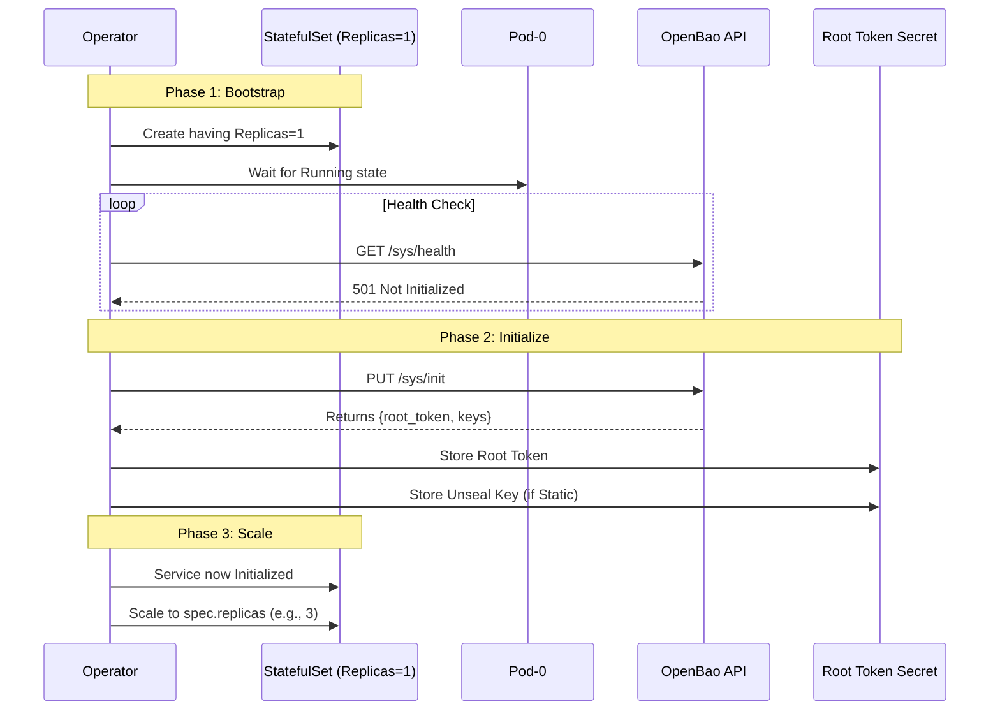

# InitManager (Cluster Initialization)

!!! abstract "Responsibility"
    Automate the "Day 1" bootstrap of a new cluster.

To avoid split-brain scenarios during initial formation, the Operator enforces a **Single-Pod Bootstrap** pattern.

## 1. Workflow

The InitManager coordinates the first start of the cluster.



## 2. Execution Phases

=== "Phase 1: Bootstrap"

    **Goal:** Start a single, stable node.
    
    Regardless of `spec.replicas`, a new cluster **always starts with 1 replica**.

    -   **Why?** Raft requires a stable leader to form a cluster. Starting 3 uninitialized nodes simultaneously can lead to race conditions on who becomes the first leader.
    -   **Mechanism:** The InfrastructureManager caps `replicas: 1` as long as `status.initialized` is `false`.

=== "Phase 2: Initialize"

    **Goal:** Bootstrap the Raft cluster and generate root material.

    Once `pod-0` is running, the InitManager takes over:

    1.  **Detection:** Checks internal status. If it finds `openbao-initialized=true` label or receives `200 OK` from `/sys/health`, it assumes adoption of an existing cluster and skips to Phase 3.
    2.  **Execution:** If uninitialized, it calls `sys/init`.
    3.  **Security:**
        -   The Root Token is **encrypted** and stored immediately in a Secret.
        -   The Unseal Key (if using Static mode) is stored in a separate Secret.
        -   !!! warning "Security"
            The initialization response is held in memory only for the duration of the request and is **NEVER logged**.

=== "Phase 3: Scale Up"

    **Goal:** Expand to High Availability.

    Once initialization is confirmed (and the root token is safely stored):

    1.  The Operator sets `status.initialized = true`.
    2.  The InfrastructureManager observes this and updates the StatefulSet to the full `spec.replicas`.
    3.  New pods join the existing leader (Pod-0) via the `retry_join` configuration.

---

## 3. Reconciliation Semantics

- **One-Time Operation:** The InitManager is designed to be **idempotent** but typically runs only once in the cluster's lifecycle.
- **Failure Handling:** If `sys/init` fails (network, timeout), the operator retries. The cluster remains at `replicas: 1` until success.
- **Adoption:** You can bring an existing OpenBao cluster under management. If the operator detects it is already initialized, it simply adopts it and moves to Scale Up.

---

## 4. Autopilot Configuration

After successful initialization, the InitManager configures **Raft Autopilot** for automatic dead server cleanup.

!!! note "Always-On Feature"
    Autopilot dead server cleanup is **enabled by default** for all clusters. This prevents orphaned Raft peers from accumulating when pods are terminated.

### Default Configuration

| Setting | Default Value | Description |
| :--- | :--- | :--- |
| `cleanup_dead_servers` | `true` | Enable automatic removal of failed peers |
| `dead_server_last_contact_threshold` | `5m` | Time before a server is considered dead |
| `min_quorum` | `max(3, replicas/2+1)` | Minimum servers before pruning allowed |

### Customization

Override defaults via `spec.configuration.raft.autopilot`:

```yaml
spec:
  configuration:
    raft:
      autopilot:
        cleanupDeadServers: true
        deadServerLastContactThreshold: "5m"
        minQuorum: 2
```

### Disabling Autopilot Cleanup

To disable automatic dead server cleanup:

```yaml
spec:
  configuration:
    raft:
      autopilot:
        cleanupDeadServers: false
```

!!! warning "Manual Cleanup Required"
    When disabled, you must manually remove dead Raft peers via `bao operator raft remove-peer`.
