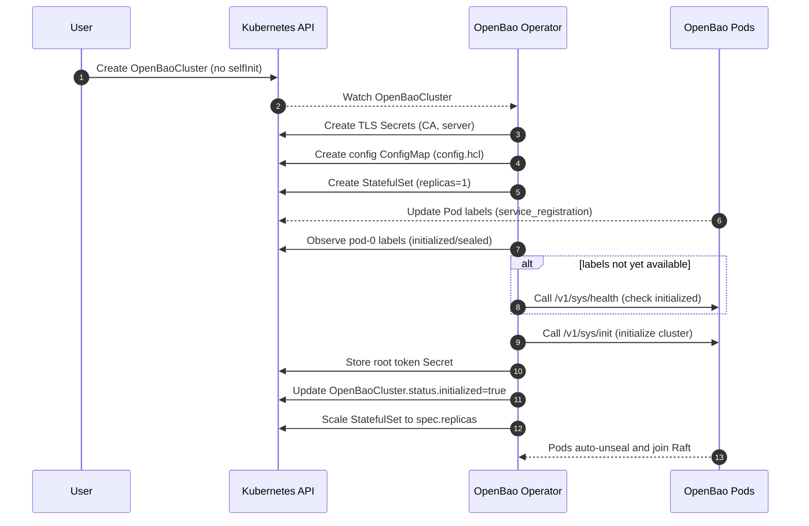
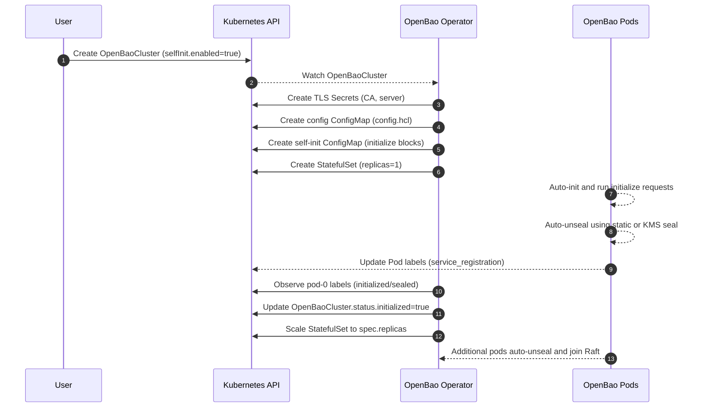
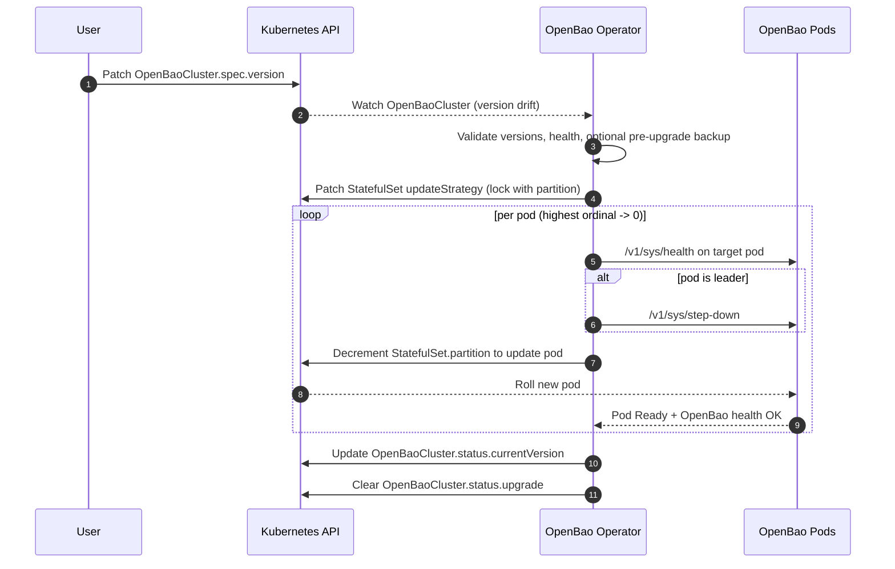
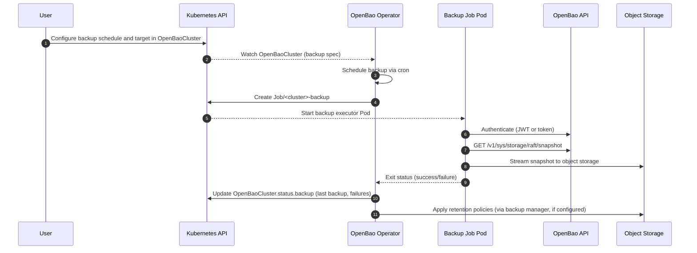

# Key Flows (Day 0, Day 2, Day N)

These flows describe manager-level responsibilities; in code, `OpenBaoCluster` reconciliation is split across `openbaocluster-workload` (certs/infra/init), `openbaocluster-adminops` (upgrade/backup), and `openbaocluster-status` (conditions/finalizers).

## 1. Cluster Creation (Day 0) - Standard Initialization

1. User creates an `OpenBaoCluster` CR in a namespace (without `spec.selfInit`).
2. Cert Manager (workload controller) bootstraps PKI (CA + leaf certs).
3. If image verification is enabled (`spec.imageVerification.enabled`), the operator verifies the container image signature using Cosign before proceeding.
4. Infrastructure Manager (workload controller) ensures a per-cluster auto-unseal configuration:
   - If `spec.unseal` is omitted or `spec.unseal.type` is `"static"`, creates a static auto-unseal key Secret (`<cluster>-unseal-key`) if missing.
   - If `spec.unseal.type` is an external KMS provider (`awskms`, `gcpckms`, `azurekeyvault`, `transit`), configures the seal with the provided options and credentials (if specified).
5. Infrastructure Manager renders `config.hcl` with TLS, Raft storage, `retry_join`, `service_registration "kubernetes"`, and the appropriate `seal` stanza (static or external KMS).
   - The Operator injects `BAO_K8S_NAMESPACE` into the OpenBao container environment so service registration can determine the Pod namespace.
6. Infrastructure Manager creates the StatefulSet with **1 replica initially** (regardless of `spec.replicas`), mounting TLS and unseal Secrets (if using static seal) or KMS credentials (if using external KMS).
7. Init Manager waits for pod-0 to be running, then:
   - Prefers Kubernetes service registration Pod labels (`openbao-initialized`, `openbao-sealed`) when available.
   - Falls back to the HTTP health endpoint (`GET /v1/sys/health`) when labels are not yet available.
   - If not, calls the HTTP initialization endpoint (`PUT /v1/sys/init`) against pod-0 to initialize the cluster.
   - Stores the root token in a per-cluster Secret (`<cluster>-root-token`).
   - Sets `Status.Initialized = true`.
8. Once initialized, Infrastructure Manager scales the StatefulSet to the desired `spec.replicas`.
9. Additional OpenBao pods start, auto-unseal using the static key, join the Raft cluster via `retry_join`, and become Ready.

### 1.1 Day 0 Sequence (Standard Initialization)

## 2. Cluster Creation (Day 0) - Self-Initialization

When `spec.selfInit.enabled = true`, the cluster uses OpenBao's native self-initialization feature:

1. User creates an `OpenBaoCluster` CR with `spec.selfInit` configured.
2. Cert Manager (workload controller) bootstraps PKI (CA + leaf certs).
3. If image verification is enabled, the operator verifies the container image signature before proceeding.
4. Infrastructure Manager (workload controller) ensures a per-cluster auto-unseal configuration (static seal by default, or external KMS if configured).
5. Infrastructure Manager renders `config.hcl` with TLS, Raft storage, `retry_join`, `service_registration "kubernetes"`, and the appropriate `seal` stanza.
   - The init container appends the self-init `initialize` stanzas (rendered from `spec.selfInit.requests[]`) to the rendered config for pod-0 only.
6. Infrastructure Manager creates the StatefulSet with **1 replica initially**.
7. OpenBao automatically initializes itself on first start using the `initialize` stanzas:
   - Auto-unseals using the static key.
   - Executes all configured `initialize` requests (audit, auth, secrets, policies).
   - **The root token is NOT returned and is automatically revoked after use.**
8. Init Manager detects initialization via Kubernetes service registration labels (preferred) and sets `Status.Initialized = true`.
9. Infrastructure Manager scales the StatefulSet to the desired `spec.replicas`.
10. Additional OpenBao pods start, auto-unseal, and join the Raft cluster.

**Note:** Self-initialization requires an auto-unseal mechanism (which the Operator provides via static auto-unseal by default, or external KMS if configured). No root token Secret is created when self-init is enabled.

**Note:** The static auto-unseal feature requires **OpenBao v2.4.0 or later**. Earlier versions do not support the `seal "static"` configuration. External KMS seals may have different version requirements depending on the provider.

### 2.1 Day 0 Sequence (Self-Initialization)

## 3. Cluster Operations / Upgrades (Day 2)

1. User configures upgrade executor:
   - Set `spec.upgrade.executorImage` (container image used by upgrade Jobs)
   - Set `spec.upgrade.jwtAuthRole` and configure the role in OpenBao (binds to `<cluster-name>-upgrade-serviceaccount`, automatically created by operator)
2. User updates `OpenBaoCluster.Spec.Version` and/or `Spec.Image`.
3. Upgrade Manager (adminops controller) detects version drift and performs pre-upgrade validation:
   - Validates semantic versioning (blocks downgrades by default).
   - Verifies all pods are Ready and quorum is healthy.
   - Optionally triggers a pre-upgrade backup if `spec.upgrade.preUpgradeSnapshot` is enabled.
4. Upgrade Manager orchestrates Raft-aware rolling updates:
   - Locks StatefulSet updates using partitioning.
   - Iterates pods in reverse ordinal order.
   - Runs an upgrade Job to perform leader step-down before updating the leader pod.
   - Waits for pod Ready, OpenBao health, and Raft sync after each update.
5. Upgrade progress is persisted in `Status.Upgrade`, allowing resumption after Operator restart.
6. On completion, `Status.CurrentVersion` is updated and `Status.Upgrade` is cleared.

### 3.1 Day 2 Sequence (Upgrade Flow)

**Note:** Upgrades are designed to be safe and resumable. Downgrades are blocked by default. If an upgrade fails, it halts and sets `Degraded=True`; automated rollback is not supported. Root tokens are not used for upgrade operations.

## 4. Maintenance / Manual Recovery

1. User sets `OpenBaoCluster.Spec.Paused = true` to enter maintenance mode.
2. All reconcilers for that cluster short-circuit and stop mutating resources, allowing manual actions (e.g., manual restore from snapshot).
3. If an upgrade was in progress, it is paused but state is preserved in `Status.Upgrade`.
4. After maintenance, user sets `Paused = false` to resume normal reconciliation (including any paused upgrade).

## 5. Backups (Day N)

1. User configures backup schedule (`spec.backup.schedule`) and target object storage in the `OpenBaoCluster` spec.
2. User configures authentication method:
   - **JWT Auth (Preferred):** Set `spec.backup.jwtAuthRole` and configure the role in OpenBao
   - **Static Token (Fallback):** For all clusters, set `spec.backup.tokenSecretRef` pointing to a backup token Secret (root tokens are not used)
3. Backup Manager (adminops controller) schedules backups using cron expressions (e.g., `"0 3 * * *"` for daily at 3 AM).
4. On schedule, Backup Manager:
   - Creates a Kubernetes Job with the backup executor container
   - Job uses `<cluster-name>-backup-serviceaccount` (automatically created by operator)
   - Backup executor:
     - Authenticates to OpenBao using JWT Auth (via projected ServiceAccount token) or static token
     - Discovers the current Raft leader via OpenBao API
     - Streams `GET /v1/sys/storage/raft/snapshot` directly to object storage (no disk buffering)
     - Names backups predictably: `<prefix>/<namespace>/<cluster>/<timestamp>-<uuid>.snap`
     - Verifies upload completion
5. Backup status is recorded in `Status.Backup`:
   - `LastBackupTime`, `NextScheduledBackup` for visibility
   - `ConsecutiveFailures` for alerting
6. Optional retention policies (`spec.backup.retention`) automatically delete old backups:
   - `MaxCount`: Keep only the N most recent backups
   - `MaxAge`: Delete backups older than a specified duration

**Note:** Backups are skipped during upgrades to avoid inconsistent snapshots. Backups are optional for all clusters. If backups are enabled, either `jwtAuthRole` or `tokenSecretRef` must be configured. Root tokens are not used for backup operations.

### 5.1 Day N Sequence (Backup Flow)

