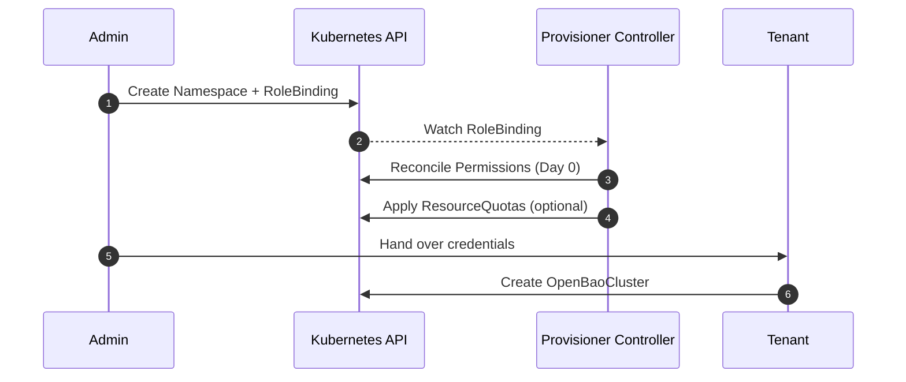

# Day 0: Tenant Provisioning

Day 0 operations focus on onboarding tenants and ensuring they have the necessary permissions and resources to manage their own OpenBao clusters. This phase uses the **Provisioner Controller**.

!!! tip "User Guide"
    For practical instructions on setting up tenants, see the [Tenant Onboarding Guide](../../user-guide/openbaotenant/onboarding.md) and [Multi-Tenancy Guide](../../user-guide/openbaotenant/multi-tenancy.md).

## 1. Namespace & RBAC Creation

- The cluster admin creates a `Provisioner` CR (or manually configures a Namespace with appropriate RoleBindings).
- The Provisioner Controller reconciles these resources, granting limited permissions to the tenant's ServiceAccount (e.g., ability to manage `OpenBaoCluster`, `Secret`, and `ConfigMap` within their namespace).

## 2. Resource Quotas

- Default `ResourceQuota` and `LimitRange` objects are applied to the tenant namespace to prevent noisy neighbor issues.
- These limits can be customized by setting `spec.quota` and `spec.limitRange` in the `OpenBaoTenant` CR.

## 3. Tenant Onboarding

- The tenant receives their authentication credentials (e.g., Kubeconfig limited to their namespace).
- The tenant verifies access by listing resources in their namespace.

## Sequence Diagram

