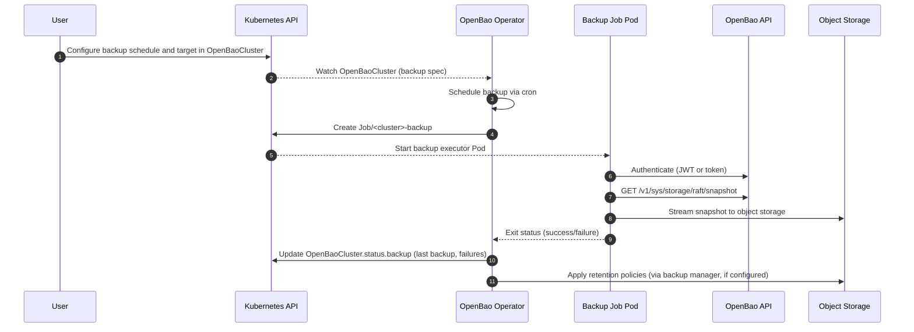

# Day N: Backups & Disaster Recovery

Day N operations ensure data durability through regular backups and disaster recovery procedures.

!!! tip "User Guide"
    See [Backups](../../user-guide/openbaocluster/operations/backups.md) and [Restore](../../user-guide/openbaorestore/restore.md) for configuration examples.

## Backups

1. User configures backup schedule (`spec.backup.schedule`) and target object storage in the `OpenBaoCluster` spec. Supported providers:
   - **S3**: AWS S3 or S3-compatible storage (MinIO, Ceph, etc.)
   - **GCS**: Google Cloud Storage
   - **Azure**: Azure Blob Storage
2. User configures authentication method:
   - **JWT Auth (Preferred):** Automatically configured via `spec.selfInit.oidc.enabled` (or manually via `spec.backup.jwtAuthRole`)
   - **Static Token (Fallback):** For clusters without OIDC, set `spec.backup.tokenSecretRef` pointing to a backup token Secret
3. Backup Manager (adminops controller) schedules backups using cron expressions (e.g., `"0 3 * * *"` for daily at 3 AM).
4. On schedule, Backup Manager:
   - Creates a Kubernetes Job with the backup executor container
   - Job uses `<cluster-name>-backup-serviceaccount` (automatically created by operator)
   - Backup executor:
     - Authenticates to OpenBao using JWT Auth (via projected ServiceAccount token) or static token
     - Discovers the current Raft leader via OpenBao API
     - Streams `GET /v1/sys/storage/raft/snapshot` directly to object storage (no disk buffering)
     - Names backups predictably: `<prefix>/<namespace>/<cluster>/<timestamp>-<uuid>.snap`
     - Verifies upload completion
5. Backup status is recorded in `status.backup`:
   - `lastBackupTime`, `nextScheduledBackup` for visibility
   - `consecutiveFailures` for alerting
6. Optional retention policies (`spec.backup.retention`) automatically delete old backups:
   - `maxCount`: Keep only the N most recent backups
   - `maxAge`: Delete backups older than a specified duration

!!! warning "Backup Limitations"
    Backups are skipped during upgrades to avoid inconsistent snapshots. Backups are optional for all clusters. If backups are enabled, either `jwtAuthRole` or `tokenSecretRef` must be configured. Root tokens are not used for backup operations.

### Sequence Diagram

