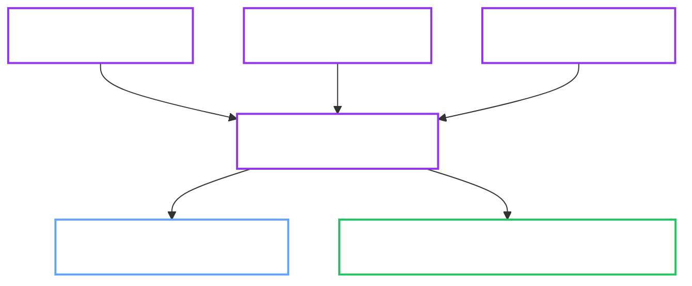

# Operation Lifecycle Coordination

`internal/service/opslifecycle` provides shared service-layer primitives for long-running operations. It does not own a single controller or CRD. Instead, it gives backup, restore, and upgrade flows a consistent model for operation locks, requeue timing, and phase-transition audit logging.

## 1. Architectural Placement

Operation lifecycle coordination sits in the service layer and is used by multiple domain managers:

- `internal/service/backup`
- `internal/service/restore`
- `internal/service/upgrade`

It wraps the concrete lock adapter in `internal/adapter/operationlock`, so controllers and app packages do not need to duplicate operation-lock semantics.

## 2. Responsibilities

The package centralizes three concerns:

- **Lock ownership:** Acquire, renew, and release `OpenBaoCluster.status.operationLock`.
- **Retry intent:** Map lock contention and progress polling to consistent requeue delays.
- **Phase audit logging:** Emit consistent audit fields when long-running operations change phase.

## 3. Coordination Model

## 4. Shared Primitives

| Primitive | Purpose |
| :--- | :--- |
| `OperationLock` | Describes the expected lock identity for an operation. |
| `Acquire` / `Release` | Wrap lock adapter behavior for status-based lock ownership. |
| `RetryClass` / `RequeueDelay` | Keep lock-contention and progress-poll retries consistent across managers. |
| `LogPhaseTransition` | Emit stable audit fields for phase changes. |

## 5. Design Intent

!!! note "Why This Exists"
    Operation coordination belongs in the service layer so backup, restore, and upgrade flows share the same safety model without recreating lock and retry logic inside each controller.

This keeps long-running operations consistent:

- Only one disruptive cluster operation should own the lock at a time.
- Lock contention should requeue predictably rather than fail noisily.
- Phase changes should produce comparable audit events across managers.

## 6. See Also

- [Backup Manager](backup-manager.md)
- [Restore Manager](restore-manager.md)
- [Upgrade Manager](upgrade-manager.md)
