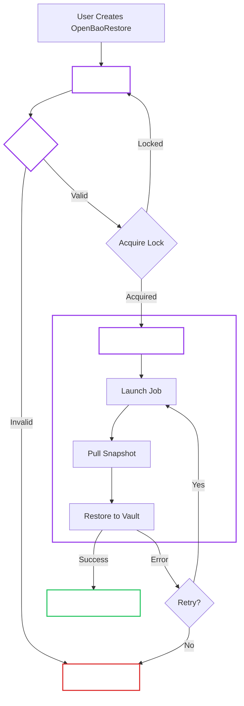

# OpenBaoRestore Controller (Restore Lifecycle)

!!! abstract "Responsibility"
    Reconcile `OpenBaoRestore` resources and orchestrate snapshot restores via a Kubernetes Job.

!!! tip "User Guide"
    For operational instructions, see the [Restore User Guide](../user-guide/openbaorestore/restore.md).

## 1. Design Philosophy

- **CRD-Based**: Restores are modeled as `OpenBaoRestore` objects, not as a mode of `OpenBaoCluster`. This ensures GitOps stability and provides an audit log of restore operations.
- **Stateless Controller**: The controller polls the restore Job rather than watching it, minimizing RBAC requirements.
- **Safety First**: Restores use a distinct **Operation Lock** to prevent conflicts with Backups or Upgrades.

## 2. Restore Lifecycle

The controller drives the `OpenBaoRestore` through a defined phase machine.

## 3. Workflow Steps

1. **Validation:**
    - Target Cluster exists.
    - Snapshot source is accessible.
    - No conflicting operations (unless `spec.force` is used).
2. **Operation Lock:**
    - The controller sets `OpenBaoCluster.status.operationLock = "Restore"`.
    - This **blocks** the BackupManager and UpgradeManager from starting new operations.
3. **Execution:**
    - A Kubernetes Job is spawned with the `bao-backup` binary in restore mode.
    - It downloads the snapshot from object storage (S3, GCS, or Azure).
    - It uses a temporary token (or valid credentials) to authenticate and hit the `sys/storage/raft/snapshot-force` endpoint.
4. **Completion:**
    - On success, the lock is released.
    - The cluster may need to be unsealed manually or via auto-unseal.

## 4. Interaction with Other Managers

!!! note "Conflict Prevention"
    The **Operation Lock** is the primary mechanism for safety.

    -   **Backups:** Will skip scheduled runs if a Restore is locked.
    -   **Upgrades:** Will pause reconciliation if a Restore is locked.

To override this check during emergencies (e.g., restoring a broken cluster where the lock is stuck), use `spec.overrideOperationLock`.

## 5. See Also

- [Backup Manager](backup-manager.md)
- [Lifecycle Flows](lifecycle/index.md)
