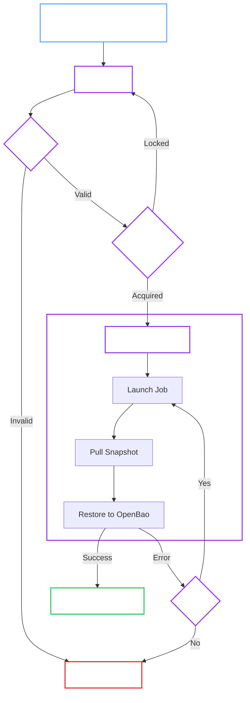

# Restore Manager (OpenBaoRestore Lifecycle)

!!! abstract "Responsibility"
    Reconcile `OpenBaoRestore` resources and orchestrate snapshot restores via a Kubernetes Job.

!!! tip "User Guide"
    For operational instructions, see the [Restore User Guide](../user-guide/openbaorestore/restore.md).

## 1. Architectural Placement

Restore orchestration follows a dedicated controller path:

1. `internal/controller/openbaorestore` receives the reconcile event.
2. It delegates orchestration to `internal/app/openbaorestore`.
3. The app layer invokes `internal/restore` manager logic for validation, lock lifecycle, and Job flow.

This keeps the restore controller focused on reconcile plumbing and preserves domain ownership in the restore manager package.

## 2. Design Philosophy

- **CRD-Based**: Restores are modeled as `OpenBaoRestore` objects, not as a mode of `OpenBaoCluster`. This ensures GitOps stability and provides an audit log of restore operations.
- **Immutable Request**: `OpenBaoRestore.spec` is immutable after creation. To change inputs, create a new restore object.
- **Stateless Controller**: The controller polls the restore Job rather than watching it, minimizing RBAC requirements.
- **Safety First**: Restores use a distinct **Operation Lock** to prevent conflicts with Backups or Upgrades.

## 3. Restore Lifecycle

The controller drives the `OpenBaoRestore` through a defined phase machine.

```mermaid
graph TD
    Start[User Creates OpenBaoRestore] --> Pending
    
    Pending --> Validating{Validate}
    Validating -- Invalid --> Failed[Phase: Failed]
    Validating -- Valid --> Lock{Acquire Lock}
    
    Lock -- Locked --> Pending
    Lock -- Acquired --> Running[Phase: Running]
    
    subgraph Execution [Restore Job]
        Running --> Job[Launch Job]
        Job --> Pull[Pull Snapshot]
        Pull --> Restore[Restore to OpenBao]
    end
    
    Restore -- Success --> Completed[Phase: Completed]
    Restore -- Error --> Retrying{Retry?}
    
    Retrying -- Yes --> Job
    Retrying -- No --> Failed

    classDef read fill:transparent,stroke:#60a5fa,stroke-width:2px,color:#fff;
    classDef write fill:transparent,stroke:#22c55e,stroke-width:2px,color:#fff;
    classDef security fill:transparent,stroke:#dc2626,stroke-width:2px,color:#fff;
    classDef process fill:transparent,stroke:#9333ea,stroke-width:2px,color:#fff;
    
    class Start read;
    class Pending,Validating,Lock,Running,Execution,Retrying process;
    class Completed write;
    class Failed security;
```

## 4. Workflow Steps

1. **Validation:**
    - Target Cluster exists.
    - Snapshot source is accessible.
    - Authentication is configured (`tokenSecretRef` or JWT auth; when self-init OIDC is enabled, JWT can use the default `openbao-operator-restore` role).
    - No conflicting operations (unless `OpenBaoRestore.spec.overrideOperationLock` is used with `OpenBaoRestore.spec.force: true`).
2. **Operation Lock:**
    - The controller acquires the cluster operation lock by updating `OpenBaoCluster.status.operationLock`:
      - `operation: Restore`
      - `holder: <controller>/<restore-name>`
      - `message: restore <namespace>/<name>`
    - This **blocks** the BackupManager and UpgradeManager from starting new operations.
3. **Execution:**
    - A Kubernetes Job is spawned with the `bao-backup` binary in restore mode.
    - It downloads the snapshot from object storage (S3, GCS, or Azure).
    - It uses a temporary token (or valid credentials) to authenticate and hit the `sys/storage/raft/snapshot-force` endpoint.
4. **Completion:**
    - On success or failure, the controller attempts to release the cluster operation lock.
    - Terminal restores (`Completed`/`Failed`) re-run lock cleanup on subsequent reconciles until release succeeds.
    - The cluster may need to be unsealed manually or via auto-unseal.

## 5. Interaction with Other Managers

!!! note "Conflict Prevention"
    The **Operation Lock** is the primary mechanism for safety.

    -   **Backups:** Will skip scheduled runs if a Restore is locked.
    -   **Upgrades:** Will pause reconciliation if a Restore is locked.

To override this check during emergencies (e.g., restoring a broken cluster where the lock is stuck), use `OpenBaoRestore.spec.overrideOperationLock`.
This requires `OpenBaoRestore.spec.force: true`.

## 6. See Also

- [Backup Manager](backup-manager.md)
- [Lifecycle Flows](lifecycle/index.md)
