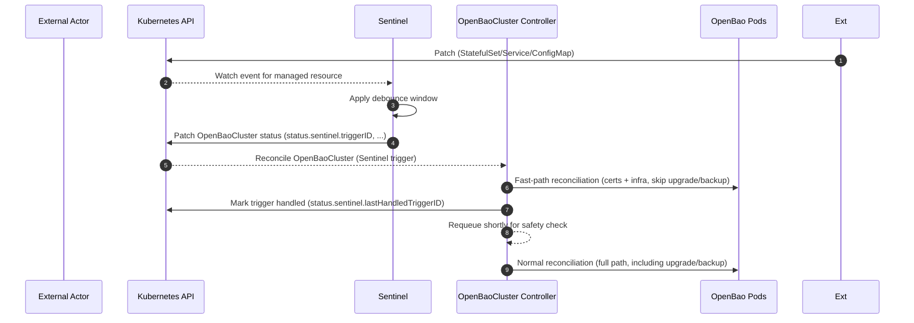

# Sentinel Drift Detection (Day N)

The Sentinel is an optional per-cluster drift detector that provides high-availability drift detection and fast-path reconciliation. When enabled via `spec.sentinel.enabled`, the operator deploys a lightweight Deployment that watches for unauthorized changes to managed infrastructure resources.

## How It Works

1. **Deployment:** The operator creates a Sentinel Deployment in the cluster namespace with a single replica (stateless).
2. **Watching:** The Sentinel watches StatefulSets, Services, and ConfigMaps that are labeled with `app.kubernetes.io/managed-by=openbao-operator` and `app.kubernetes.io/instance=<cluster-name>`.
3. **Actor Filtering:** The Sentinel ignores changes made by the operator itself by inspecting `managedFields` to prevent infinite loops.
4. **Debouncing:** Multiple drift events within a configurable window (default: 2 seconds) are coalesced into a single trigger to prevent "thundering herd" scenarios.
5. **Scope:** The Sentinel does not have access to Secrets. Drift on unseal keys or root tokens is detected indirectly via OpenBao health and status, not by inspecting Secret data.
6. **Trigger:** When drift is detected, the Sentinel patches `OpenBaoCluster` **status** (`status.sentinel.triggerID`, plus optional `triggerResource/triggeredAt`).
7. **Fast Path:** The workload controller (`openbaocluster-workload`) detects the trigger in `status.sentinel.triggerID` and enters "fast path" mode, skipping admin operations (upgrades/backups) to quickly correct the drift.
8. **Follow-up:** After successful drift correction, the workload controller marks the trigger as handled (`status.sentinel.lastHandledTriggerID`). The adminops controller (`openbaocluster-adminops`) observes this and runs a full-path reconcile (including upgrades/backups) and periodically forces full reconciles after repeated fast paths to avoid starving admin operations.

### Drift Detection Sequence

## Security Model

- The Sentinel has read-only access to infrastructure resources and limited patch access to `OpenBaoCluster` **status**.
- A ValidatingAdmissionPolicy (VAP) enforces that the Sentinel can only modify `status.sentinel` trigger fields; all other mutations (Spec, metadata, and other status fields) are blocked at the API server level.
- This mathematically prevents privilege escalation even if the Sentinel binary is compromised.

## Configuration

- `spec.sentinel.enabled`: Enable/disable Sentinel (default: `true` when `spec.sentinel` is set).
- `spec.sentinel.image`: Override the Sentinel container image (defaults to `ghcr.io/dc-tec/openbao-operator-sentinel:<operator-version>`).
- `spec.sentinel.resources`: Configure resource limits (defaults: 64Mi memory, 100m CPU requests; 128Mi memory, 200m CPU limits).
- `spec.sentinel.debounceWindowSeconds`: Configure debounce window (default: 2 seconds, range: 1-60).

**Note:** The Sentinel is designed to be a lightweight, stateless component. It does not store state and can be safely restarted or recreated without affecting cluster operation.
