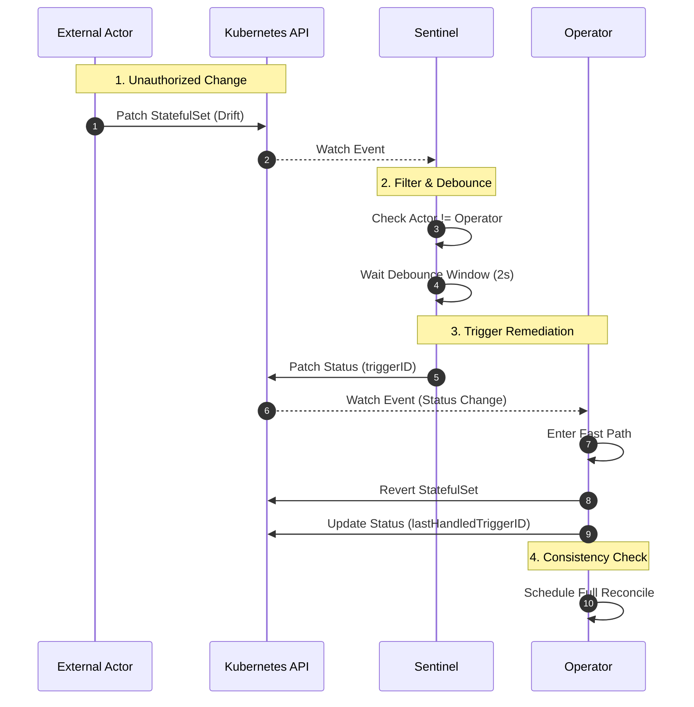

# Sentinel Architecture

The Sentinel provides a specialized high-availability loop for detecting infrastructure drift (Day 2 operations).

## Design Principles

1. **Fast Feedback**: Detects changes in seconds, unlike the standard 10h resync period.
2. **Safety First**: Cannot modify Spec or Secrets. Relies on the Operator for actual remediation.
3. **Low Impact**: Fast-path reconciliation skips expensive checks (upgrades, backups) to restore service validity execution quickly.

## Sequence Diagram

The following diagram illustrates the interaction between an External Actor, the Sentinel, and the Operator.

## Security Model

Sentinel operates under a strict **Zero Trust** model enforced by Kubernetes primitives.

| Component | Policy | Effect |
| :--- | :--- | :--- |
| **RBAC** | `Role` / `RoleBinding` | Read-only access to Infra. No Secret access. |
| **VAP** | `ValidatingAdmissionPolicy` | Blocks all mutations except `status.sentinel.*`. |
| **Logic** | Code Level | Ignores own updates via `managedFields`. |

## Fast Path Logic

When the Operator observes a Sentinel trigger:

1. **Verify**: Checks `status.sentinel.triggerID`.
2. **Fast Path**:
    - Runs `InfraManager` (StatefulSet, Service, ConfigMap).
    - Runs `CertManager` (TLS validity).
    - **Skips** `UpgradeManager` (Rolling/BlueGreen logic).
    - **Skips** `BackupManager` (Snapshot logic).
3. **Acknowledge**: Updates `status.sentinel.lastHandledTriggerID`.
4. **Requeue**: Enqueues a full reconciliation (standard path) to ensure system convergence.
