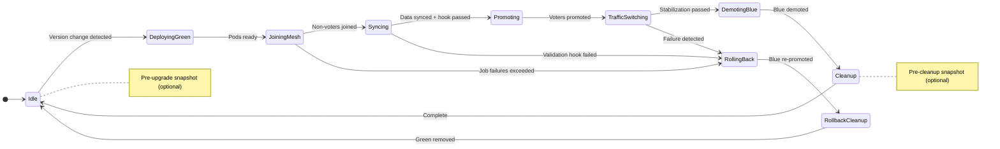

# UpgradeManager (Rolling & Blue/Green)

**Responsibility:** Safe rolling updates with Raft-aware leader handling.

## Rolling Update Strategy (Default)

The UpgradeManager uses **StatefulSet Partitioning** to control exactly which Pods are updated by Kubernetes, rather than letting Kubernetes update them all at once.

If image verification is enabled (`spec.imageVerification.enabled`), the operator verifies and pins upgrade executor Jobs to the verified digest for `spec.upgrade.executorImage`.

### The Algorithm

1. **Trigger:** User changes `Spec.Version` to `2.1.0`. `Status.CurrentVersion` is `2.0.0`.
2. **Set Strategy:** Operator patches StatefulSet `updateStrategy` to `RollingUpdate` with `partition: <replicas>`. (This pauses K8s updates).
3. **Identify Leader:** Operator prefers OpenBao's Kubernetes service registration label `openbao-active=true` to identify the leader pod (falls back to `GET /v1/sys/health` if labels are unavailable).
   - *Result:* Pod-0 (Follower), Pod-1 (Leader), Pod-2 (Follower).
4. **Update Followers (Reverse Ordinal):**
   - Operator decrements partition to `2`. Pod-2 updates.
   - Operator waits for Pod-2 `Ready` check + OpenBao Health check.
   - **The Step-Down:** We cannot skip indices in a StatefulSet. Therefore, we must force a step-down BEFORE the update reaches the leader's index.
   - Target: Pod-1. Is it Leader? **Yes.**
   - **Action:** Send `PUT /v1/sys/step-down` to Pod-1. Wait for leadership to transfer to Pod-0 or Pod-2.
   - Once Pod-1 is a follower, decrement partition to allow K8s to update Pod-1.
   - Repeat for Pod-0.

### Pod-by-Pod Update (Reverse Ordinal)

For each pod from highest ordinal to 0:

| Step | Description | Timeout |
|------|-------------|---------|
| Check Leadership | Prefer `openbao-active=true` label, fallback to health API | - |
| Step-Down (if leader) | `PUT /v1/sys/step-down` and wait for transfer | 30s |
| Allow Pod Update | Decrement partition | - |
| Wait for Pod Ready | Pod reaches `Ready` state | 5 min |
| Wait for Health | `initialized: true` AND `sealed: false` | 2 min |
| Wait for Raft Sync | Pod within acceptable lag (100 entries) | 2 min |
| Record Progress | Add to `Status.Upgrade.CompletedPods` | - |

### Upgrade State Machine

1. **Detect Drift:** `Spec.Version` != `Status.CurrentVersion` AND `Status.Upgrade == nil`.
2. **Pre-upgrade Snapshot:** If `spec.backup.preUpgradeSnapshot == true`, trigger a backup and wait for completion.
3. **Initialize Upgrade State:** Create `Status.Upgrade`, set `Status.Phase = Upgrading`, set `Upgrading=True` condition.
4. **Lock StatefulSet:** Patch `updateStrategy.rollingUpdate.partition` to `Replicas`.
5. **Update Pods:** Execute pod-by-pod update.
6. **Finalization:** Update `Status.CurrentVersion`, clear `Status.Upgrade`, set `Status.Phase = Running`.

### Resumability

Upgrades are designed to survive Operator restarts:

- All upgrade state is stored in `Status.Upgrade`.
- On Operator restart, if `Status.Upgrade != nil`:
  1. Verify upgrade is still needed (`Spec.Version == Status.Upgrade.TargetVersion`).
  2. If user changed `Spec.Version` mid-upgrade, clear `Status.Upgrade` and start fresh.
  3. Otherwise, resume from `Status.Upgrade.CurrentPartition`.
  4. Re-verify health of already-upgraded pods before continuing.

---

## Blue/Green Upgrade Strategy

When `spec.updateStrategy.type` is `BlueGreen`, the operator uses a parallel cluster upgrade approach instead of rolling updates.

If image verification is enabled (`spec.imageVerification.enabled`), the operator verifies and pins the Green StatefulSet image (and its init container image, when configured) to verified digests.

### Architecture

The Blue/Green strategy is implemented in the `internal/upgrade/bluegreen/` subpackage:

- `manager.go` - Main upgrade orchestrator (`bluegreen.Manager`)
- `actions.go` - Executor action constants (including rollback actions)
- `job.go` - Upgrade executor Job creation

### 10-Phase State Machine

| Phase | Description |
|-------|-------------|
| **Idle** | No upgrade in progress. Pre-upgrade snapshot created if configured. |
| **DeployingGreen** | Creates Green StatefulSet with new version, waits for all pods to be running, ready, and unsealed |
| **JoiningMesh** | Runs executor Job to join Green pods to Raft as non-voters |
| **Syncing** | Runs executor Job to verify Green pods have replicated data, runs pre-promotion validation hook if configured |
| **Promoting** | Runs executor Job to promote Green pods to voters |
| **TrafficSwitching** | Service selectors point to Green, stabilization period monitors health |
| **DemotingBlue** | Runs executor Job to demote Blue pods to non-voters, verifies Green leader election |
| **Cleanup** | Pre-cleanup snapshot created if configured. Runs executor Job to remove Blue peers from Raft, deletes Blue StatefulSet |
| **RollingBack** | Triggered on failure. Re-promotes Blue voters, demotes Green non-voters |
| **RollbackCleanup** | Removes Green peers from Raft, deletes Green StatefulSet |

### Key Design Decisions

1. **Revision-based naming**: StatefulSets are named `<cluster>-<revision>` where revision is a hash of version+image+replicas.
2. **Shared headless service**: Blue and Green StatefulSets share the same headless service for Raft discovery.
3. **Executor Jobs**: Long-running Raft operations run in isolated Jobs to avoid blocking the controller.
4. **Automatic rollback**: Configurable via `autoRollback` with triggers for job failures, validation failures, and traffic failures.
5. **Pre-upgrade/Pre-cleanup snapshots**: Optional backup jobs created before upgrade starts and before Blue removal.

### Upgrade Executor Jobs

Each phase transition that requires Raft operations creates an upgrade executor Job:

| Action | Description |
|--------|-------------|
| `ActionJoinGreenNonVoters` | Adds Green pods as Raft non-voters |
| `ActionWaitGreenSynced` | Verifies replication is complete |
| `ActionPromoteGreenVoters` | Promotes Green pods to Raft voters |
| `ActionDemoteBlueNonVotersStepDown` | Demotes Blue pods, triggers leader step-down |
| `ActionRemoveBluePeers` | Removes Blue pods from Raft peer list |
| `ActionPromoteBlueVoters` | (Rollback) Re-promotes Blue pods to voters |
| `ActionDemoteGreenNonVoters` | (Rollback) Demotes Green pods |
| `ActionRemoveGreenPeers` | (Rollback) Removes Green pods from Raft |

### Reconciliation Semantics

- All state is stored in `Status.BlueGreen` for resumability, including `JobFailureCount`, `RollbackReason`, and snapshot job names.
- Phase transitions are idempotent; re-running returns the same result.
- The manager requeues (returns `true`) when waiting for external state changes.
- Executor Jobs are owned by the OpenBaoCluster for automatic cleanup.

See also: [Upgrades User Guide](../user-guide/upgrades.md)
