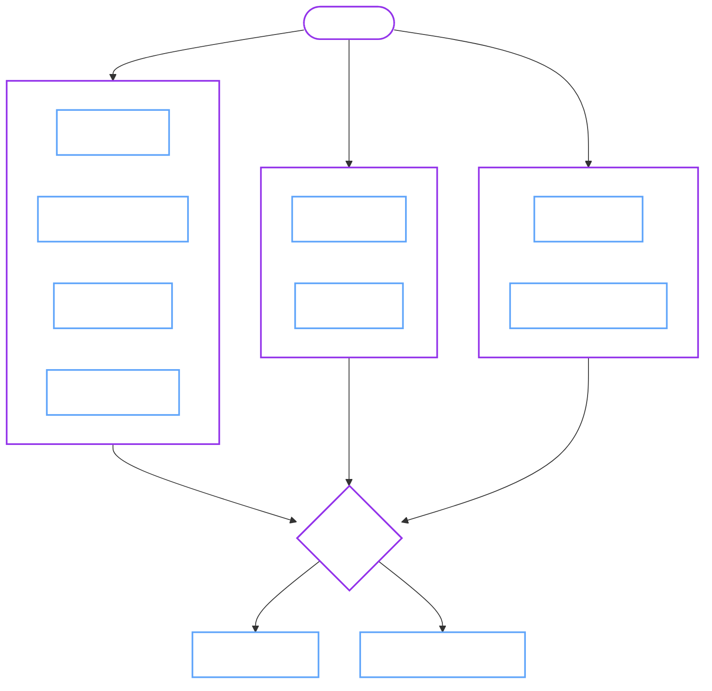

# Continuous Integration

We use GitHub Actions for all CI checks. The pipeline is designed to be deterministic and reproducible locally.

## 1. CI Pipeline

The pipeline runs on every PR and `main` push.



## 2. CI vs Local Commands ("The Rosetta Stone")

Run these locally to debug CI failures.

| CI Job | Local Command | Description |
| :--- | :--- | :--- |
| **Lint Check** | `make lint` | Runs `golangci-lint` |
| **Formatting** | `make verify-fmt` | Checks `gofmt` compliance |
| **Dependencies** | `make verify-tidy` | Ensures `go.mod` is clean |
| **Generators** | `make verify-generated` | Checks for drift in CRDs/RBAC |
| **Helm Sync** | `make verify-helm` | Checks drift in `charts/` (including values/schema validation) |
| **Unit Tests** | `make test-ci` | Runs unit + integration tests |
| **Compatibility** | `make verify-openbao-config-compat` | Checks HCL against upstream OpenBao |

## 3. End-to-End Testing

We use [Kind](https://kind.sigs.k8s.io/) for E2E tests.

### Prerequisites

- [x] Docker running
- [x] `kubectl` installed
- [x] 4 CPU / 8GB RAM recommended

### Running Tests

=== ":material-rocket-launch: Smoke Test (Fast)"
    Runs a subset of critical tests. Best for quick feedback.

    ```sh
    make test-e2e-ci \
      KIND_NODE_IMAGE=kindest/node:v1.34.3 \
      E2E_LABEL_FILTER=smoke \
      E2E_PARALLEL_NODES=1
    ```

=== ":material-flask: Full Suite (Thorough)"
    Runs the entire test matrix (Upgrade, Backup, Restore, etc).

    ```sh
    make test-e2e-ci KIND_NODE_IMAGE=kindest/node:v1.34.3
    ```

=== ":material-bug: Debug Mode"
    Keeps the cluster alive after failure for inspection.

    ```sh
    make test-e2e-ci E2E_SKIP_CLEANUP=true
    ```

## 4. Security Checks

We run vulnerability scanning on every PR.

=== "Govulncheck"
    Detects known vulnerabilities in Go dependencies.

    ```sh
    go install golang.org/x/vuln/cmd/govulncheck@latest
    govulncheck -test ./...
    ```

=== "Trivy"
    Scans the operator image for OS vulnerabilities.

    ```sh
    make security-scan IMG=ghcr.io/dc-tec/openbao-operator:latest
    ```

    !!! note "Expected RBAC findings (skipped in Trivy FS)"
        Trivy's Kubernetes misconfiguration rules flag several **intentionally privileged** RBAC manifests/templates
        (e.g. tenant template roles, single-tenant mode, and provisioner cleanup permissions).
        We skip these specific files in CI and in `make security-scan` using Trivy's `--skip-files` flags.

        If you modify RBAC under `config/rbac/`, `dist/install.yaml`, or the chart RBAC templates, and Trivy starts failing,
        update the skip list in:

        - `.github/workflows/ci.yml` (Trivy FS step)
        - `.github/workflows/nightly.yml` (Trivy FS step)
        - `Makefile` (`security-scan` target)

## 5. Documentation Build

Docs are built with MkDocs and Material.

```sh
# Local preview
make docs-serve

# Build distribution (checks internal links)
make docs-build
```

!!! tip "Preview Deployment"
    Every PR deploys a temporary preview environment URL directly in the GitHub comment.
