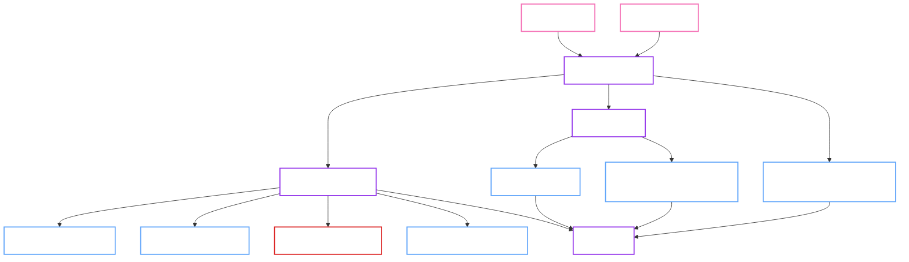
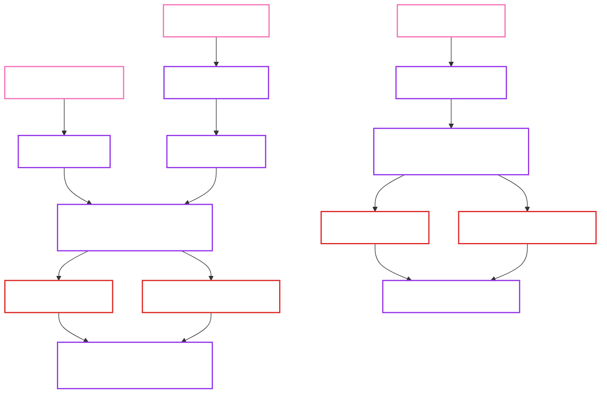

# Continuous Integration

We use GitHub Actions for pull request validation, `main` branch validation, and release/build hardening channels.

!!! note
    CI and release workflows enforce vendored Go dependencies. After changing dependencies, run `make verify-vendor`.
    Dependency license verification uses the same vendored view of the dependency graph.

## 1. Pipeline Overview

### 1.1 Pull Request and `main` CI

The `CI` workflow runs on every pull request update and every push to `main`.
On pull requests, the `Detect Changes` job narrows which jobs actually execute so
workflow-only, docs-only, chart-only, and targeted E2E changes do not all pay
for the full pipeline. Pushes to `main` still run the full gate.


```mermaid
graph TD
    A[Pull request] --> B[Detect Changes]
    C[Push to main] --> B

    B --> D[Core quality gates]
    D --> D1[Lint format tidy vendor]
    D --> D2[Generated docs helm]
    D --> D3[Security compatibility]
    D --> D4[Unit and integration tests]

    B --> E[E2E routing]
    E --> E1[Targeted shards]
    E --> E2[Full suite with ci full e2e label]
    B --> E3[Helm E2E smoke on chart changes]

    D --> F[CI result]
    E1 --> F
    E2 --> F
    E3 --> F

    classDef write fill:transparent,stroke:#22c55e,stroke-width:2px,color:#fff;
    classDef read fill:transparent,stroke:#60a5fa,stroke-width:2px,color:#fff;
    classDef security fill:transparent,stroke:#dc2626,stroke-width:2px,color:#fff;
    classDef process fill:transparent,stroke:#9333ea,stroke-width:2px,color:#fff;
    classDef git fill:transparent,stroke:#f472b6,stroke-width:2px,color:#fff;

    class A,C git;
    class B,D,E,F process;
    class D1,D2,D4,E1,E2,E3 read;
    class D3 security;
```

### 1.2 Publish and Release Hardening

Edge, nightly, and tagged releases use strict hardening gates before publish.


```mermaid
graph TD
    M[CI success on main] --> PE[Publish Edge]
    N[Nightly schedule] --> NW[Nightly workflow]
    NW --> PN[Publish Nightly]
    T[Semver tag push] --> R[Release workflow]

    PE --> H[Reusable channel hardening]
    PN --> H

    H --> H1[Provenance gate]
    H --> H2[Byte reproducibility gate]
    H1 --> HP[Promote by digest and publish pages]
    H2 --> HP

    R --> RB[Build and independent rebuild]
    RB --> RG1[Provenance gate]
    RB --> RG2[Byte reproducibility gate]
    RG1 --> RP[Publish release artifacts]
    RG2 --> RP

    classDef write fill:transparent,stroke:#22c55e,stroke-width:2px,color:#fff;
    classDef read fill:transparent,stroke:#60a5fa,stroke-width:2px,color:#fff;
    classDef security fill:transparent,stroke:#dc2626,stroke-width:2px,color:#fff;
    classDef process fill:transparent,stroke:#9333ea,stroke-width:2px,color:#fff;
    classDef git fill:transparent,stroke:#f472b6,stroke-width:2px,color:#fff;

    class M,N,T git;
    class PE,NW,PN,R,H,RB,HP,RP process;
    class H1,H2,RG1,RG2 security;
```

## 2. CI vs Local Commands

Run these commands locally to reproduce CI behavior.

### 2.1 Core PR-equivalent checks

```sh
make bootstrap
make doctor
make ci-core
```

!!! note
    `make lint-ci` bootstraps `ast-grep` locally through `npm` if needed. `npm` must still be available on your `PATH`.

### 2.2 Job-to-command mapping

| CI Job | Local Command | Notes |
| :--- | :--- | :--- |
| `Lint` | `make lint-ci` | GolangCI-Lint config + lint run, plus ast-grep policy verification, rule tests, and strict scan |
| `Dependency Licenses` | `make license-check` | Verifies shipped Go dependency licenses against the project allowlist using `go-licenses` in vendored mode |
| `Workflow Lint` | `GOFLAGS=-mod=mod GOBIN="$PWD/bin" go install github.com/rhysd/actionlint/cmd/actionlint@v1.7.11 && ./bin/actionlint .github/workflows/*.yml` | Runs only when workflow files change on PRs; always runs on `main` |
| `Verify Formatting` | `make verify-fmt` | Checks `gofmt` compliance |
| `Verify go.mod/go.sum` | `make verify-tidy` | Ensures module files are clean |
| `Verify vendor/` | `make verify-vendor` | Fails on stale vendored dependencies |
| `Verify Generated Artifacts` | `make verify-generated` | Checks generated files drift (`api/v1alpha1`, `config/crd/bases`, `docs/reference/api.md`) |
| `Helm Chart` | `make verify-helm && make helm-test` | Includes Helm sync, lint, template, and OpenShift rendering checks |
| `Security (vulncheck + Trivy FS)` | `make security-ci` | Runs `govulncheck` plus the CI-equivalent Trivy filesystem scan |
| `Security (Trivy built image <name>)` | `make security-scan-built-images` | Builds and scans the manager, config-init, backup, and upgrade images with the same Trivy policy used in PR CI |
| `Unit Tests` + `Envtest Integration` | `make test-ci` | Runs unit + integration test stack |
| `Fuzz Smoke` | `make fuzz` | Runs the short curated fuzz sweep across discovered `*fuzz_test.go` targets |
| `OpenBao Config Compatibility` | `make verify-openbao-config-compat` | Validates generated HCL fixtures against upstream parser |
| `Docs Build` | `make docs-build` | Strict MkDocs build |

!!! tip
    `make security-scan-image IMG=<image>` is available when you want to scan a specific prebuilt image directly. `make security-scan-built-manager` remains as a backward-compatible alias for the full local CI-equivalent built-image scan set.

## 3. Pull Request Standards Gates

The `PR Standards` workflow (`.github/workflows/pr-standards.yml`) enforces:

- PR title follows Conventional Commits.
- PR description includes required template sections.
- Commit-subject checks are informational only.

Because this repository uses squash merge, the PR title is the release-facing commit message gate for `main`.

## 4. End-to-End Testing

We run E2E tests on Kind and route scope based on changed files and labels.

- PRs that only touch workflow files do not trigger E2E by default.
- PRs that only touch docs do not trigger E2E by default.
- Default PR routing runs two fast label-based shards: `Core Lifecycle & Manager` and `Security & Tenants`.
- Specialized shards are routed separately for `Backup & Restore`, `Upgrade Rolling`, `Upgrade Blue/Green`, and `Hardened (Signed)`.
- Label `ci:full-e2e` enables broader suite coverage.
- Labels `backup`, `upgrades`, `security`, `provisioner`, `admission`, and `controller` can expand targeted PR coverage.
- Routing uses Ginkgo label filters instead of suite-title regexes, so new suites must carry the right labels.
- Prebuilt E2E images are reused across shards for speed.

!!! warning
    The optimized E2E lane pushes temporary images to GHCR, so it runs only for branch pushes and same-repository pull requests.

### 4.1 Local E2E commands

=== ":material-rocket-launch: Smoke"

    ```sh
    make test-e2e-ci \
      KIND_NODE_IMAGE=kindest/node:v1.34.3 \
      E2E_LABEL_FILTER='(((lifecycle && !tls) || manager) && !openshift)' \
      E2E_PARALLEL_NODES=1
    ```

=== ":material-flask: Full"

    ```sh
    make test-e2e-ci KIND_NODE_IMAGE=kindest/node:v1.34.3
    ```

=== ":material-hammer-wrench: Helm Smoke"

    ```sh
    make helm-e2e-smoke
    ```

=== ":material-bug: Debug"

    ```sh
    make test-e2e-ci E2E_SKIP_CLEANUP=true
    ```

## 5. Security Checks

## 5. Fuzzing in CI

Pull request and `main` CI run `make fuzz` as a smoke lane when code or CI inputs that affect fuzz
coverage change. The nightly workflow runs `make fuzz-long` with a larger time budget against the same
discovered target set.

When a fuzz job fails in CI, the workflow uploads per-target logs from `dist/fuzz/` and any generated
minimized inputs under `testdata/fuzz/` as build artifacts for replay.

For local repro, use:

```sh
make fuzz
FUZZTIME=30s make fuzz
FUZZ_TARGET_FILTER='FuzzDiscoverConfig|internal/service/upgrade' make fuzz
```

## 6. Security Checks

=== "Govulncheck"

    ```sh
    make vulncheck
    ```

=== "Dependency licenses"

    ```sh
    make license-check
    make license-report
    ```

    !!! note
        The blocking gate covers shipped binaries only: `controller`, `bao-backup`, `bao-upgrade`, and `provisioner`.
        See [Dependency License Policy](dependency-licenses.md) for the allowlist and `MPL-2.0` handling rules.

=== "Trivy"

    ```sh
    make security-scan IMG=ghcr.io/dc-tec/openbao-operator:edge
    ```

    !!! note "Expected RBAC findings"
        Trivy's Kubernetes misconfiguration rules flag several intentionally privileged RBAC manifests and templates.

        CI and local security scans skip specific files in:

        - `.github/workflows/ci.yml`
        - `.github/workflows/nightly.yml`
        - `Makefile` (`security-scan` target)

## 7. Documentation Build

```sh
make docs-serve
make docs-build
```

## 8. Performance Workflows

### 7.1 Baseline Capture

1. Open **Actions** -> **Performance Baseline Capture**.
2. Run on `main` (or the release branch you are validating).
3. Download the artifact containing baseline JSON and thresholds YAML.
4. Commit updated baseline files in a normal PR.

### 7.2 Weekly Regression Gate

The `Performance Regression Weekly` workflow runs `make verify-perf` weekly and can also be triggered manually.

- Scheduled failures open or update the `Weekly performance regression detected` issue.
- Release workflow enforces full `verify-perf` as a blocking gate.

## 9. GHCR Housekeeping

Run `GHCR Housekeeping` (`.github/workflows/ghcr-housekeeping.yml`) to manage image package retention for:

- `ghcr.io/dc-tec/openbao-operator`
- `ghcr.io/dc-tec/openbao-init`
- `ghcr.io/dc-tec/openbao-backup`
- `ghcr.io/dc-tec/openbao-upgrade`

Workflow behavior:

- Runs daily at `06:20 UTC`.
- Supports `workflow_dispatch` for manual dry runs or manual enforce runs.
- Uses alias-safe deletion by package version (digest), not by individual tag.
- Enforces a safety brake via `--max-delete-per-package` (default `100`).
- In `enforce` mode, the workflow performs a global preflight check and aborts all deletions if any package exceeds the safety brake.

!!! note
    Keep protected references indefinitely: SemVer tags, `edge`, `nightly`, `sha256-*`, and unknown/unmatched tags.

Set execution mode in this order:

1. Manual `workflow_dispatch` input `mode` (if provided)
2. Repository variable `GHCR_HOUSEKEEPING_MODE`
3. Default `dry-run`

!!! warning
    Before enabling enforce mode, run dry-run mode for several days and review the generated report.

Each run uploads `dist/housekeeping-report.json` as an artifact and writes a markdown summary to the Actions job summary.

The report and summary include unknown-version breakdown fields:

- `kept_unknown_untagged`
- `kept_unknown_unmatched_tag`
- `kept_unknown_no_transient_match`
