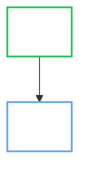

# OpenBao Operator Documentation Style Guide

This guide ensures a consistent voice, structure, and appearance across all OpenBao Operator documentation.

## 1. General Principles

- **Voice:** Professional, concise, and direct. Use the imperative mood (e.g., "Run the command").
- **Audience:** DevOps engineers, SREs, and Platform engineers.
- **Terminology:**
      - **OpenBao Operator** (capitalized).
      - **OpenBao** (software).
      - **Kubernetes** or **K8s**.

## 2. Structure & Layout

### 2.1 Grids & Cards

Use `grid` layouts for landing pages or grouping related navigation items.

<div class="grid cards" markdown>

- :material-rocket-launch: **Quick Start**

    ---

    Get up and running in minutes.

    [:material-arrow-right: Start](../user-guide/index.md)

- :material-book-open-page-variant: **Concepts**

    ---

    Deep dive into architecture.

    [:material-arrow-right: Learn](../architecture/index.md)

</div>

### 2.2 Content Tabs

Use tabs to group alternative configurations (e.g., Helm vs YAML) or operating modes.

=== "Helm"

    ```bash
    helm install openbao openbao/openbao
    ```

=== "YAML"

    ```yaml
    apiVersion: v1
    kind: Pod
    ```

## 3. Advanced Components

### 3.1 Admonitions

Use the correct type for the severity of the message.

| Type | Usage |
| :--- | :--- |
| `!!! note` | General context or "good to know". |
| `!!! tip` | Shortcuts or best practices. |
| `!!! success` | Confirming an action or "Best Practice". |
| `!!! warning` | Potential pitfalls (recoverable). |
| `!!! failure` | Operational failures (troubleshooting). |
| `!!! danger` | **Irreversible data loss** or security risks. |

### 3.2 Annotations

Add callouts to code blocks to explain specific lines.

```yaml
apiVersion: v1
kind: Secret
metadata:
  name: my-secret # (1)!
```

1. This name must match the `OpenBaoCluster` reference.

### 3.3 Icons & Buttons

- **Icons**: Use Material Design icons: `:material-check-circle:`.
- **Buttons**:
    [Click Me]{ .md-button .md-button--primary }

## 4. Diagrams (Mermaid)

All diagrams must be **Theme Neutral** (work in Light and Dark mode).

### 4.1 Color Palette

Use `fill:transparent` generally, and distinct stroke colors for semantic meaning.

| Class | Meaning | Stroke Color | CSS |
| :--- | :--- | :--- | :--- |
| `write` | Create, Update, Success | Green | `stroke:#22c55e` |
| `read` | Read, Observe, Info | Blue | `stroke:#60a5fa` |
| `security` | RBAC, Policies, Danger | Red | `stroke:#dc2626` |
| `process` | Jobs, Workflows | Purple | `stroke:#9333ea` |
| `git` | GitOps, Source control | Pink | `stroke:#f472b6` |

### 4.2 Standard Definition Block

Include this at the end of every Mermaid diagram:



## 5. User Guide Structure

1. **Title:** Noun-based (e.g., "Backup Configuration").
2. **Introduction:** What does this feature do?
3. **Prerequisites:** What is needed?
4. **Configuration:** YAML examples.
5. **Operations:** How to use/monitor.

## 6. Previewing Docs

```sh
make docs-serve # http://localhost:8000
make docs-build # ./site/
```
