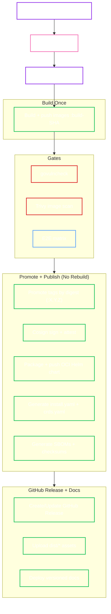

# Release Management

We follow a strict "Build Once, Promote Everywhere" philosophy. Releases are automated, signed, and provenanced.

!!! note "Version format"
    Git tags and Helm chart versions use SemVer **without** a leading `v` (for example: `0.1.0`, `0.2.0-rc.1`).

## 0. Channels

We publish multiple channels:

- **Stable / SemVer**: `MAJOR.MINOR.PATCH` (and prereleases like `X.Y.Z-rc.1`, `X.Y.Z-beta.1`, `X.Y.Z-alpha.1`).
- **Edge** (main): published automatically after CI passes on `main` (tags: `edge`, `edge-<shortsha>`).
- **Nightly dev**: published automatically after nightly E2E passes (tags: `dev`, `dev-YYYYMMDD`, `dev-YYYYMMDD-<shortsha>`), and a moving GitHub prerelease named `nightly`.

## 0.1 Release-Please (Versioning + Release PRs)

We use **release-please** as the source of truth for:

- Open/maintain a Release PR on `main` based on Conventional Commits.
- Update `CHANGELOG.md` and bump `charts/openbao-operator/Chart.yaml` (chart `version` and `appVersion`).
- Create the `X.Y.Z` tag and a draft GitHub Release when the Release PR is merged.

!!! important "Required token"
    `release-please` must use a non-default token, otherwise the resulting tag/release may not trigger downstream GitHub Actions workflows.

    Recommended: configure a GitHub App (for example `openbao-operator-release`) and use its installation token (no server required; no webhook/callback needed). Store:

    - `OPENBAO_OPERATOR_RELEASE_APP_ID`
    - `OPENBAO_OPERATOR_RELEASE_PRIVATE_KEY`

    Fallback: if you prefer a PAT, configure a repository secret named `RELEASE_PLEASE_TOKEN` with permissions to:
    - Create/update PRs
    - Create tags and releases
    and update `.github/workflows/release-please.yml` to use it.

!!! tip "Keep release-please PRs mergable"
    If you enforce "required approval" rules, avoid using a PAT for your own user as `RELEASE_PLEASE_TOKEN`.
    GitHub often excludes self-approvals from required reviews. Prefer a bot account or GitHub App.

## 0.2 Automation Workflows

=== "Stable / prerelease"

    - Versioning + release notes: `.github/workflows/release-please.yml`
    - Build + gates + artifacts: `.github/workflows/release.yml`

=== "Edge (main)"

    - After CI success on `main`, `.github/workflows/publish-edge.yml` publishes:
        - Images: `:edge` and `:edge-<shortsha>`

=== "Nightly dev"

    - After nightly E2E success, `.github/workflows/publish-nightly.yml` publishes:
        - Images: `:dev`, `:dev-YYYYMMDD`, `:dev-YYYYMMDD-<shortsha>`
        - A moving GitHub prerelease named `nightly`

## 1. Stable/Prerelease Release Flow

`release-please` is responsible for *versioning and release notes*. The `Release` workflow is responsible for *building, gating, and publishing artifacts*.

Our pipeline ensures that the artifacts we test in E2E are the *exact* same bits that are published (bit-for-bit identical).



## 2. Triggers

=== "Release-please"

    - Merge the release-please PR on `main`.
    - Wait for the tag to be created and for the `Release` workflow to publish artifacts.

!!! note "Policy: release only when ready"
    The repository includes an gate (`.github/workflows/release-pr-gate.yml`) intended for the release-please PR:

    - Require a label (default: `release:ready`)
    - Require an explicit approval from the designated release manager (default: `@dc-tec`)

!!! note "Manual releases"
    Stable/prerelease releases should be created by merging the release-please PR.
    For out-of-band release, prefer cutting a dedicated PR on `main` and letting release-please generate the tag/release.

!!! note "Prereleases"
    For `-alpha.*`, `-beta.*`, and `-rc.*` tags, the GitHub Release is marked as a prerelease and docs are published without moving the `latest` alias.

## 2.1 Cutting Beta/RC Releases (Release-As)

By default, `release-please` determines the next version bump from Conventional Commits:

- `fix:` -> patch bump
- `feat:` -> minor bump
- `feat!:` (or `BREAKING CHANGE:`) -> major bump

When a ad-hoc prerelease is needed (for example `0.2.0-beta.1` or `0.2.0-rc.1`), override the target version using `Release-As:` in a commit that lands on `main`. `release-please` will update the Release PR to that exact version; merge it when you are ready to publish the prerelease.

=== "Override via empty commit"

    ```sh
    git commit --allow-empty -m "chore: release 0.2.0-beta.1" -m "Release-As: 0.2.0-beta.1"
    git push
    ```

=== "Override via PR merge message"

    Add the override line to the squash/merge commit message:

    ```text
    chore: prepare 0.2.0-beta.1

    Release-As: 0.2.0-beta.1
    ```

!!! note "Iterating prereleases"
    Repeat the same process for `0.2.0-beta.2`, then `0.2.0-rc.1`, and finally `0.2.0`.

## 3. Published Artifacts

The stable/prerelease release produces the following artifacts:

=== "GitHub Release assets"

    - `install.yaml` (digest-pinned installer manifest)
    - `crds.yaml` (CRDs only)
    - `checksums.txt` (sha256 of `install.yaml`, `crds.yaml`, and SBOMs)
    - `checksums.txt.sig` and `checksums.txt.crt` (keyless signature + certificate for `checksums.txt`)
    - `sbom-openbao-operator.spdx.json`
    - `sbom-openbao-init.spdx.json`
    - `sbom-openbao-backup.spdx.json`
    - `sbom-openbao-upgrade.spdx.json`

=== "Container images"

    - `ghcr.io/<OWNER>/openbao-operator:X.Y.Z`
    - `ghcr.io/<OWNER>/openbao-init:X.Y.Z`
    - `ghcr.io/<OWNER>/openbao-backup:X.Y.Z`
    - `ghcr.io/<OWNER>/openbao-upgrade:X.Y.Z`

=== "Helm chart (OCI)"

    - `ghcr.io/<OWNER>/charts/openbao-operator:X.Y.Z`

## 4. Release Checklist

For Release Managers.

### Pre-Flight Checks

- [ ] **Changelog**: Ensure the release-please PR looks correct (changelog entries and version bumps).
- [ ] **Docs**: Ensure documentation is consistent with new features.
- [ ] **Compatibility**: Verify `docs/reference/compatibility.md` covers the supported versions.
- [ ] **Clean CI**: Ensure the latest commit on main is green.

### Post-Release

- [ ] **Verify**: Check that the GitHub Release exists and assets are valid.
- [ ] **Announce**: Post in relevant community channels.

## 5. Verifying Artifacts

All artifacts are signed using Sigstore (Keyless).

=== ":material-check-decagram: Verify Image Signature"
    Using `cosign` to verify the image was built by our release workflow.

    ```sh
    cosign verify \
      --certificate-identity-regexp "https://github.com/dc-tec/openbao-operator/.github/workflows/release.yml" \
      --certificate-oidc-issuer "https://token.actions.githubusercontent.com" \
      ghcr.io/dc-tec/openbao-operator:0.1.0
    ```

=== ":material-file-certificate: Verify Attestation"
    Using GitHub CLI to verify build provenance.

    ```sh
    gh attestation verify \
      oci://ghcr.io/dc-tec/openbao-operator:0.1.0 \
      --owner dc-tec
    ```

=== ":material-chart-bubble: Verify Helm Chart"
    Verify the OCI Helm Chart signature by digest.

    ```sh
    # Resolve the chart digest (example uses crane)
    crane digest ghcr.io/dc-tec/charts/openbao-operator:0.1.0

    cosign verify \
      --certificate-identity-regexp "https://github.com/dc-tec/openbao-operator/.github/workflows/release.yml" \
      --certificate-oidc-issuer "https://token.actions.githubusercontent.com" \
      ghcr.io/dc-tec/charts/openbao-operator@sha256:...
    ```

=== ":material-file-lock: Verify Release Checksums"
    Verify `checksums.txt` using the signature and certificate uploaded to the GitHub Release.

    ```sh
    cosign verify-blob \
      --certificate dist/checksums.txt.crt \
      --signature dist/checksums.txt.sig \
      --certificate-identity-regexp "https://github.com/dc-tec/openbao-operator/.github/workflows/release.yml" \
      --certificate-oidc-issuer "https://token.actions.githubusercontent.com" \
      dist/checksums.txt
    ```
