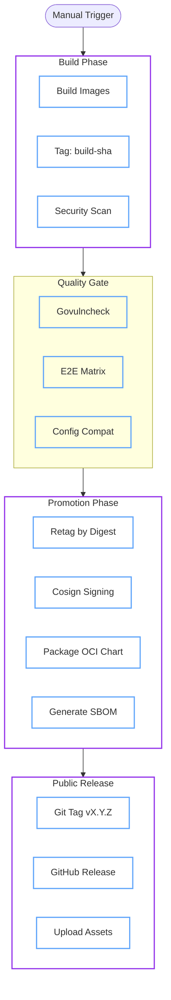

# Release Management

We follow a strict "Build Once, Promote Everywhere" philosophy. Releases are automated, signed, and provenanced.

## 1. Release Architecture

Our pipeline ensures that the artifacts we test in E2E are the *exact* same bits that are published (bit-for-bit identical).



## 2. Release Checklist

For Release Managers.

### Pre-Flight Checks

- [ ] **Changelog**: Regenerate `CHANGELOG.md` locally from git history:
  - `make changelog` (Unreleased since last tag)
  - `make changelog-all` (all tags + Unreleased)
- [ ] **Docs**: Ensure documentation is consistent with new features.
- [ ] **Compatibility**: Verify `docs/reference/compatibility.md` covers the supported versions.
- [ ] **Clean CI**: Ensure the latest commit on main is green.

### Triggering the Release

1. Go to **Actions** -> **Release Workflow**.
2. Click **Run workflow**.
3. **Version**: Enter the semver tag (e.g., `v0.1.0`).
4. **Ref**: Leave blank for `main`.

### Post-Release

- [ ] **Verify**: Check that the GitHub Release exists and assets are valid.
- [ ] **Announce**: Post in relevant community channels.

## 3. Verifying Artifacts

All artifacts are signed using Sigstore (Keyless).

=== ":material-check-decagram: Verify Image Signature"
    Using `cosign` to verify the image was built by our release workflow.

    ```sh
    cosign verify \
      --certificate-identity-regexp "https://github.com/dc-tec/openbao-operator/.github/workflows/release.yml" \
      --certificate-oidc-issuer "https://token.actions.githubusercontent.com" \
      ghcr.io/dc-tec/openbao-operator:v0.1.0
    ```

=== ":material-file-certificate: Verify Attestation"
    Using GitHub CLI to verify build provenance.

    ```sh
    gh attestation verify \
      oci://ghcr.io/dc-tec/openbao-operator:v0.1.0 \
      --owner dc-tec
    ```

=== ":material-chart-bubble: Verify Helm Chart"
    Verify the OCI Helm Chart signature.

    ```sh
    cosign verify \
      --certificate-identity-regexp "https://github.com/dc-tec/openbao-operator/.github/workflows/release.yml" \
      --certificate-oidc-issuer "https://token.actions.githubusercontent.com" \
      ghcr.io/dc-tec/charts/openbao-operator:0.1.0
    ```

## 4. Helm Chart Maintenance

The Helm chart is a first-class citizen but heavily automated.

!!! note "Generated Sources"
    The chart lives in `charts/openbao-operator`.
    However, **CRDs** and the **Installer Template** are generated from source.

### Updating the Chart

If you change `api/`, `config/`, or `dist/install.yaml`, you **must** sync the chart.

```sh
# Syncs CRDs and templates from upstream sources
make helm-sync
```

### Validation

CI ensures the chart is always in sync.

```sh
make verify-helm
```
