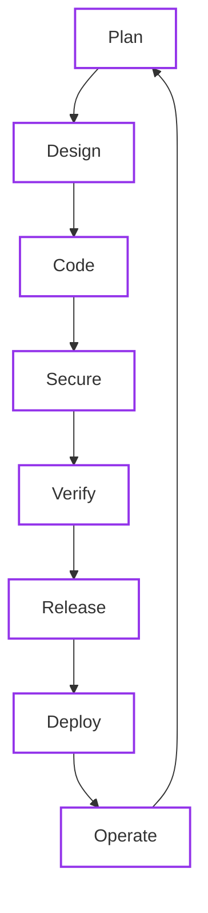

# Software Development Lifecycle (SDLC)

The OpenBao Operator follows a secure-by-default SDLC, integrating security checks, automated verification, and provenance at every stage.

## 1. Lifecycle Overview

## 2. Phase Detail

The lifecycle maps directly to our documentation and toolchain.

- :material-clipboard-list: **Plan & Design**

    ---

    Define requirements and architecture.

      - :material-scale-balance: [Compatibility Policy](../reference/compatibility.md)
      - :material-lan: [Architecture Overview](../architecture/index.md)
      - :material-toy-brick: [Components](../architecture/components.md)

- :material-code-braces: **Code & Implement**

    ---

    Write code adhering to strict standards.

      - :material-file-code: [Coding Standards](standards/index.md)
      - :material-laptop: [Dev Setup](getting-started/development.md)
      - :material-check: [Project Conventions](standards/project-conventions.md)

- :material-shield-check: **Secure & Verify**

    ---

    Automated gates ensure quality and safety.

      - :material-shield-check: [Security Practices](standards/security-practices.md)
      - :material-test-tube: [CI Pipeline](ci.md)
      - :material-list-status: [Threat Model](../security/fundamentals/threat-model.md)

- :material-rocket-launch: **Release & Deploy**

    ---

    Build once, sign, and promote.

      - :material-rocket-launch: [Release Process](release-management.md)
      - :material-signature-freehand: [Artifact Verification](release-management.md#3-verifying-artifacts)
      - :material-package-variant: [Helm Charts](https://github.com/dc-tec/openbao-operator/tree/main/charts/openbao-operator)

- :material-server-network: **Operate & Monitor**

    ---

    Run reliably in production.

      - :material-book-open-page-variant: [User Guides](../user-guide/index.md)
      - :material-security: [Security Posture](../security/index.md)
      - :material-stethoscope: [Troubleshooting](../user-guide/openbaocluster/recovery/no-leader.md)

## 3. Secure by Design

Security is not a separate phase; it is injected into every step of the process.

| Phase | Tooling | Check |
| :--- | :--- | :--- |
| **Code** | `golangci-lint` | Static analysis for bugs and style |
| **Deps** | `dependabot` | Automated dependency updates |
| **Verify** | `govulncheck` | Known vulnerability scanning |
| **Build** | `trivy` | Container filesystem scanning |
| **Release** | `cosign` | Keyless signing of images and charts |
| **Publish** | `gh attestation` | Build provenance trails |
