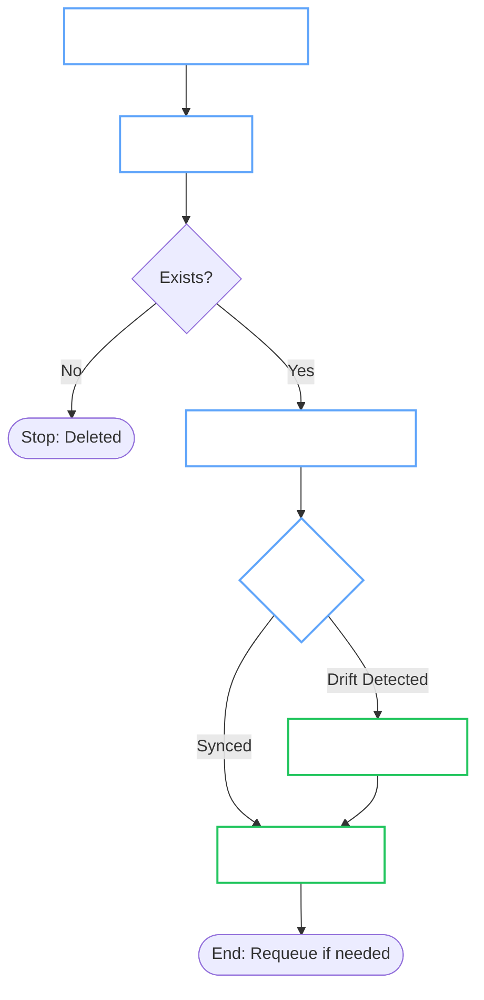

# Kubernetes Operator Patterns

This guide outlines the core design patterns used in the OpenBao Operator. Understanding these is essential for writing robust, "Kubernetes-native" controllers.

## 1. The Reconcile Loop

Kubernetes controllers are **Level-Triggered**, not Edge-Triggered. We reconcile the *current state* of the world with the *desired state* defined in the Custom Resource (CR).



## 2. Idempotency

The `Reconcile` function may be called 10 times in a row for the same change. Your logic must be **idempotent**: it should produce the same result regardless of how many times it runs.

### The "Fetch-Check-Act" Pattern

Always check if a resource exists before creating it. Check if it matches spec before updating it.

=== ":material-check: Good Pattern"
    ```go
    // 1. Define Expected Object
    expected := &corev1.Secret{
        ObjectMeta: metav1.ObjectMeta{
            Name:      cluster.Name + "-tls",
            Namespace: cluster.Namespace,
        },
        Data: derivedData,
    }

    // 2. Fetch Existing
    existing := &corev1.Secret{}
    err := r.Client.Get(ctx, client.ObjectKeyFromObject(expected), existing)

    // 3. Act based on state
    if apierrors.IsNotFound(err) {
        // DOES NOT EXIST -> CREATE
        return r.Client.Create(ctx, expected)
    } else if err != nil {
        return err
    }

    // 4. Update if drifted (simplified)
    if !reflect.DeepEqual(existing.Data, expected.Data) {
        existing.Data = expected.Data
        return r.Client.Update(ctx, existing)
    }
    ```

=== ":material-close: Bad Pattern"
    ```go
    // BLIND CREATE - Will fail on 2nd run
    secret := &corev1.Secret{...}
    if err := r.Client.Create(ctx, secret); err != nil {
        return err
    }
    ```

## 3. Concurrency & Context

### No Unmanaged Goroutines

The Controller Runtime manages concurrency for you. Do **not** spawn goroutines inside a Reconciler.

=== ":material-check: Good Pattern"
    ```go
    if err := r.heavyOperation(ctx); err != nil {
        return ctrl.Result{}, err
    }
    ```

=== ":material-close: Bad Pattern"
    ```go
    go func() {
        // Race conditions, lost errors, potential crash
        r.heavyOperation(context.Background())
    }()
    ```

### No Blocking

Never block the reconcile thread with `time.Sleep`. This starves other resources from being reconciled.

=== ":material-check: Good Pattern"
    ```go
    // Re-run this loop in 10 seconds
    return ctrl.Result{RequeueAfter: 10 * time.Second}, nil
    ```

=== ":material-close: Bad Pattern"
    ```go
    // Blocks the thread completely
    time.Sleep(10 * time.Second)
    ```

## 4. Structured Logging

Use the context-aware logger. It automatically attaches `reconcile_id` and other metadata.

### Standard Fields

| Field | Description |
| :--- | :--- |
| `cluster_namespace` | Namespace of the target CR |
| `cluster_name` | Name of the target CR |
| `phase` | Current status phase of the operation |

### Usage

=== ":material-check: Good Pattern"
    ```go
    log := log.FromContext(ctx)

    log.Info("Reconciling connection", 
        "cluster_name", req.Name,
        "mode", "production",
    )
    ```

=== ":material-close: Bad Pattern"
    ```go
    // Losing context
    fmt.Printf("Reconciling %s\n", req.Name)
    ```

!!! danger "Security"
    **NEVER** log secrets, passwords, token content, or private keys.
