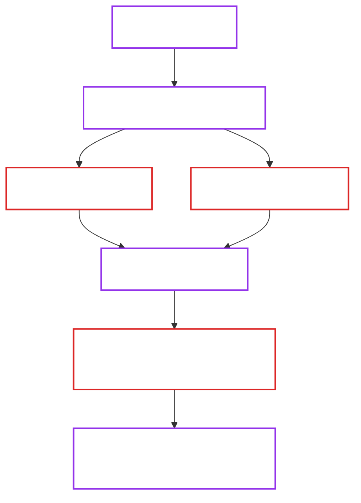

# Supply Chain Security

This page describes the current supply-chain security posture of OpenBao Operator and how controls are implemented in CI and release workflows.

!!! note "How to use this page"
    Use this document as the implementation reference for maintainers.
    For exact verification commands and release execution steps, use [Release Management](release-management.md).

## 1. Current Model

OpenBao Operator uses a hardened "build once, verify, then promote" model:

1. Build immutable artifacts from a pinned workflow/toolchain.
2. Verify provenance and reproducibility before publish.
3. Sign and attest published subjects.
4. Publish machine-readable verification metadata.

## 2. Channel Coverage

| Channel | Workflow Path | Blocking Provenance Gate | Blocking Byte-Repro Gate | Published Output |
| :--- | :--- | :---: | :---: | :--- |
| CI (PR/main) | `.github/workflows/ci.yml` | No | No | Validation only |
| Edge | `.github/workflows/publish-edge.yml` + `reusable-channel-hardening.yml` | Yes | Yes | GitHub Pages edge manifests + checksums + provenance index |
| Nightly | `.github/workflows/publish-nightly.yml` + `reusable-channel-hardening.yml` | Yes | Yes | GitHub Pages nightly manifests + checksums + provenance index |
| Stable/prerelease | `.github/workflows/release.yml` | Yes | Yes | GitHub Release assets + OCI images/chart + provenance index |

!!! tip "Shared hardening component"
    Edge and nightly use the same reusable hardening workflow as the strict pre-publish gate implementation.

## 3. Implementation Map

The controls on this page are implemented by these workflows and scripts:

| Control | Implementation |
| :--- | :--- |
| Build and attest images | `.github/workflows/reusable-build.yml` + `actions/attest-build-provenance` |
| Dependency license allowlist | `.github/workflows/dependency-review.yml` + `.github/dependency-review-config.yml` + `make license-check` |
| Channel hardening gates (edge/nightly) | `.github/workflows/reusable-channel-hardening.yml` + `hack/ci/verify-image-attestations.sh` + `hack/ci/verify-byte-reproducibility.sh` |
| Release hardening gates (stable/prerelease) | `.github/workflows/release.yml` + `hack/ci/verify-image-attestations.sh` + `hack/ci/verify-byte-reproducibility.sh` |
| Chart/checksum attestation verification | `hack/ci/verify-release-artifact-attestations.sh` |
| Provenance metadata index generation | `hack/ci/generate-provenance-index.sh` + `hack/ci/generate-channel-provenance-index.sh` |
| SBOM deterministic normalization | `hack/ci/normalize-spdx-json.sh` |

## 4. Governance Controls

Current governance controls:

1. Protected default branch and protected release tag patterns.
2. CODEOWNERS coverage for release-critical paths (workflows, Dockerfiles, chart, security/release docs).
3. PR-based change flow with required checks.
4. GitHub Actions pinned by SHA.

!!! warning "Single-maintainer constraint"
    Approval count remains `0` due to current single-maintainer operating mode. Human two-person controls are not currently enforced.

## 5. Build and Dependency Controls

Deterministic and least-drift controls in use:

1. Go build/test paths in CI, edge/nightly hardening, and release use vendored dependency mode (`-mod=vendor`) where applicable.
2. Shipped Go dependency licenses are verified against an explicit allowlist in vendored mode.
3. Pull requests also receive dependency-diff license review through GitHub dependency review.
4. Build metadata normalization via `SOURCE_DATE_EPOCH` from commit time.
5. Docker base images pinned by digest.
6. Critical build tool versions pinned (Buildx, QEMU, Helm, Cosign).
7. Release and channel promotion uses digest references, not rebuild-on-promote.

## 6. Provenance, Signing, and Attestation Controls

Current enforced controls:

1. Image build provenance attestations are emitted by reusable build workflow.
2. Image provenance is verified with strict identity constraints before publish.
3. Published images are keylessly signed.
4. Release/chart/checksum subjects are signed and/or attested before publish completion.
5. Published metadata includes `provenance-index.json` for verifiable linkage.

Verification reference commands:

- [Release artifact verification commands](release-management.md#5-verifying-artifacts)

## 7. Reproducibility Controls

Blocking reproducibility checks validate that independent rebuild output matches expected bytes before publish.

Checked subjects include:

1. Image digests (primary vs independent rebuild).
2. Rendered manifests (`install.yaml`, `crds.yaml`).
3. Helm chart package bytes.
4. Checksums file bytes.
5. SBOM bytes after deterministic SPDX normalization.

!!! note "SBOM normalization"
    Raw SPDX output is not byte-stable by default due runtime metadata fields.
    The workflow normalizes SPDX JSON before comparison to keep strict gates deterministic.

Diagnostic workflow:

- `.github/workflows/reproducibility.yml` (report-focused parity checks)

## 8. Release Evidence Requirements

For each stable/prerelease release, collect and retain:

1. Workflow run URL and run ID.
2. Successful provenance/reproducibility gate evidence.
3. Verification outputs for image/chart/checksum subjects.
4. Asset listing that includes `provenance-index.json`.
5. Ruleset export evidence for branch/tag protections.

## 9. Troubleshooting Quick Reference

| Failure | Likely Cause | Resolution |
| :--- | :--- | :--- |
| `gh attestation verify` returns 404 | Attestation index delay | Retry with bounded backoff. |
| Signer workflow mismatch | Wrong workflow identity constraint | Verify with the expected workflow path for that subject. |
| Source-ref mismatch | Verification uses wrong ref | Verify against the exact source ref used by workflow. |
| Byte reproducibility failure | Nondeterministic artifact input/output | Inspect gate logs, normalize/canonicalize deterministic fields, and rerun. |
| `checksums.txt` verify fails | File changed after signing/attestation | Regenerate checksums and re-run sign/attestation flow. |
