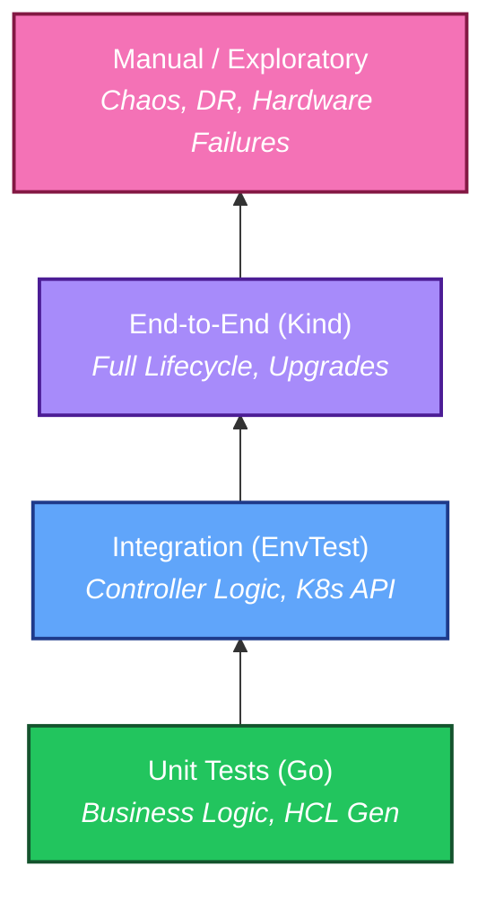

# Testing Strategy

To ensure correctness and avoid regressions, we adopt a **Layered Testing Strategy**. We trade off speed and isolation (Unit) for fidelity and coverage (E2E).



## Quick Start

<div class="grid cards" markdown>

- :material-test-tube: **Unit Tests**

    ---

    Fast, in-process logic checks.

    `make test`

- :material-server-network: **Integration**

    ---

    Controller logic against real K8s API.

    `make test-integration`

- :material-robot: **End-to-End**

    ---

    Full cluster lifecycle in Kind.

    `make test-e2e`

- :material-human-handsup: **Manual**

    ---

    Disaster recovery & chaos.

    [See Scenarios](#test-layers)

</div>

---

## Test Layers

=== ":material-test-tube: 1. Unit Tests"

    Unit tests focus on deterministic, in-process logic with **no external I/O**.
    
    **Targets:**
    
    - HCL Config Generation (`internal/config`)
    - PKI Helpers (Cert rotation math)
    - State Machine Logic (Upgrade paths)
    
    ### Table-Driven Pattern
    
    We strictly enforce table-driven tests for business logic.
    
    ```go
    func TestRenderConfig(t *testing.T) {
        tests := []struct {
            name      string
            spec      OpenBaoClusterSpec
            wantErr   bool
            wantMatch string
        }{
            {
                name:      "minimal config",
                spec:      minimalSpec(),
                wantErr:   false,
                wantMatch: `listener "tcp"`,
            },
            {
                name:    "protected stanza override rejected",
                spec:    specWithForbiddenConfig(),
                wantErr: true,
            },
        }
    
        for _, tt := range tests {
            t.Run(tt.name, func(t *testing.T) {
                // ... assertion logic ...
            })
        }
    }
    ```
    
    ### Golden Files
    
    For complex output like HCL generation, we use **Golden Files**.
    
    - **Location**: `internal/config/testdata/`
    - **Update Command**: `make test-update-golden`
    
    !!! warning "Golden File Review"
        Always carefully review the `git diff` of golden files. They represent the exact configuration that will be deployed to user clusters.

=== ":material-server-network: 2. Integration (EnvTest)"

    Integration tests validate reconciliation behavior using `controller-runtime`'s `envtest`.
    
    **Environment**:
    
    - Local `etcd` and `kube-apiserver` (managed by `setup-envtest`).
    - **No** container runtime (no Pods are scheduled).
    - Controllers run as goroutines in the test process.
    
    **Scope**:
    
    - **CRUD Operations**: Ensuring Objects are created/updated correctly.
    - **Status Updates**: Verifying `Status.Phase` transitions.
    - **Finalizers**: Testing deletion interception.
    - **Admission Policies**: Verifying VAP-enforced invariants and safety checks.
    
    !!! tip "Speed vs Fidelity"
        Since no Pods run, you cannot test network connectivity, volume mounting, or OpenBao startup. Use E2E tests for those.

=== ":material-robot: 3. End-to-End (E2E)"

    E2E tests validate real-system behavior in a `kind` cluster.
    
    **Environment**:
    
    - **Kind Cluster**: Runs actual Kubernetes nodes in Docker.
    - **Real Images**: Builds and loads the Operator and OpenBao images.
    - **Helpers**: automated `backup-executor`, `upgrade-executor`.
    - **Storage**: The suite installs the CSI hostpath test driver and applies an expandable StorageClass `openbao-e2e-hostpath`.
      Tests may consume this via `E2E_STORAGE_CLASS` (set automatically in Kind mode).
    
    **Core Scenarios**:
    
    1.  **Lifecycle**: Provision -> Init -> Scale -> Delete.
    2.  **Upgrades**: Rolling Updates (with pre-upgrade backups) and Blue/Green.
    3.  **Backups**: Streaming Raft snapshots to MinIO.
    4.  **Security**: RBAC and admission policy enforcement.
    5.  **Multi-Tenancy**: Namespace isolation verification.
    
    **Filtering Tests**:
    
    Use `E2E_LABEL_FILTER` to focus on specific domains.
    
    ```bash
    # Run only critical smoke tests
    make test-e2e E2E_LABEL_FILTER='smoke && critical'
    
    # Run only upgrade scenarios
    make test-e2e E2E_LABEL_FILTER='upgrade'
    ```

    ### OpenShift Local / Existing Cluster

    To validate OpenShift compatibility, run a focused subset of E2E tests against an existing cluster
    (for example OpenShift Local / CRC).

    ```bash
    export KUBECONFIG=/path/to/your/kubeconfig

    # Operator image must be pullable by the cluster (push it to a registry accessible from CRC).
    export E2E_OPERATOR_IMAGE=quay.io/your-org/openbao-operator:dev

    # For non-kind clusters, configure the API server CIDR used in NetworkPolicies.
    # A permissive value works for smoke testing if you don't know the exact CIDR:
    export E2E_API_SERVER_CIDR=0.0.0.0/0

    # Run only OpenShift platform checks
    make test-e2e-existing E2E_LABEL_FILTER='openshift'
    ```

    !!! note "Cleanup behavior"
        When `E2E_USE_EXISTING_CLUSTER=true` (used by `make test-e2e-existing`), the suite does **not**
        uninstall CRDs or cert-manager by default. To enable full cleanup, set:
        `E2E_EXISTING_CLUSTER_FULL_CLEANUP=true`.
        In existing-cluster mode, you must also provide a suitable expandable StorageClass if you want storage-resize tests:
        set `E2E_STORAGE_CLASS=<name>` to a class with `allowVolumeExpansion: true`.

=== ":material-human-handsup: 4. Manual / Exploratory"

    Some scenarios are difficult or impossible to automate reliably in CI. These must be tested manually before major releases (Minor/Major versions).
    
    **Scenarios**:
    
    | Category | Scenario | Procedure |
    | :--- | :--- | :--- |
    | **Infrastructure** | **Node Failure** | Hard power-off a Kind node (`docker stop <container>`) and verify Pod rescheduling and Raft recovery. |
    | **Consensus** | **Split Brain** | Isolate network traffic between nodes using `iptables` and verify leader election behavior. |
    | **Data Safety** | **Corrupt Storage** | Manually corrupt `raft.db` on a PVC and verify the operator does not nuke the cluster. |
    | **Disaster Recovery** | **Region Failover** | (If applicable) Simulate region loss by deleting all resources in one zone. |
    | **Operations** | **Manual Unseal** | Boot a cluster in `mode: "manual"` and perform the Shamir unseal flow by hand. |

    !!! danger "Production Safety"
        Never run exploratory chaos tests against a production cluster. Use a dedicated staging environment.

## Code Quality Standards

We enforce strict quality gates via `make lint`.

<div class="grid cards" markdown>

- **GolangCI-Lint**

    Static analysis for bugs and anti-patterns.

    `make lint`

- **Formatting**

    Standard `gofmt` style.

    `make fmt`

- **Code Generation**

    DeepCopy and CRD manifest generation.

    `make generate manifests`

</div>
