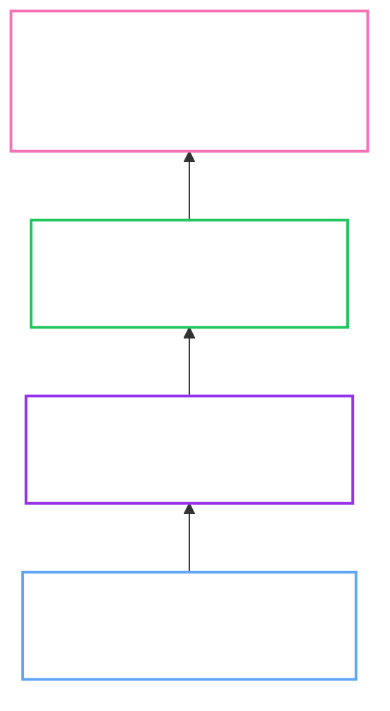

# Testing Strategy

To ensure correctness and avoid regressions, we adopt a **Layered Testing Strategy**. We trade off speed and isolation (Unit) for fidelity and coverage (E2E).


```mermaid
graph BT
    Unit["Unit Tests (Go)<br/><i>Business Logic, HCL Gen</i>"]
    Integration["Integration (EnvTest)<br/><i>Controller Logic, K8s API</i>"]
    E2E["End-to-End (Kind)<br/><i>Full Lifecycle, Upgrades</i>"]
    Manual["Manual / Exploratory<br/><i>Chaos, DR, Hardware Failures</i>"]

    Unit --> Integration
    Integration --> E2E
    E2E --> Manual

    classDef read fill:transparent,stroke:#60a5fa,stroke-width:2px,color:#fff;
    classDef write fill:transparent,stroke:#22c55e,stroke-width:2px,color:#fff;
    classDef process fill:transparent,stroke:#9333ea,stroke-width:2px,color:#fff;
    classDef git fill:transparent,stroke:#f472b6,stroke-width:2px,color:#fff;

    class Unit read;
    class Integration process;
    class E2E write;
    class Manual git;
```

## Quick Start

<div class="grid cards" markdown>

- :material-test-tube: **Unit Tests**

    ---

    Fast, in-process logic checks.

    `make test`

- :material-server-network: **Integration**

    ---

    Controller logic against real K8s API.

    `make test-integration`

- :material-robot: **End-to-End**

    ---

    Full cluster lifecycle in Kind.

    `make test-e2e`

- :material-human-handsup: **Manual**

    ---

    Disaster recovery & chaos.

    [See Scenarios](#test-layers)

</div>

---

## Test Layers

=== ":material-test-tube: 1. Unit Tests"

    Unit tests focus on deterministic, in-process logic with **no external I/O**.
    
    **Targets:**
    
    - HCL Config Generation (`internal/adapter/config`)
    - PKI Helpers (Cert rotation math)
    - State Machine Logic (Upgrade paths)
    
    ### Table-Driven Pattern
    
    We strictly enforce table-driven tests for business logic.
    
    ```go
    func TestRenderConfig(t *testing.T) {
        tests := []struct {
            name      string
            spec      OpenBaoClusterSpec
            wantErr   bool
            wantMatch string
        }{
            {
                name:      "minimal config",
                spec:      minimalSpec(),
                wantErr:   false,
                wantMatch: `listener "tcp"`,
            },
            {
                name:    "protected stanza override rejected",
                spec:    specWithForbiddenConfig(),
                wantErr: true,
            },
        }
    
        for _, tt := range tests {
            t.Run(tt.name, func(t *testing.T) {
                // ... assertion logic ...
            })
        }
    }
    ```
    
    ### Golden Files
    
    For complex output like HCL generation, we use **Golden Files**.
    
    - **Location**: `internal/adapter/config/testdata/`
    - **Update Command**: `make test-update-golden`
    
    !!! warning "Golden File Review"
        Always carefully review the `git diff` of golden files. They represent the exact configuration that will be deployed to user clusters.

=== ":material-server-network: 2. Integration (EnvTest)"

    Integration tests validate reconciliation behavior using `controller-runtime`'s `envtest`.
    
    **Environment**:
    
    - Local `etcd` and `kube-apiserver` (managed by `setup-envtest`).
    - **No** container runtime (no Pods are scheduled).
    - Controllers run as goroutines in the test process.
    
    **Scope**:
    
    - **CRUD Operations**: Ensuring Objects are created/updated correctly.
    - **Status Updates**: Verifying `Status.Phase` transitions.
    - **Finalizers**: Testing deletion interception.
    - **Admission Policies**: Verifying VAP-enforced invariants and safety checks.
    
    !!! tip "Speed vs Fidelity"
        Since no Pods run, you cannot test network connectivity, volume mounting, or OpenBao startup. Use E2E tests for those.

=== ":material-robot: 3. End-to-End (E2E)"

    E2E tests validate real-system behavior in a `kind` cluster.
    
    **Environment**:
    
    - **Kind Cluster**: Runs actual Kubernetes nodes in Docker.
    - **Real Images**: Builds and loads the Operator and OpenBao images.
    - **Helpers**: automated `openbao-backup`, `openbao-upgrade`.
    - **Storage**: The suite installs the CSI hostpath test driver and applies an expandable StorageClass `openbao-e2e-hostpath`.
      Tests may consume this via `E2E_STORAGE_CLASS` (set automatically in Kind mode).
    - **Hardened Init Image Override**: set `E2E_HARDENED_CONFIG_INIT_IMAGE` to run Hardened-profile scenarios with a signed helper image while keeping the default local helper image for development lanes.
    
    **Core Scenarios**:
    
    1.  **Lifecycle**: Provision -> Init -> Scale -> Delete.
    2.  **Upgrades**: Rolling Updates (with pre-upgrade backups) and Blue/Green.
    3.  **Backups**: Streaming Raft snapshots to MinIO.
    4.  **Security**: RBAC and admission policy enforcement.
    5.  **Multi-Tenancy**: Namespace isolation verification.
    
    **Filtering Tests**:
    
    Use `E2E_LABEL_FILTER` to focus on specific domains.
    
    ```bash
    # Run only critical smoke tests
    make test-e2e E2E_LABEL_FILTER='smoke && critical'
    
    # Run only upgrade scenarios
    make test-e2e E2E_LABEL_FILTER='upgrade'

    # Run a single top-level suite by Describe regex
    make test-e2e E2E_FOCUS='Manager Resilience'
    ```

    **Cataloging Test Cases**:

    Generate a machine-readable and Markdown inventory of the current E2E cases, including suite/spec paths,
    inherited labels, and any recorded `By(...)` checkpoints:

    ```bash
    make e2e-catalog
    ```

    Output is written under `test/e2e/catalog/`:

    - `test/e2e/catalog/README.md`: summary index with one row per suite file
    - `test/e2e/catalog/cases.json`: machine-readable case inventory
    - `test/e2e/catalog/suites/*.md`: per-suite case tables plus any recorded checkpoints

    `case:` and `covers:` labels are the stable audit fields in the catalog. Recorded checkpoints are best-effort:

    - they only come from literal `By(...)` text visible to `ginkgo outline`
    - they are optional and supplementary
    - missing checkpoints do not imply missing coverage

    **Explicit Case Tracking**:

    For specs that need stable audit coverage, add a `case:` identifier and one or more `covers:` tags with a literal `Label(...)` call:

    ```go
    It("retains PVCs and recoverability secrets when policy is Retain", Label(
        "case:deletion-policy-retain",
        "covers:deletion-policy",
        "covers:pvc-retention",
        "covers:recoverability-secret-retention",
    ), func() {
        // ...
    })
    ```

    Use a literal `Label(...)` call rather than a helper that returns labels. The catalog generator relies on `ginkgo outline`, which only sees labels that are present in the test source.

    Guidelines:

    - Use exactly one stable `case:` ID per spec.
    - Keep `case:` IDs short and durable; treat them like API names.
    - Use `covers:` tags for the behavior or risk area the spec exercises.
    - Prefer explicit `case:` / `covers:` labels on high-risk or audit-relevant specs first.

    ### Performance Baseline + Regression Gate

    Performance baselines run on Kind and reuse existing E2E flows and controller metrics.

    - Baseline capture (default: 5 runs per scenario):

      ```bash
      make perf-baseline
      ```

    - Regression verification against committed thresholds:

      ```bash
      make verify-perf
      ```

    - Optional local smoke verification (lifecycle-only):

      ```bash
      make verify-perf-smoke
      ```

    Baseline/threshold artifacts:

    - `hack/perf/baseline/kind-v1.34.3-baseline.json`
    - `hack/perf/thresholds/kind-v1.34.3.yaml`

    Scenarios covered by the gate:

    - `lifecycle && critical && tenant && !slow && !openshift && !pentest`
    - `dr && backup && restore && !failure-injection`
    - `upgrade && rolling && !failure && !bluegreen`

    Metric contract:

    - p95 latency/duration:
      - `openbao_reconcile_duration_seconds`
      - `openbao_restore_duration_seconds`
      - `openbao_upgrade_duration_seconds`
      - `openbao_upgrade_pod_duration_seconds`
    - max/churn:
      - `openbao_backup_last_duration_seconds` (max)
      - `workqueue_retries_total` (delta)
      - `openbao_reconcile_errors_total / controller_runtime_reconcile_total` (delta ratio)

    CI usage:

    - PR/Main/Nightly CI does **not** run performance verification by default.
    - Weekly schedule and on-demand dispatch run full `verify-perf` (`Performance Regression Weekly` workflow).
    - Release workflow runs full `verify-perf`.
    - Baseline capture is on-demand via `Performance Baseline Capture` (`workflow_dispatch`).

    ### OpenShift Local / Existing Cluster

    To validate OpenShift compatibility, run a focused subset of E2E tests against an existing cluster
    (for example OpenShift Local / CRC).

    ```bash
    export KUBECONFIG=/path/to/your/kubeconfig

    # Operator image must be pullable by the cluster (push it to a registry accessible from CRC).
    export E2E_OPERATOR_IMAGE=quay.io/your-org/openbao-operator:dev

    # For non-kind clusters, configure the API server CIDR used in NetworkPolicies.
    # A permissive value works for smoke testing if you don't know the exact CIDR:
    export E2E_API_SERVER_CIDR=0.0.0.0/0

    # Run only OpenShift platform checks
    make test-e2e-existing E2E_LABEL_FILTER='openshift'
    ```

    !!! note "Cleanup behavior"
        When `E2E_USE_EXISTING_CLUSTER=true` (used by `make test-e2e-existing`), the suite does **not**
        uninstall CRDs or cert-manager by default. To enable full cleanup, set:
        `E2E_EXISTING_CLUSTER_FULL_CLEANUP=true`.
        In existing-cluster mode, you must also provide a suitable expandable StorageClass if you want storage-resize tests:
        set `E2E_STORAGE_CLASS=<name>` to a class with `allowVolumeExpansion: true`.

=== ":material-human-handsup: 4. Manual / Exploratory"

    Some scenarios are difficult or impossible to automate reliably in CI. These must be tested manually before major releases (Minor/Major versions).
    
    **Scenarios**:
    
    | Category | Scenario | Procedure |
    | :--- | :--- | :--- |
    | **Infrastructure** | **Node Failure** | Hard power-off a Kind node (`docker stop <container>`) and verify Pod rescheduling and Raft recovery. |
    | **Consensus** | **Split Brain** | Isolate network traffic between nodes using `iptables` and verify leader election behavior. |
    | **Data Safety** | **Corrupt Storage** | Manually corrupt `raft.db` on a PVC and verify the operator does not nuke the cluster. |
    | **Disaster Recovery** | **Region Failover** | (If applicable) Simulate region loss by deleting all resources in one zone. |
    | **Operations** | **Manual Unseal** | Boot a cluster in `mode: "manual"` and perform the Shamir unseal flow by hand. |

    !!! danger "Production Safety"
        Never run exploratory chaos tests against a production cluster. Use a dedicated staging environment.

## Code Quality Standards

We enforce strict quality gates via `make lint-ci`.

<div class="grid cards" markdown>

- **GolangCI-Lint**

    Static analysis for bugs and anti-patterns.

    `make lint`

- **Ast-Grep Guardrails**

    Policy- and rule-driven checks for architecture and runtime safety.

    ```sh
    make generate-ast-rules
    make verify-arch-policy
    make test-ast
    make lint-ast
    ```

    Full lint gate (CI-equivalent):

    `make lint-ci`

- **Formatting**

    Standard `gofmt` style.

    `make fmt`

- **Code Generation**

    DeepCopy and CRD manifest generation.

    `make generate manifests`

</div>
