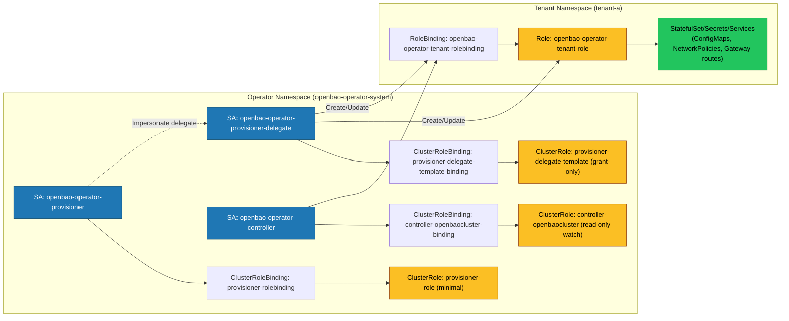
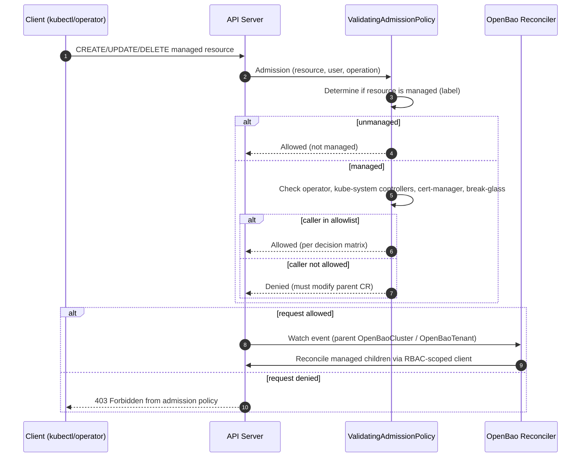

# Security: OpenBao Operator

This document provides a comprehensive security overview for the OpenBao Operator, covering the security model, RBAC architecture, and threat analysis. It serves as a single reference for security teams and auditors.

## 1. Security Model Overview

This document details the security model implemented by the OpenBao Operator. It covers the specific controls used to secure the operator itself, the OpenBao clusters it manages, and the boundaries between tenants in a multi-tenant environment.

The security model relies on a **Supervisor Pattern**, where the operator orchestrates security-critical configuration (TLS, unseal keys, network policies) from the outside, while delegating data plane security to OpenBao itself.

### 1.1 Secure by Default

The Operator enforces a "Secure by Default" posture:

- **Non-Root Execution:** Operator and OpenBao pods run as non-root users
- **Read-Only Filesystem:** OpenBao pods use read-only root filesystem
- **Network Isolation:** Automatic NetworkPolicies enforce default-deny ingress
- **Least-Privilege RBAC:** Split-controller design with minimal permissions
- **Supply Chain Security:** Optional Cosign image verification

## 2. RBAC Architecture

The Operator implements a **least-privilege RBAC model** using separate ServiceAccounts to minimize the attack surface and enforce strict tenant isolation. This architecture ensures that the operator cannot access resources unrelated to OpenBao in tenant namespaces.

### 2.1 Separate ServiceAccounts (Least-Privilege Model)

The Operator uses two distinct ServiceAccounts with different privilege levels:

#### 2.1.1 Provisioner ServiceAccount (`openbao-operator-provisioner`)

The Provisioner ServiceAccount has **minimal cluster-wide permissions**:

- **Namespace Access:** Permissions to `get`, `update`, and `patch` namespaces (no `list` or `watch`). The Provisioner only accesses namespaces that are explicitly declared via `OpenBaoTenant` CRDs, eliminating the ability to survey the cluster topology.
- **OpenBaoTenant CRD Management:** Permissions to `get`, `list`, `watch`, `update`, and `patch` `OpenBaoTenant` resources, which explicitly declare target namespaces for provisioning.
- **RBAC Management:** Permissions to create, update, patch, and delete Roles and RoleBindings in tenant namespaces.
- **Workload Permissions (Grant-Only):** The Provisioner has cluster-wide permissions for all workload resources (StatefulSets, Secrets, Services, etc.), but **these are only used to grant permissions in tenant Roles**. Kubernetes RBAC requires that you have permissions to grant them. The Provisioner does NOT use these permissions to access workload resources directly.

**Security Benefit:** Even if the Provisioner is compromised, it cannot read or modify workload resources in tenant namespaces. It can only create Roles/RoleBindings. Additionally, the Provisioner cannot enumerate namespaces to discover cluster topology, as it only accesses namespaces explicitly declared in `OpenBaoTenant` CRDs.

#### 2.1.2 OpenBaoCluster Controller ServiceAccount (`openbao-operator-controller`)

The OpenBaoCluster Controller ServiceAccount has **very limited cluster-wide permissions**:

- **Cluster-wide watch on `OpenBaoCluster`:** A ClusterRole grants `get;list;watch` on `openbaoclusters` so the controller can establish a shared cache for the primary CRD.
- **Tenant-scoped writes and all child resources:** All write operations on `OpenBaoCluster` and all managed child resources (Secrets, StatefulSets, Services, Jobs, etc.) are namespace-scoped via Roles created by the Provisioner in tenant namespaces.
- **Namespace Isolation:** Can only access resources in namespaces where the Provisioner has created a tenant Role and RoleBinding.

**Security Benefit:** The OpenBaoCluster controller cannot access any resources outside of tenant namespaces, and cannot access non-OpenBao resources within tenant namespaces (unless explicitly granted by the tenant Role).

#### 2.1.3 RBAC & Zero-Trust Topology

The following diagram shows how the Provisioner, Controller, and tenant
namespaces interact under the least‑privilege, zero‑trust model:

### 2.2 Tenant Isolation (Namespace Provisioner)

The Operator includes a **Namespace Provisioner** controller that manages RBAC for tenant namespaces using a governance model based on the `OpenBaoTenant` Custom Resource Definition (CRD).

**Governance Model (OpenBaoTenant CRD):**

Instead of watching all namespaces for labels, the Provisioner watches `OpenBaoTenant` CRDs that explicitly declare which namespaces should be provisioned. This eliminates the need for `list` and `watch` permissions on namespaces, significantly improving the security posture.

- **OpenBaoTenant CRD:** A namespaced resource that declares a target namespace for provisioning. Users create an `OpenBaoTenant` resource in the operator's namespace (typically `openbao-operator-system`) with `spec.targetNamespace` set to the namespace that should receive tenant RBAC.
- **Tenant Role (`openbao-operator-tenant-role`):** A namespace-scoped Role is created in each target namespace granting the OpenBaoCluster Controller ServiceAccount permission to manage OpenBao-related resources (StatefulSets, Secrets, Services, ConfigMaps, etc.) in that specific namespace only.
- **Tenant RoleBinding (`openbao-operator-tenant-rolebinding`):** A RoleBinding ties the OpenBaoCluster Controller ServiceAccount to the tenant Role, ensuring it only operates on tenant resources within their designated boundary.

**Security Benefits:**

- The OpenBaoCluster controller cannot access resources in non-tenant namespaces.
- The OpenBaoCluster controller cannot access resources unrelated to OpenBao in tenant namespaces (e.g., other applications' Secrets, Deployments, etc.).
- The Provisioner cannot access workload resources directly, only create Roles/RoleBindings.
- **Information Disclosure Mitigation:** The Provisioner cannot enumerate namespaces to discover cluster topology. It can only access namespaces explicitly declared in `OpenBaoTenant` CRDs.
- **Elevation of Privilege Mitigation:** Creating an `OpenBaoTenant` CRD requires write access to the operator's namespace, which should be highly restricted (Cluster Admin only).

**Recommendation:** Tenants should typically be granted `edit` or `view` roles for `OpenBaoCluster` resources but should **not** have `get` access to Secrets matching `*-root-token` or `*-unseal-key`. Additionally, only cluster administrators should have permission to create `OpenBaoTenant` resources.

### 2.3 RBAC Components

**Provisioner ClusterRole:**

- Namespace access permissions (`get`, `update`, `patch` only - no `list` or `watch`)
- OpenBaoTenant CRD management permissions
- RBAC management permissions (Roles, RoleBindings)
- Workload permissions (grant-only, for creating tenant Roles)

**Controller Permissions:**

- No cluster-wide permissions
- Receives permissions only via namespace-scoped tenant Roles
- Tenant Roles grant permissions for:
  - OpenBaoCluster management
  - Workload infrastructure (StatefulSets, Services, ConfigMaps, ServiceAccounts)
  - Limited Secret permissions (excludes `list` and `watch` to prevent enumeration)
  - Networking resources (Ingresses, NetworkPolicies, Gateway API resources)
  - Service discovery (Endpoints, EndpointSlices)

**Security Note:** The tenant Role explicitly excludes `list` and `watch` verbs on Secrets to prevent secret enumeration attacks. The operator uses direct `GET` requests for specific secrets it needs to access.

### 2.4 Admission Policies (No Webhooks)

In addition to RBAC, the operator enforces **admission policies** using
Kubernetes `ValidatingAdmissionPolicy` (CEL) resources. This operator does
not deploy admission webhooks.

These policies prevent direct mutation of OpenBao‑managed child resources and
constrain what the controller ServiceAccount itself can change, reducing pivot
risk if the controller process or its credentials are compromised.

**Scope:**

- Targets core and workload resources labelled with:
  - `app.kubernetes.io/managed-by: openbao-operator`
- Resources include:
  - `Secrets`, `ConfigMaps`, `Services`, `StatefulSets`, `Jobs`,
    `Ingresses`, `NetworkPolicies`
  - Gateway API: `HTTPRoute`, `TLSRoute`, `BackendTLSPolicy`

**High-Level Decision Matrix:**

| Actor / Identity                                      | Allowed Mutations on Managed Resources                              | Notes                                           |
|------------------------------------------------------|---------------------------------------------------------------------|-------------------------------------------------|
| Operator controller ServiceAccount                   | Full R/W                                                            | Main reconciler path                            |
| Provisioner / delegate ServiceAccounts (impersonation) | R/W limited to RBAC objects in tenant namespaces                   | Used for tenant Role/RoleBinding management     |
| kube-system controllers (GC, EndpointSlice, etc.)    | Updates/deletes (policy allowlist)                                  | Identified via `system:serviceaccounts:kube-system` group or `kube-system` SA prefix |
| Cert-manager ServiceAccount                          | Updates/deletes (policy allowlist)                                  | Identified via `system:serviceaccount:cert-manager:*` prefix |
| Ingress / Gateway controller ServiceAccounts         | Status updates                                                      | Not subject to the policy (status subresources are not matched) |
| Break-glass admins                                   | Updates/deletes when `openbao.org/maintenance: "true"` is present    | Identified via `system:masters` group |
| OpenBao pod ServiceAccount                           | Pod label updates only                                               | Limited to the service-registration labels |
| Kubelet node identity                                | Pod deletes only                                                     | Allows kubelet to delete managed pods |
| Tenant users and other identities                    | **Denied**                                                          | Must modify `OpenBaoCluster` / `OpenBaoTenant`  |

**Policy resources:**

- `config/policy/lock-managed-resource-mutations.yaml`: denies UPDATE/DELETE of managed resources for non-operator identities.
- `config/policy/lock-controller-statefulset-mutations.yaml`: denies controller ServiceAccount attempts to change high-risk StatefulSet fields (volumes, commands, security context, etc.).

**Break‑glass semantics:**

- When `metadata.annotations["openbao.org/maintenance"] == "true"` and the
  caller is a cluster admin (`system:masters`), the policy permits the requested
  mutation. This provides a controlled emergency escape hatch without disabling
  admission control.

**Failure mode and safety net:**

- Policies use `failurePolicy: Fail` to prefer safety over availability.
- The `OpenBaoCluster` controller periodically requeues clusters with a
  long, jittered interval to detect and correct unexpected drift, even if
  admission policies are temporarily misconfigured.

#### 2.4.1 Resource Lock Admission Flow

### 2.4.2 Controller Pivot Guard (ValidatingAdmissionPolicy)

### 2.4.3 Sentinel Mutation Restrictions (ValidatingAdmissionPolicy)

The Sentinel is a per-cluster sidecar controller that watches for infrastructure drift and triggers fast-path reconciliation. To prevent privilege escalation, a ValidatingAdmissionPolicy (`openbao-restrict-sentinel-mutations`) enforces strict restrictions on what the Sentinel can modify.

**Policy Scope:**

The VAP matches UPDATE and PATCH operations on `OpenBaoCluster` resources where the requesting user is the Sentinel ServiceAccount (`system:serviceaccount:<namespace>:openbao-sentinel`).

**Enforced Restrictions:**

1. **Spec Immutability:** The Sentinel cannot modify `OpenBaoCluster.Spec`. This ensures the Sentinel cannot change the desired state (e.g., version, replicas, configuration).

2. **Status Immutability:** The Sentinel cannot modify `OpenBaoCluster.Status`. This prevents the Sentinel from confusing the operator's status logic or masking conditions.

3. **Annotation Restrictions:** The Sentinel can only add or update the `openbao.org/sentinel-trigger` annotation. All other annotations, labels, and finalizers are blocked.

**Security Guarantees:**

- **Mathematical Security:** Even if the Sentinel binary is compromised, the VAP prevents privilege escalation at the API server level. The Sentinel cannot:
  - Modify cluster configuration
  - Change status conditions
  - Add or modify labels
  - Modify finalizers
  - Access or modify other resources

- **Least Privilege:** The Sentinel has minimal RBAC permissions (read-only access to infrastructure, limited patch access to `OpenBaoCluster`), and the VAP further restricts what mutations are allowed.

**Policy Expression:**

The VAP uses CEL (Common Expression Language) to:
- Identify Sentinel requests via ServiceAccount username pattern matching
- Compare `object.spec` with `oldObject.spec` to block Spec changes
- Compare `object.status` with `oldObject.status` to block Status changes
- Validate that only the trigger annotation is added/updated in metadata

**Deployment:**

The VAP and VAPBinding are included in the operator's installation manifests (`config/policy/restrict-sentinel-mutations.yaml` and `config/policy/restrict-sentinel-mutations-binding.yaml`). They are automatically applied when the operator is deployed.

**Note:** This VAP requires Kubernetes 1.33+ (ValidatingAdmissionPolicy is a stable feature in 1.33+).

In addition to the resource lock policy (which blocks *external* actors from mutating managed resources),
the operator deploys a Kubernetes-native `ValidatingAdmissionPolicy` to constrain what the **controller
ServiceAccount itself** is allowed to change on long-lived workloads.

The policy is defined under `config/policy/lock-controller-statefulset-mutations.yaml` and is intended
to reduce “pivot risk” if the controller process or its credentials are compromised.

**Behavior (UPDATE on StatefulSets only):**

- When the request user is the controller ServiceAccount (`system:serviceaccount:openbao-operator-system:openbao-operator-controller`),
  the API server rejects updates that attempt to change:
  - Pod volumes
  - Container / init container `command` and `args`
  - Pod and container `securityContext`
  - Container `volumeMounts`
  - `automountServiceAccountToken`

**Operational note:** If you install the operator into a different namespace or change the controller
ServiceAccount name, update the `request.userInfo.username` check in the policy accordingly.

### 2.5 Tenant Namespace Provisioning Flow

1. User creates a namespace (target namespace for OpenBao clusters)
2. User creates an `OpenBaoTenant` CRD in the operator's namespace (typically `openbao-operator-system`) with `spec.targetNamespace` set to the target namespace
3. Provisioner controller detects the `OpenBaoTenant` CRD via watch
4. Provisioner verifies the target namespace exists (using `get` permission)
5. Provisioner creates the tenant Role (`openbao-operator-tenant-role`) in the target namespace
6. Provisioner creates the tenant RoleBinding (`openbao-operator-tenant-rolebinding`) binding the `openbao-operator-controller` ServiceAccount to the tenant Role
7. Provisioner applies Pod Security Standards labels to the namespace:
   - `pod-security.kubernetes.io/enforce: restricted`
   - `pod-security.kubernetes.io/audit: restricted`
   - `pod-security.kubernetes.io/warn: restricted`
8. Provisioner updates `OpenBaoTenant.Status.Provisioned = true`
9. OpenBaoCluster controller can now manage OpenBaoCluster resources in that namespace

**Note:** If the target namespace does not exist, the Provisioner updates `OpenBaoTenant.Status.LastError` and requeues the reconciliation. The Provisioner will retry once the namespace is created.

### 2.6 Security Benefits of Split-Controller Design

**Provisioner Compromise:**

- Cannot read or modify workload resources (StatefulSets, Secrets, Services, etc.) in tenant namespaces
- Can only create Roles/RoleBindings, which is a limited attack surface
- Cannot access OpenBao data or configuration

**OpenBaoCluster Controller Compromise:**

- Cannot access resources outside of tenant namespaces
- Cannot access non-OpenBao resources within tenant namespaces (unless explicitly granted)
- Cannot create or modify cluster-wide resources
- Cannot access other tenants' namespaces

**Tenant Isolation:**

- Each tenant namespace has its own Role and RoleBinding
- The OpenBaoCluster controller can only access resources in namespaces where it has been granted permissions
- Cross-tenant access is impossible without explicit RoleBindings

## 3. Admission Validation & Configuration Security

The Operator enforces a strict "Secure by Default" posture for OpenBao configuration using CRD structural validation and `ValidatingAdmissionPolicy`.

### 3.1 Configuration Allowlist

The operator rejects `OpenBaoCluster` resources that attempt to override protected configuration stanzas. This prevents tenants from weakening security controls managed by the operator.

- **Protected Stanzas:** Users cannot override `listener`, `storage`, `seal`, `api_addr`, or `cluster_addr` via `spec.config`. These are strictly owned by the operator to ensure mTLS and Raft integrity.
- **Parameter Allowlist:** Only known-safe OpenBao configuration parameters are accepted in `spec.config`. Unknown or arbitrary keys are rejected.

### 3.2 Immutability

Certain security-critical fields, such as the enabling/disabling of the Init Container, are validated to ensure the cluster cannot be put into an unsupported or insecure state.

## 4. Network Security

The Operator adopts a "Default Deny" network posture for every OpenBao cluster it creates.

### 4.1 Automated NetworkPolicies

For every `OpenBaoCluster`, the operator automatically creates a Kubernetes `NetworkPolicy`.

- **Default Ingress Deny:** All ingress traffic is blocked by default.
- **Allow Rules:**
  - **Inter-Pod Traffic:** Allows traffic between OpenBao pods within the same cluster (required for Raft replication).
  - **Operator Access:** Allows ingress from the OpenBao Operator pods on port 8200 (required for upgrade operations such as leader step-down; initialization prefers Kubernetes service-registration signals but the operator may still need API access for non-self-init initialization and as a fallback).
  - **Kube-System:** Allows ingress from `kube-system` for necessary components like DNS.
  - **Gateway API:** If `spec.gateway` is enabled, traffic is allowed from the Gateway's namespace.

### 4.2 Egress Control

Egress is restricted to essential services:

- **DNS:** UDP/TCP on port 53.
- **Kubernetes API:** TCP on port 443/6443 (required for the `discover-k8s` provider to find peer pods).
- **Kubernetes API (Service Registration):** OpenBao uses Kubernetes service registration to update Pod labels (leader/initialized/sealed/version), which requires in-cluster API access from the OpenBao pods.
- **Cluster Peers:** Communication with other Raft peers.

**Note:** Backup job pods run in separate pods that are excluded from this strict policy to allow them to reach external object storage endpoints (S3, GCS, etc.).

### 4.3 Custom Network Rules

While the operator enforces a default deny posture, users can extend the NetworkPolicy with custom ingress and egress rules via `spec.network.ingressRules` and `spec.network.egressRules`. These custom rules are merged with the operator-managed rules, ensuring that essential operator rules (DNS, API server, cluster peers) are always present and cannot be overridden.

**Security Considerations:**
- Custom rules should follow the principle of least privilege
- Only allow access to specific namespaces, IPs, or ports as needed
- Review custom rules regularly to ensure they remain necessary
- For transit seal backends, prefer namespace selectors over broad IP ranges
- Consider using backup jobs (excluded from NetworkPolicy) rather than adding broad egress rules for object storage access

## 5. Workload Security

The operator ensures that OpenBao pods run with restricted privileges.

### 5.1 Pod Security Context

The `StatefulSet` creates pods with a hardened security context:

- **Non-Root:** Pods run as user/group 1000 (non-root).
- **Read-Only Root Filesystem:** The root filesystem is mounted read-only to prevent tampering. Configuration and data are written to specific mounted volumes.
- **Capability Drop:** All capabilities are dropped (`ALL`) to minimize privilege escalation risks.
- **Seccomp Profile:** Sets `RuntimeDefault` seccomp profile.
- **No Privilege Escalation:** `AllowPrivilegeEscalation` is set to false.

### 5.2 ServiceAccount Token Handling

The Operator disables Pod-level ServiceAccount token automounting and instead mounts a short-lived projected token only into the OpenBao container. This reduces token exposure while still enabling:

- Kubernetes auto-join discovery (`retry_join` via `discover-k8s`).
- Kubernetes service registration (OpenBao-managed Pod labels such as `openbao-active`, `openbao-initialized`, and `openbao-sealed`).

### 5.2 Init Containers

An init container (`bao-config-init`) is used to render the OpenBao configuration (`config.hcl`) at runtime.

- **Purpose:** It injects dynamic environment variables (like Pod IP and Hostname) into the config template securely, without requiring the main container to run a shell or template engine.
- **Security:** This container runs with the same non-root restrictions as the main container.

### 5.3 Pod Security Standards

The Provisioner automatically applies Pod Security Standards (PSS) labels to tenant namespaces:

- **Enforce Label:** `pod-security.kubernetes.io/enforce: restricted`
- **Audit Label:** `pod-security.kubernetes.io/audit: restricted`
- **Warn Label:** `pod-security.kubernetes.io/warn: restricted`

**Security Benefits:**

- Enforces Restricted PSS compliance for all workloads in tenant namespaces.
- Prevents deployment of workloads that do not meet security requirements.
- Provides consistent security posture across all tenant namespaces.
- Aligns with Kubernetes security best practices.

## 6. Secret Management

The Operator manages several high-value secrets.

### 6.1 Auto-Unseal Configuration

**Static Auto-Unseal (Default):**

- **Generation:** A 32-byte cryptographically secure random key is generated by the operator if one does not exist.
- **Storage:** Stored in a Secret named `<cluster>-unseal-key`.
- **Mounting:** Mounted at `/etc/bao/unseal/key` in the OpenBao pod.
- **Risk:** This key acts as the root of trust for data encryption. The Operator sets a `ConditionEtcdEncryptionWarning` status if it cannot verify that etcd encryption is enabled, warning admins that physical access to etcd could compromise this key.

**External KMS Auto-Unseal:**

- **Configuration:** When `spec.unseal.type` is set to an external KMS provider (`awskms`, `gcpckms`, `azurekeyvault`, `transit`), the operator does NOT create or manage the unseal key.
- **Root of Trust:** Shifts from Kubernetes Secrets to the cloud provider's KMS service, improving security posture.
- **Credentials:** If `spec.unseal.credentialsSecretRef` is provided, credentials are mounted at `/etc/bao/seal-creds`. For GCP Cloud KMS, the `GOOGLE_APPLICATION_CREDENTIALS` environment variable is set to point to the mounted credentials file.
- **Workload Identity:** When using workload identity mechanisms (IRSA for AWS, GKE Workload Identity for GCP), credentials may be omitted as the pod identity is used for authentication.

### 6.2 Root Token

- **Lifecycle:** During manual bootstrap (non-self-init), the initial root token is stored in `<cluster>-root-token`.
- **Recommendation:** Users are strongly advised to revoke this token or delete the Secret immediately after initial setup.
- **Self-Init:** When `spec.selfInit` is used, the root token is automatically revoked by OpenBao after initialization and is **never** stored in a Secret.

## 7. TLS & Identity

The Operator supports three modes for TLS certificate management:

### 7.1 Operator-Managed TLS (Default)

When `spec.tls.mode` is `OperatorManaged` (or omitted), the Operator acts as an internal Certificate Authority (CA) to enforce mTLS.

- **Automated PKI:** The operator generates a self-signed Root CA and issues ephemeral leaf certificates for every cluster.
- **Strict SANs:** Certificates include strict Subject Alternative Names (SANs) for the Service and Pod DNS names. Pod IPs are explicitly *excluded* to avoid identity fragility during pod churn.
- **Rotation:** Server certificates are automatically rotated before expiry (configurable via `spec.tls.rotationPeriod`).
- **Gateway Integration:** When Gateway API is used, the operator manages a CA ConfigMap to allow the Gateway (e.g., Traefik) to validate the backend OpenBao pods, ensuring full end-to-end TLS.

### 7.2 External TLS Provider

When `spec.tls.mode` is `External`, the operator does not generate or rotate certificates. Instead, it expects Secrets to be managed by an external entity (e.g., cert-manager, corporate PKI, or CSI drivers).

- **BYO-PKI:** Users can integrate with their organization's PKI infrastructure or use cert-manager for certificate lifecycle management.
- **Secret Names:** The operator expects Secrets named `<cluster-name>-tls-ca` and `<cluster-name>-tls-server` to exist in the cluster namespace.
- **Hot Reload:** The operator still monitors certificate changes and triggers hot-reloads when external providers rotate certificates, ensuring seamless certificate updates without service interruption.
- **No Rotation:** The operator does not check expiry or attempt to rotate certificates in External mode; this is the responsibility of the external provider.

### 7.3 ACME TLS (Native OpenBao ACME Client)

When `spec.tls.mode` is `ACME`, OpenBao uses its native ACME client to automatically obtain and manage TLS certificates.

- **Native ACME:** OpenBao fetches certificates over the network using the ACME protocol (e.g., Let's Encrypt) and stores them in-memory (or cached per `tls_acme_cache_path`).
- **No Secrets:** No Kubernetes Secrets are created or mounted for server certificates. Certificates are managed entirely by OpenBao.
- **Automatic Rotation:** OpenBao handles certificate acquisition and rotation automatically via the ACME protocol, eliminating the need for external certificate management tools.
- **No Wrapper Needed:** No TLS reload wrapper is needed, and `ShareProcessNamespace` is disabled, providing better container isolation and security.
- **Zero Trust:** The operator never possesses private keys, making this mode ideal for zero-trust architectures.
- **Configuration:** ACME parameters (`directoryURL`, `domain`, `email`) are configured via `spec.tls.acme` and rendered directly in the OpenBao listener configuration.

## 8. Supply Chain Security

The Operator implements container image signature verification to protect against compromised registries, man-in-the-middle attacks, and TOCTOU (Time-of-Check to Time-of-Use) vulnerabilities.

### 8.1 Image Verification

- **Verification Method:** Uses Cosign to verify container image signatures against a trusted public key.
- **Configuration:** Enabled via `spec.imageVerification.enabled` with a public key provided in `spec.imageVerification.publicKey`.
- **Timing:** Verification occurs before StatefulSet creation or updates, blocking deployment of unverified images when `failurePolicy` is `Block`.
- **Rekor Transparency Log:** By default, signatures are verified against the Rekor transparency log (`ignoreTlog: false`) to provide non-repudiation guarantees, following OpenBao's verification guidance. This can be disabled via `spec.imageVerification.ignoreTlog: true` if needed.
- **Digest Pinning (TOCTOU Mitigation):** The operator resolves image tags to immutable digests during verification and uses the verified digest in StatefulSets instead of the mutable tag. This prevents an attacker from updating a tag to point to a malicious image between verification and deployment.
- **Private Registry Support:** When `spec.imageVerification.imagePullSecrets` is provided, the operator uses these secrets to authenticate with private registries during verification. Secrets must be of type `kubernetes.io/dockerconfigjson` or `kubernetes.io/dockercfg`.
- **Caching:** Verification results are cached in-memory keyed by image digest (not tag) and public key to avoid redundant network calls while preventing cache issues when tags change.
- **Failure Policies:**
  - `Block` (default): Prevents StatefulSet updates and sets `ConditionDegraded=True` with `Reason=ImageVerificationFailed`.
  - `Warn`: Logs an error and emits a Kubernetes Event but proceeds with deployment.
- **Security Benefits:**
  - Ensures that only cryptographically verified images are deployed, protecting against supply chain attacks.
  - Rekor verification provides non-repudiation, making it impossible to deny that a signature was created.
  - Digest pinning prevents TOCTOU attacks where tags could be swapped between verification and deployment.

## 9. Security Profiles

The Operator supports two security profiles via `spec.profile` to enforce different security postures:

### 9.1 Hardened Profile

**CRITICAL: The Hardened profile is REQUIRED for all production deployments.** The Development profile stores root tokens in Kubernetes Secrets, which creates a significant security risk. The operator enforces Hardened profile requirements via admission policies and CRD validation to prevent misconfiguration.

The `Hardened` profile enforces strict security requirements suitable for production environments:

- **TLS Requirements:** `spec.tls.mode` MUST be `External` (cert-manager or CSI managed) OR `ACME` (OpenBao native ACME client). Operator-managed certificates are rejected.
- **Unseal Requirements:** MUST use external KMS unseal (`awskms`, `gcpckms`, `azurekeyvault`, or `transit`). Static unseal is rejected.
- **Self-Init Requirements:** `spec.selfInit.enabled` MUST be `true`. Root tokens are never created.
- **TLS Verification:** `tlsSkipVerify=true` in seal configuration (e.g., `spec.unseal.transit.tlsSkipVerify` or `spec.unseal.kmip.tlsSkipVerify`) is rejected to ensure proper certificate validation.
- **JWT Authentication:** JWT authentication is automatically bootstrapped during self-init, eliminating the need for manual configuration.

**Security Benefits:**

- **No Root Tokens:** Root tokens are never created or stored, eliminating the risk of token compromise in etcd or through Secret enumeration.
- **External KMS:** Provides stronger root of trust than Kubernetes Secrets for unseal keys, leveraging cloud provider key management services.
- **External TLS:** Integrates with organizational PKI and certificate management systems (cert-manager, CSI drivers).
- **Automatic JWT Bootstrap:** Reduces configuration errors and ensures proper authentication setup without manual intervention.

**Production Requirement:** All production OpenBaoCluster resources MUST use `spec.profile: Hardened`. Admission policies prevent accidental use of Development profile configurations that would violate Hardened profile requirements.

### 9.2 Development Profile

The `Development` profile allows relaxed security for development and testing:

- **Flexible Configuration:** Allows operator-managed TLS, static unseal, and optional self-init.
- **Security Warning:** Sets `ConditionSecurityRisk=True` to indicate relaxed security posture.
- **Root Token Storage:** Creates and stores root tokens in Kubernetes Secrets, which poses a security risk.
- **Use Case:** Suitable for development, testing, and non-production environments where convenience is prioritized over strict security.

**CRITICAL WARNING:** Development profile clusters **MUST NOT** be used in production. The Development profile stores root tokens in Kubernetes Secrets, which can be compromised through Secret enumeration, etcd access, or RBAC misconfiguration. The SecurityRisk condition serves as a reminder to upgrade to Hardened profile before production deployment.

**Recommendation:** Always use the Hardened profile for production deployments. Admission policies prevent accidental use of Development profile configurations that would violate Hardened profile requirements.

## 10. JWT Authentication & OIDC Integration

The Operator uses JWT authentication (OIDC-based) for all operator-to-OpenBao communication, replacing the previous Kubernetes Auth mechanism.

### 10.1 OIDC Discovery

- **Startup Discovery:** The operator discovers the Kubernetes OIDC issuer URL and CA bundle at startup by querying the well-known OIDC endpoint.
- **Caching:** OIDC configuration is cached in the operator's memory for use during cluster reconciliation.
- **Failure Handling:** If OIDC discovery fails, the operator logs an error but continues operation (Development profile clusters can function without OIDC).

### 10.2 Projected ServiceAccount Tokens

- **Operator Token Source:** The operator requests short-lived ServiceAccount tokens via the Kubernetes TokenRequest API (audience `openbao-internal`) for operator-to-OpenBao JWT authentication.
- **Job Token Source:** Backup jobs mount a projected ServiceAccount token at `/var/run/secrets/tokens/openbao-token` (audience `openbao-internal`).
- **Automatic Rotation:** Kubernetes automatically rotates these tokens, providing better security than static tokens.
- **Short Lifetime:** Tokens have a limited lifetime (default 1 hour), reducing the impact of token compromise.

### 10.3 Automatic Bootstrap (Hardened Profile)

For `Hardened` profile clusters, JWT authentication is automatically bootstrapped during self-initialization:

- **JWT Auth Enablement:** The operator automatically enables JWT authentication in OpenBao.
- **OIDC Configuration:** Configures OIDC discovery URL and CA bundle pointing to the Kubernetes API server.
- **Operator Policy:** Creates a least-privilege policy (`openbao-operator`) granting only necessary permissions:
  - `sys/health` (read)
  - `sys/step-down` (update)
  - `sys/storage/raft/snapshot` (read)
- **Operator Role:** Creates a JWT role (`openbao-operator`) that binds to the operator's ServiceAccount with appropriate token policies.

**Security Benefits:**

- Eliminates manual JWT configuration errors.
- Ensures consistent security posture across Hardened clusters.
- Reduces operational overhead while maintaining security.

### 10.4 Backup and Upgrade Authentication

Backup and upgrade executors use JWT authentication when `jwtAuthRole` is configured:

- **Backup Executor:** Uses projected ServiceAccount token from `<cluster-name>-backup-serviceaccount` to authenticate via JWT.
- **Upgrade Manager:** Uses projected ServiceAccount token from `<cluster-name>-upgrade-serviceaccount` to authenticate via JWT.
- **Fallback:** Static tokens can be used as a fallback when JWT is not available (via `tokenSecretRef`).

## 11. Threat Model

This section provides a comprehensive threat analysis using the STRIDE framework.

### 11.1 Asset Identification

- **Critical:** Root token stored in Kubernetes Secret (`<cluster>-root-token`) - grants full administrative access to OpenBao.
- **High Value:** Root CA Private Key (stored in Secret).
- **High Value:** Static auto-unseal key stored in Kubernetes Secret (`<cluster>-unseal-key`) per OpenBao cluster.
- **High Value:** OpenBao Raft data on persistent volumes (PVCs).
- **High Value:** Backup snapshots stored in external object storage.
- **Medium Value:** The OpenBao Configuration (ConfigMap).
- **Medium Value:** Operator service account tokens, backup ServiceAccount tokens, and any credentials/secrets used to access object storage.
- **Medium Value:** `OpenBaoCluster` CRDs and their Status (can reveal topology and health).

### 11.2 Threat Analysis (STRIDE)

#### A. Spoofing

**Threat:** A rogue pod attempts to join the Raft cluster.

**Mitigation:** We use strict mTLS. The Operator acts as the CA. Only pods with a valid certificate mounted via the Secret can join the mesh.

**Threat:** An attacker spoofs external endpoints (Ingress/LoadBalancer) to intercept OpenBao traffic.

**Mitigation:** Require TLS with correct SANs for all external hostnames; the Operator automatically creates NetworkPolicies to enforce cluster isolation (default deny all ingress, allow same-cluster and kube-system traffic). Additionally, recommend service mesh mTLS for north-south traffic where applicable.

#### B. Tampering

**Threat:** User manually edits the StatefulSet (e.g., changes image tag).

**Mitigation:** The Operator's Reconciliation loop runs constantly. It will revert any out-of-band changes to the StatefulSet to match the CRD "Source of Truth" immediately.

**Threat:** Malicious or misconfigured tenant modifies their `OpenBaoCluster` to point backups to an unauthorized object storage location.

**Mitigation:** Backup target configuration can be constrained via admission control policies and/or namespace-scoped RBAC; operators should validate backup targets against an allowlist where required.

#### C. Elevation of Privilege

**Threat:** Attacker compromises the Operator Pod to gain control of the cluster.

**Mitigation:**

- Operator runs as non-root.
- **Least-Privilege RBAC Model:** The Operator uses separate ServiceAccounts:
  - **Provisioner ServiceAccount:** Has minimal cluster-wide permissions (namespace watching + RBAC management). Cannot access workload resources directly.
  - **OpenBaoCluster Controller ServiceAccount:** Has cluster-wide read access to `openbaoclusters` (`get;list;watch`) to support controller-runtime watches/caching, and cluster-wide `create` on `tokenreviews`/`subjectaccessreviews` for the protected metrics endpoint; all OpenBaoCluster writes and all child resources remain tenant-scoped via namespace Roles.
- **Namespace Isolation:** The OpenBaoCluster controller cannot access resources outside tenant namespaces or non-OpenBao resources within tenant namespaces.
- Operator does NOT have permission to read the *data* inside OpenBao (KV engine), only the API system endpoints.
- **Blind Writes:** For sensitive assets like the Unseal Key Secret, the operator uses a "blind create" pattern. It attempts to create the Secret but does not require `GET` or `LIST` permissions on the generated secret data after creation, minimizing the attack surface if the operator is compromised.

**Threat:** One tenant's `OpenBaoCluster` configuration impacts other clusters (cross-tenant impact).

**Mitigation:**

- All resources use deterministic naming: `<cluster-name>-<suffix>` pattern.
- Resources are always created in the `OpenBaoCluster` namespace.
- Resources are labeled with `openbao.org/cluster=<cluster-name>` for proper identification.
- **Namespace-Scoped RBAC:** The OpenBaoCluster controller receives permissions only via namespace-scoped Roles, preventing cross-namespace access.
- RBAC supports namespace-scoped user access via RoleBindings.
- Controller rate limiting (MaxConcurrentReconciles: 3, exponential backoff) prevents one cluster from starving others.

**Threat:** Compromised Provisioner controller accesses workload resources in tenant namespaces (e.g., reading other applications' Secrets).

**Mitigation:**

- The Provisioner ServiceAccount has cluster-wide permissions only for granting permissions (required by Kubernetes RBAC), but the Provisioner controller code does NOT use these permissions to access workload resources.
- The Provisioner only creates Roles/RoleBindings; it does not perform GET/LIST operations on StatefulSets, Secrets, Services, etc.
- The OpenBaoCluster controller (which does access workload resources) uses a separate ServiceAccount with NO cluster-wide permissions, only namespace-scoped permissions in tenant namespaces.
- This separation ensures that even if the Provisioner is compromised, it cannot read or modify workload resources.

**Threat:** Compromised Provisioner enumerates namespaces to discover cluster topology and project names.

**Mitigation:**

- The Provisioner no longer has `list` or `watch` permissions on namespaces. It can only `get` namespaces that are explicitly declared in `OpenBaoTenant` CRDs.
- The Provisioner watches `OpenBaoTenant` CRDs instead of namespaces, making it a "blind executor" that only acts on explicit governance instructions.
- Creating an `OpenBaoTenant` CRD requires write access to the operator's namespace, which should be highly restricted (Cluster Admin only).
- This eliminates the ability for a compromised Provisioner to survey the cluster topology.

#### D. Information Disclosure

**Threat:** TLS keys, backup credentials, or snapshot contents are exposed via logs or metrics.

**Mitigation:** Never log secret material; use structured logging with careful redaction; encrypt Secrets at rest and enforce least-privilege RBAC; rely on OpenBao's telemetry parameters (not custom logging of sensitive fields).

**Threat:** Unauthorized access to backups in object storage.

**Mitigation:** Use storage-level encryption and strict access controls (per-tenant buckets/prefixes, scoped credentials); document best practices for platform teams.

**Threat:** Backup credentials Secret (`spec.backup.target.credentialsSecretRef`) or backup ServiceAccount is compromised, allowing unauthorized access to backup storage.

**Mitigation:**

- Use least-privilege credentials that only allow write access to the specific bucket/prefix for the cluster.
- Prefer workload identity over static credentials where possible:
  - Configure `spec.backup.target.roleArn` and omit `credentialsSecretRef` to use Web Identity (OIDC federation).
  - The backup Job mounts a projected ServiceAccount token and relies on the cloud SDK default credential chain.
- Enable audit logging for access to credentials Secrets.
- Rotate credentials periodically.

**Threat:** Snapshot data contains sensitive OpenBao secrets and could be exfiltrated via backups.

**Mitigation:**

- Backups are encrypted at rest by the object storage provider (SSE-S3, GCS encryption, etc.).
- Per-tenant bucket/prefix isolation prevents cross-tenant access.
- Backup credentials should be scoped to prevent read access (write-only for backups, read for restore is a separate credential).
- Document that restores should be performed in secure environments.

**Threat (Critical):** Compromise of Kubernetes Secrets storing the static auto-unseal key allows decryption of all OpenBao data for that cluster.

**Mitigation:** Require etcd encryption at rest; strictly limit Secret access via RBAC; apply network and node hardening; enable audit logging for Secret access in the Kubernetes control plane.

**Threat (Critical):** Compromise of the root token Secret (`<cluster>-root-token`) grants full administrative access to the OpenBao cluster.

**Mitigation:**

- RBAC MUST strictly limit access to the root token Secret. Only cluster administrators and the Operator ServiceAccount should have read access.
- Enable audit logging for all access to this Secret.
- Organizations SHOULD revoke or rotate the root token after initial cluster setup and use more granular policies for ongoing administration.
- The Operator intentionally does NOT log the root token or the initialization response.
- Platform teams SHOULD periodically audit who has access to these Secrets.

#### E. Denial of Service

**Threat:** Misconfigured `OpenBaoCluster` resources cause hot reconcile loops that overload the Operator or API server.

**Mitigation:** Implement reconciliation backoff, limit concurrent reconciles per cluster, and surface misconfiguration via Status conditions so users can remediate.

**Threat:** Excessive backup frequency or large snapshot sizes exhaust object storage quotas or saturate network bandwidth.

**Mitigation:** Validate backup schedules and document recommended limits; make backup settings configurable and observable.

#### F. Repudiation

**Threat:** Lack of audit trail for Operator-initiated actions (e.g., upgrades, step-downs, backups).

**Mitigation:**

- The Operator emits structured audit logs for critical operations (initialization, leader step-down) tagged with `audit=true` and `event_type` for easy filtering in log aggregation systems.
- Use structured, timestamped logs including `OpenBaoCluster` namespace/name and correlation IDs.
- Rely on Kubernetes/audit logs and OpenBao audit logs (configurable via `spec.audit`) where available.

### 11.3 Secrets Management Requirements

- **Requirement:** The CA Key generated by the Operator must never be logged to stdout/stderr.
- **Requirement:** The root token and initialization response (containing unseal keys) must NEVER be logged.
- **Requirement:** Credentials and tokens used for object storage access must be stored in Kubernetes Secrets or via workload identity, never embedded in ConfigMaps or images.
- **Requirement:** Secret names must be unique per `OpenBaoCluster` to prevent accidental cross-tenant sharing.
- **Requirement:** The root token Secret (`<cluster>-root-token`) must be protected with strict RBAC; access should be limited to cluster administrators and the Operator.
- **Recommendation:** Organizations should revoke or rotate the root token after initial cluster setup, storing it securely offline for emergency recovery only.

### 11.4 Multi-Tenancy Security Considerations

In multi-tenant deployments, additional threats and mitigations apply:

**Tenant Isolation Threats:**

- **Threat:** Tenant A reads Tenant B's root token or unseal key Secret.
- **Mitigation:**
  - **Namespace-Scoped Permissions:** The OpenBaoCluster controller uses namespace-scoped Roles that only grant permissions within the tenant namespace, preventing cross-namespace access.
  - Use namespace-scoped RoleBindings that do NOT grant Secret read access to tenants.
  - Deploy policy engines (OPA Gatekeeper, Kyverno) to block access to `*-root-token` and `*-unseal-key` Secrets.
  - **External KMS:** When using external KMS auto-unseal (`spec.unseal.type` set to `awskms`, `gcpckms`, `azurekeyvault`, or `transit`), the unseal key is not stored in Kubernetes Secrets, eliminating this threat vector for the unseal key.
  - Consider using self-initialization to avoid root token Secrets entirely.

- **Threat:** Tenant A's OpenBao pods communicate with Tenant B's pods.
- **Mitigation:** The Operator automatically creates NetworkPolicies for each cluster that restrict ingress/egress to pods with matching `openbao.org/cluster` labels, enforcing default-deny-all-ingress with exceptions for same-cluster pods, kube-system, and operator pods.

- **Threat:** Tenant A accesses Tenant B's backup data in object storage.
- **Mitigation:**
  - Each tenant MUST have separate backup credentials.
  - IAM policies MUST restrict access to tenant-specific bucket prefixes.
  - Backup credentials should be write-only (read access granted separately for restore operations).

**Resource Exhaustion Threats:**

- **Threat:** One tenant creates excessive OpenBaoCluster resources, exhausting cluster resources.
- **Mitigation:** Configure ResourceQuotas per namespace to limit pods, PVCs, CPU, and memory. Controller rate limiting (MaxConcurrentReconciles: 3) prevents one cluster from starving the reconciler.

### 11.5 Recommended Multi-Tenancy Controls

For secure multi-tenant deployments, platform teams SHOULD implement:

| Control | Purpose | Implementation |
|---------|---------|----------------|
| Separate ServiceAccounts | Least-privilege operator permissions | Provisioner ServiceAccount (RBAC management only) and OpenBaoCluster Controller ServiceAccount (tenant-scoped only) |
| Namespace-scoped RBAC | Isolate tenant access to CRs | RoleBindings with `openbaocluster-editor-role`; tenant Roles created by Provisioner |
| Secret access restrictions | Protect root tokens and unseal keys | Policy engine rules or explicit RBAC denies |
| NetworkPolicies | Isolate cluster network traffic | Automatically created by Operator (default deny all ingress, allow same-cluster and kube-system) |
| ResourceQuotas | Prevent resource exhaustion | Namespace-level quotas |
| Backup credential isolation | Protect backup data | Per-tenant IAM credentials with prefix restrictions |
| Pod Security Standards | Enforce secure pod configuration | PSA labels on namespaces |
| Audit logging | Monitor sensitive access | Kubernetes audit policy for Secrets |

**Note:** The Operator implements the separate ServiceAccounts model by default. The Provisioner ServiceAccount has minimal cluster-wide permissions (namespace `get`/`update`/`patch` + OpenBaoTenant CRD management + RBAC management), while the OpenBaoCluster Controller ServiceAccount has cluster-wide read access to `openbaoclusters` (`get;list;watch`) and cluster-wide `create` on `tokenreviews`/`subjectaccessreviews` (for the protected metrics endpoint). All OpenBaoCluster writes and all child resources are tenant-scoped via namespace Roles created by the Provisioner. The Provisioner uses a governance model based on `OpenBaoTenant` CRDs, eliminating the need for `list`/`watch` permissions on namespaces and preventing cluster topology enumeration.
