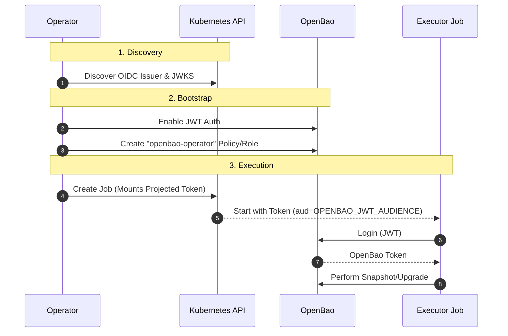

# Secrets Management

The Operator manages the lifecycle of several critical secrets, from the Root Token to internal PKI certificates.

## Managed Secrets Matrix

| Secret Name Config | Default Name | Rotation Policy | Risk Level |
| :--- | :--- | :--- | :--- |
| **Root Token** | `<cluster>-root-token` | Manual Revocation | :material-alert: Critical |
| **Unseal Keys** | `<cluster>-unseal-key` | Manual Rotation | :material-alert: Critical |
| **Cluster CA** | `<cluster>-ca` | 1 Year (Auto) | :material-alert: High |
| **TLS Certs** | `<cluster>-tls` | 90 Days (Auto) | :material-alert: High |
| **Backup Creds** | User Defined | User Managed | :material-alert: High |

## Auto-Unseal Configuration

=== "Static (Default)"

    !!! warning "Static Keys"
        This mode generates a static 32-byte key stored in a Kubernetes Secret. This key becomes the root of trust for your OpenBao data encryption. If `etcd` is not encrypted at rest, this key is vulnerable.

    **Behavior:**
    
    1.  **Generation:** Operator generates a random 32-byte key.
    2.  **Storage:** Stored in `<cluster>-unseal-key`.
    3.  **Mounting:** Mounted at `/etc/bao/unseal/key`.
    4.  **Condition:** Sets `ConditionEtcdEncryptionWarning=True` if etcd encryption is not verified.

=== "External KMS (Recommended)"

    !!! success "Enhanced Security"
        Using an external KMS (AWS, GCP, Azure, or Vault Transit) shifts the root of trust away from the Kubernetes cluster, significantly improving security.

    **Behavior:**
    
    1.  **No Operator Key:** The Operator does **NOT** generate or manage unseal keys.
    2.  **Configuration:** Configure `spec.unseal` with your provider details.
    3.  **Authentication:**
        -   **Workload Identity (Recommended):** Use IRSA (AWS) or Workload Identity (GCP) to authenticate without static credentials.
        -   **Credentials Secret:** Mount static credentials via `spec.unseal.credentialsSecretRef`.

## Root Token Lifecycle

!!! danger "Root Token Security"
    In **Development** profile, the Root Token is stored in a Secret. This grants **Full Administrative Access** to anyone who can read Secrets in the namespace.

    **Recommendation:** Immediately revoke the root token after initial setup or use **Self-Initialization** with the **Hardened** profile, which avoids storing the root token entirely.

## JWT Authentication & OIDC

The OpenBao Operator uses Kubernetes OIDC to authenticate **Backup** and **Upgrade** executor jobs without managing static long-lived tokens.

!!! note "JWT bootstrap"
    Enable automatic JWT auth bootstrap with `spec.selfInit.oidc.enabled: true`.
    This requires the OIDC issuer and JWKS keys to be discoverable by the operator from the Kubernetes API server (OIDC discovery non-resource URLs).
    If you disable it, configure JWT auth manually via self-init requests.

### Workflow

### Benefits

1. **Short-Lived:** Projected tokens expire automatically (default 1 hour).
2. **Rotated:** Kubernetes rotates the tokens automatically.
3. **Audience Bound:** Tokens are valid only for the configured audience (default: `openbao-internal`), preventing replay attacks against other services.

!!! note "JWT audience"
    Set `OPENBAO_JWT_AUDIENCE` on the operator deployment and keep `bound_audiences` aligned in OpenBao roles.

## See Also

- [:material-location-exit: External Access](../../user-guide/openbaocluster/configuration/external-access.md)
- [:material-server-security: Security Profiles](profiles.md)
- [:material-archive: Backups Integration](../../user-guide/openbaocluster/operations/backups.md)
