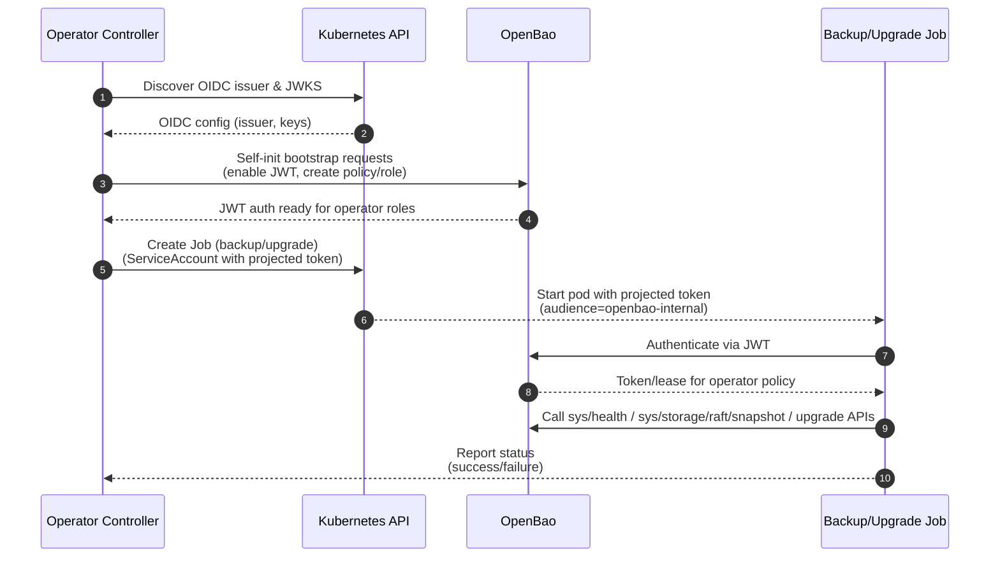

# Secrets Management

The Operator manages several high-value secrets for OpenBao clusters.

## Auto-Unseal Configuration

### Static Auto-Unseal (Default)

- **Generation:** A 32-byte cryptographically secure random key is generated by the operator if one does not exist.
- **Storage:** Stored in a Secret named `<cluster>-unseal-key`.
- **Mounting:** Mounted at `/etc/bao/unseal/key` in the OpenBao pod.
- **Risk:** This key acts as the root of trust for data encryption. The Operator sets a `ConditionEtcdEncryptionWarning` status if it cannot verify that etcd encryption is enabled, warning admins that physical access to etcd could compromise this key.

### External KMS Auto-Unseal

- **Configuration:** When `spec.unseal.type` is set to an external KMS provider (`awskms`, `gcpckms`, `azurekeyvault`, `transit`), the operator does NOT create or manage the unseal key.
- **Root of Trust:** Shifts from Kubernetes Secrets to the cloud provider's KMS service, improving security posture.
- **Credentials:** If `spec.unseal.credentialsSecretRef` is provided, credentials are mounted at `/etc/bao/seal-creds`. For GCP Cloud KMS, the `GOOGLE_APPLICATION_CREDENTIALS` environment variable is set to point to the mounted credentials file.
- **Workload Identity:** When using workload identity mechanisms (IRSA for AWS, GKE Workload Identity for GCP), credentials may be omitted as the pod identity is used for authentication.

See also: [Security Considerations](../../user-guide/openbaocluster/security-considerations.md)

## Root Token

- **Lifecycle:** During manual bootstrap (non-self-init), the initial root token is stored in `<cluster>-root-token`.
- **Recommendation:** Users are strongly advised to revoke this token or delete the Secret immediately after initial setup.
- **Self-Init:** When `spec.selfInit` is used, the root token is automatically revoked by OpenBao after initialization and is **never** stored in a Secret.

!!! warning "Root Token Security"
    The Development profile stores root tokens in Kubernetes Secrets, which can be compromised through Secret enumeration, etcd access, or RBAC misconfiguration. Always use the Hardened profile for production deployments.

## JWT Authentication & OIDC Integration

The operator supports Kubernetes OIDC-based JWT authentication for **backup and upgrade executor Jobs** (and can optionally bootstrap OpenBao’s JWT auth during self-init).

### OIDC Discovery

- **Startup Discovery:** The operator discovers the Kubernetes OIDC issuer URL and fetches JWKS public keys at startup by querying the well-known OIDC endpoint.
- **Caching:** OIDC configuration is cached in the operator's memory for use during cluster reconciliation.
- **Failure Handling:** If OIDC discovery fails, the operator logs an error but continues operation (Development profile clusters can function without OIDC).

### Projected ServiceAccount Tokens

- **Controller Token Source:** The controller does not create ServiceAccount TokenRequests.
- **Job Token Source:** Backup and upgrade Jobs mount a projected ServiceAccount token at `/var/run/secrets/tokens/openbao-token` (audience `openbao-internal`).
- **Automatic Rotation:** Kubernetes automatically rotates these tokens, providing better security than static tokens.
- **Short Lifetime:** Tokens have a limited lifetime (default 1 hour), reducing the impact of token compromise.

### Optional JWT Bootstrap During Self-Init

When `spec.selfInit.bootstrapJWTAuth=true`, the operator injects additional self-init requests to bootstrap JWT auth in OpenBao:

- **JWT Auth Enablement:** The operator automatically enables JWT authentication in OpenBao.
- **OIDC/JWKS Configuration:** Configures the bound issuer and JWT validation public keys (JWKS) captured from Kubernetes at operator startup.
- **Operator Policy:** Creates a least-privilege policy (`openbao-operator`) granting only necessary permissions:
  - `sys/health` (read)
  - `sys/step-down` (sudo) *(when used by executor Jobs)*
  - `sys/storage/raft/snapshot` (read)
- **Operator Role:** Creates a JWT role (`openbao-operator`) that binds to the operator's ServiceAccount with appropriate token policies.

### Backup and Upgrade Authentication

Backup and upgrade executors use JWT authentication when `jwtAuthRole` is configured:

- **Backup Executor:** Uses projected ServiceAccount token from `<cluster-name>-backup-serviceaccount` to authenticate via JWT.
- **Upgrade Executor:** Uses projected ServiceAccount token from `<cluster-name>-upgrade-serviceaccount` to authenticate via JWT.
- **Backup Fallback:** Backup can fall back to a static token via `spec.backup.tokenSecretRef` when JWT is not available.

See also: [Backups](../../user-guide/openbaocluster/operations/backups.md)

### JWT Flow Overview

### Operator-to-OpenBao API Calls (No JWT)

The operator itself uses TLS and relies on unauthenticated endpoints where possible (for example `sys/health` and the manual initialization fallback via `sys/init`). Privileged OpenBao actions that require authentication (snapshots, leader step-down, raft operations) are performed by the dedicated executor Jobs using JWT (preferred) or static tokens (fallback).
