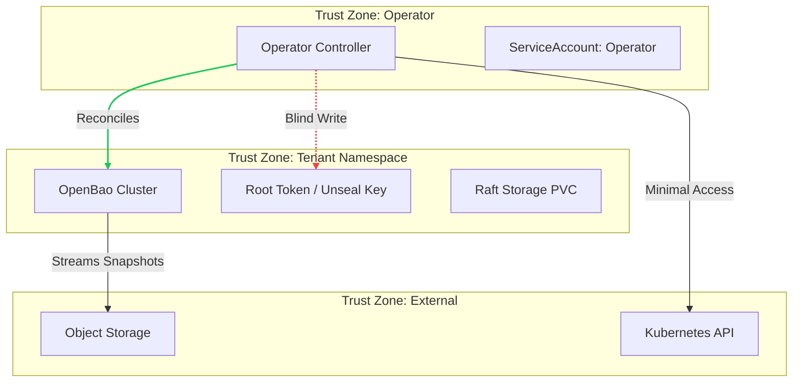

# Threat Model

!!! abstract "Scope"
    This document analyzes the security boundaries, assets, and potential threats to the OpenBao Operator using the **STRIDE** framework.

## 1. Trust Boundaries

The system is divided into three major trust zones.

## 2. Asset Identification

| Asset | Risk Level | Location | Description |
| :--- | :--- | :--- | :--- |
| **Root Token** | :material-alert: **Critical** | `Secret` | Grants full administrative access to OpenBao. |
| **Unseal Keys** | :material-alert: **High** | `Secret` | Static keys used to decrypt the vault master key. |
| **Raft Data** | :material-alert: **High** | `PVC` | Encrypted persistent storage containing all vault data. |
| **Snapshots** | :material-alert: **High** | `S3/GCS` | Encrypted backups of the Raft data. |
| **CA Key** | :material-alert: **High** | `Secret` | Private key for the Cluster Root CA. |
| **Configuration** | :material-information: Medium | `ConfigMap` | HCL configuration files. |

## 3. STRIDE Analysis

??? failure "Spoofing (Identity)"
    **Threat:** A rogue pod attempts to join the Raft cluster.

    !!! success "Mitigation: mTLS"
        Only pods with a valid certificate signed by the Operator CA (mounted via Secret) can join the mesh.

    **Threat:** An attacker spoofs external endpoints.
    
    !!! success "Mitigation: Network Policy"
        Default-deny ingress policies enforce cluster isolation. TLS required for all external traffic.

??? warning "Tampering (Data Integrity)"
    **Threat:** User manually edits the StatefulSet (e.g., changes image).

    !!! success "Mitigation: Reconciliation"
        The Operator watches for changes and immediately reverts drift to the desired state defined in the CRD.

    **Threat:** Malicious tenant points backups to unauthorized storage.
    
    !!! success "Mitigation: Policy"
        Use Admission Policies (ValidatingAdmissionPolicy) to restrict allowed backup targets.

??? danger "Repudiation (Audit Logs)"
    **Threat:** Lack of audit trail for critical actions (step-down, backup).

    !!! success "Mitigation: Structured Auditing"
        The Operator emits structured JSON logs with `audit=true` for all control plane actions.

??? failure "Information Disclosure (Privacy)"
    **Threat:** TLS keys or tokens exposed in logs.

    !!! success "Mitigation: Redaction"
        Strict policy against logging secrets. Use `crypto/rand` for generation. OpenBao telemetry is used instead of debug logs.

??? danger "Denial of Service (Availability)"
    **Threat:** Misconfigured CR causing hot reconcile loops.

    !!! success "Mitigation: Rate Limiting"
        The controller utilizes `MaxConcurrentReconciles` and exponential backoff to preventing API saturation.

??? warning "Elevation of Privilege (Authorization)"
    **Threat:** Attacker compromises the Operator Pod.

    !!! success "Mitigation: Least Privilege"
        - **Non-Root:** Operator runs as non-root.
        - **Blind Writes:** Operator can create Secrets but cannot list/read them back.
        - **Split RBAC:** Separated ServiceAccounts for Provisioning vs. Management.

## 4. Secrets Management

!!! danger "Critical Requirements"
    1.  **Never Log Secrets:** Root tokens, unseal keys, and CA keys must NEVER appear in stdout/stderr.
    2.  **Unique Names:** Secrets must include the cluster name to prevent collisions.
    3.  **Strict RBAC:** Only Cluster Admins should have access to the Root Token Secret.
