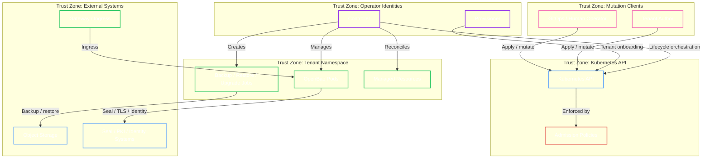

# Threat Model

This page analyzes the OpenBao Operator security model with the **STRIDE** framework. It focuses on operator-owned control-plane behavior, tenant isolation, and lifecycle workflows.

!!! note "Scope"
    This page models threats to the OpenBao Operator control plane, tenant isolation boundaries, and lifecycle workflows. It does not replace OpenBao's own internal threat model.

!!! note "Lifecycle Contract"
    `OpenBaoCluster` is an operator-owned lifecycle contract. This model assumes the operator manages clusters it created and reconciles. Generic import of arbitrary unmanaged OpenBao clusters is out of scope.

## 1. Threat Actors

This model assumes the following actors are relevant.

- A tenant author with namespace-scoped write access.
- A GitOps pipeline or human operator with namespace or cluster write access.
- A compromised Controller Pod.
- A compromised Provisioner Pod.
- A compromised OpenBao Pod or backup, restore, or upgrade Job.
- A misconfigured or compromised external dependency such as object storage, PKI, KMS, or an ingress controller.

## 2. Trust Boundaries

The system is divided into five trust zones. Admission policy is the API enforcement boundary between submitted intent and persisted state.

```mermaid
graph TD
    subgraph Client_Zone ["Trust Zone: Mutation Clients"]
        GitOps["GitOps / Human Operator"]
        Tenant["Tenant Author"]
    end

    subgraph Operator_Zone ["Trust Zone: Operator Identities"]
        Prov["Provisioner"]
        Ctrl["Controller"]
    end

    subgraph API_Zone ["Trust Zone: Kubernetes API"]
        K8sAPI["Kubernetes API"]
        VAP["Admission Policies"]
    end

    subgraph Tenant_Zone ["Trust Zone: Tenant Namespace"]
        Bao["OpenBao Pods"]
        Jobs["Backup / Restore / Upgrade Jobs"]
        Managed["Managed Resources"]
    end

    subgraph External_Zone ["Trust Zone: External Systems"]
        Edge["Gateway / Ingress"]
        Storage["Object Storage"]
        Trust["Seal / PKI / Identity Systems"]
    end

    GitOps --"Apply / mutate"--> K8sAPI
    Tenant --"Apply / mutate"--> K8sAPI
    K8sAPI --"Enforced by"--> VAP
    Prov --"Tenant onboarding"--> K8sAPI
    Ctrl --"Lifecycle orchestration"--> K8sAPI
    Ctrl --"Manages"--> Bao
    Ctrl --"Creates"--> Jobs
    Ctrl --"Reconciles"--> Managed
    Edge --"Ingress"--> Bao
    Bao --"Seal / TLS / identity"--> Trust
    Jobs --"Backup / restore"--> Storage

    classDef git fill:transparent,stroke:#f472b6,stroke-width:2px,color:#fff;
    classDef read fill:transparent,stroke:#60a5fa,stroke-width:2px,color:#fff;
    classDef write fill:transparent,stroke:#22c55e,stroke-width:2px,color:#fff;
    classDef security fill:transparent,stroke:#dc2626,stroke-width:2px,color:#fff;
    classDef process fill:transparent,stroke:#9333ea,stroke-width:2px,color:#fff;

    class GitOps,Tenant git;
    class K8sAPI,Storage,Trust read;
    class Bao,Jobs,Managed,Edge write;
    class VAP security;
    class Prov,Ctrl process;
```

## 3. Asset Identification

### Always-Relevant Assets

| Asset | Risk Level | Location | Description |
| :--- | :--- | :--- | :--- |
| **Admission Policies and Bindings** | :material-alert: **Critical** | Kubernetes API | Enforce the operator's API-level safety model before objects persist. |
| **Provisioner and Controller Identities** | :material-alert: **Critical** | `ServiceAccount`, RBAC | Long-running operator identities that define namespace onboarding and lifecycle authority. |
| **Tenant RBAC and Secret Allowlists** | :material-alert: **High** | `Role`, `RoleBinding` | Define tenant namespace access and name-scoped Secret reachability. |
| **Raft Data** | :material-alert: **High** | `PVC` | Encrypted persistent state containing OpenBao data. |
| **Snapshots** | :material-alert: **High** | `S3/GCS/Azure` | Encrypted backup artifacts of the Raft state. |
| **Operator-Managed Configuration** | :material-information: Medium | `ConfigMap`, CR spec | HCL configuration and rendered lifecycle settings. |
| **Generated Job Identity** | :material-information: Medium | `ServiceAccount`, Pod metadata | Backup, restore, and upgrade identity contract, separate from the main OpenBao Pods. |

### Conditional Assets

| Asset | Risk Level | Location | Description |
| :--- | :--- | :--- | :--- |
| **Root Token Secret** | :material-alert: **Critical** | `Secret` | Present only when bootstrap mode persists the initial root token. Hardened self-init avoids this path. |
| **Static Unseal Keys** | :material-alert: **High** | `Secret` | Present only when static unseal is used. Hardened production posture avoids this path. |
| **Operator-Managed CA Key** | :material-alert: **High** | `Secret` | Present only in `OperatorManaged` TLS mode. |
| **External TLS Secrets** | :material-alert: **High** | `Secret` | Present only when `External` TLS is used. |
| **Transit / Cloud / HSM Credentials** | :material-alert: **High** | `Secret` or workload identity | Seal and PKI credentials depend on the selected unseal and identity mode. |

## 4. STRIDE Analysis

??? failure "Spoofing"
    **Threats**

    - A client or GitOps render path spoofs the operator identity by drifting `ServiceAccount` names, policy subjects, or `RoleBinding` subjects.
    - A workload or edge path spoofs cluster identity at the TLS boundary.
    - Backup, restore, or upgrade jobs inherit the wrong identity path.

    !!! success "Primary Mitigations"
        - Split Provisioner and Controller identities.
        - Validate rendered install identities for Helm and raw-manifest overlays.
        - Validate TLS SANs and trust sources before the cluster becomes ready.
        - Use separate Job `ServiceAccount` objects, identity checks, and Job-specific network controls.

??? warning "Tampering"
    **Threats**

    - A user, GitOps controller, or compromised namespace actor directly mutates operator-managed resources.
    - A compromised Provisioner or tenant workflow broadens tenant RBAC or tenant guardrails.
    - A tenant or operator steers backup or restore jobs toward unintended endpoints or credentials.

    !!! success "Primary Mitigations"
        - Lock operator-managed resources with admission policy.
        - Restrict controller writes for RBAC, `ServiceAccount`, and Secret objects.
        - Restrict Provisioner namespace mutation and tenant-governance writes.
        - Keep backup and restore credentials name-scoped and separately validated.

    !!! note "PVC Posture"
        Operator-managed PVCs are intentionally CR-driven and status-observed rather than fully admission-locked. Kubernetes storage controllers and CSI components also mutate PVCs during normal lifecycle.

??? note "Repudiation"
    **Threats**

    - High-value control-plane actions cannot be attributed later.
    - Break-glass changes happen without a clear audit boundary.

    !!! success "Primary Mitigations"
        - Emit structured operator audit logs for startup gating, upgrades, backups, restore, and operation-lock transitions.
        - Use Kubernetes API audit logs and admission denials as the primary mutation trail.
        - Keep maintenance mode explicit and break-glass groups narrow by default.

    !!! note "Audit Boundary"
        Operator audit logs complement Kubernetes API audit logs. They do not replace cluster-level API auditing.

??? danger "Information Disclosure"
    **Threats**

    - Secrets, credentials, or keys are exposed through logs or broad namespace access.
    - TLS or certificate handling leaks sensitive material.
    - Backup and restore credentials leak across workloads.

    !!! success "Primary Mitigations"
        - Never log secrets.
        - Keep Secret access name-scoped without normal Secret enumeration.
        - Use separate writer and reader roles for operator-managed Secrets.
        - Keep ACME private keys in the OpenBao process instead of Kubernetes Secrets.
        - Use separate workload identities for backup and restore Jobs.

??? failure "Denial of Service"
    **Threats**

    - Misconfiguration or tampering causes reconcile churn or blocks convergence.
    - Day-2 operations collide or force unsafe concurrent mutations.
    - Voluntary disruption or PDB tampering breaks quorum.
    - Required admission policies disappear after startup.

    !!! success "Primary Mitigations"
        - Use controller rate limiting and bounded concurrency.
        - Validate objects at admission before invalid state persists.
        - Use explicit readiness conditions for API-server, Gateway, ACME, backup, and restore assumptions.
        - Use a shared operation lock for disruptive workflows.
        - Manage `PodDisruptionBudget` objects and lock them against drift.
        - Re-check admission dependencies at runtime and pause privileged reconciliation when they disappear.

??? danger "Elevation of Privilege"
    **Threats**

    - A compromised Controller broadens tenant privileges or writes to unrelated Secrets or `ServiceAccount` objects.
    - A compromised Provisioner mints broader tenant access or mutates protected namespaces.
    - Unsafe mode or break-glass use weakens the API-level defense-in-depth boundary.

    !!! success "Primary Mitigations"
        - Split long-running identities and restrict controller writes.
        - Keep Secret access name-scoped and allowlisted.
        - Restrict Provisioner RBAC, namespace mutation, and tenant-governance writes.
        - Keep unsafe mode explicitly non-production and break-glass scoped.

## 5. Accepted Residual Risks

!!! warning "Accepted Posture"
    - PVCs are intentionally soft-governed rather than fully admission-locked because Kubernetes and CSI controllers also update them.
    - `UserAccessBootstrap` is best-effort signaling. The operator does not try to prove that arbitrary self-init requests create a usable human authentication path.
    - Cloud KMS and external identity integrations are surfaced through conditions and validation, but still depend on external systems outside the operator trust boundary.
    - `unsafe mode` intentionally weakens the API-level safety model and is not a supported Hardened production posture.

## 6. See Also

- [Operator Invariants](../../architecture/operator-invariants.md)
- [Admission Policies](../infrastructure/admission-policies.md)
- [RBAC Architecture](../infrastructure/rbac.md)
- [Status Conditions and Events](../../reference/status-and-events.md)
