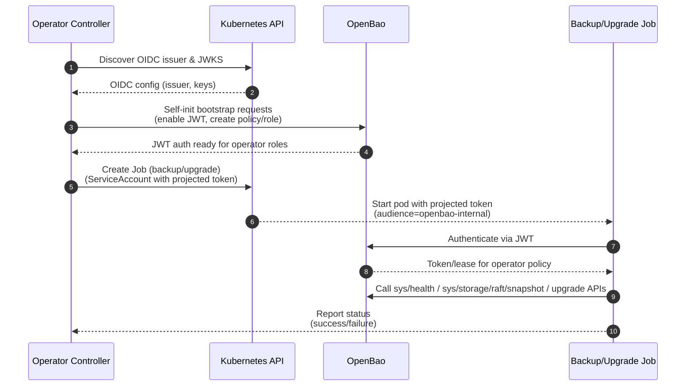

# Security: OpenBao Operator

This document provides a comprehensive security overview for the OpenBao Operator, covering the security model, RBAC architecture, and threat analysis. It serves as a single reference for security teams and auditors.

## 1. Security Model Overview

This document details the security model implemented by the OpenBao Operator. It covers the specific controls used to secure the operator itself, the OpenBao clusters it manages, and the boundaries between tenants in a multi-tenant environment.

The security model relies on a **Supervisor Pattern**, where the operator orchestrates security-critical configuration (TLS, unseal keys, network policies) from the outside, while delegating data plane security to OpenBao itself.

### 1.1 Secure by Default

The Operator enforces a "Secure by Default" posture:

- **Non-Root Execution:** Operator and OpenBao pods run as non-root users
- **Read-Only Filesystem:** OpenBao pods use read-only root filesystem
- **Network Isolation:** Automatic NetworkPolicies enforce default-deny ingress
- **Least-Privilege RBAC:** Split-controller design with minimal permissions
- **Supply Chain Security:** Optional Cosign image verification

See also:

- User guide: [Security Profiles](../user-guide/security-profiles.md)

## 2. Admission Validation & Configuration Security

The Operator enforces a strict "Secure by Default" posture for OpenBao configuration using CRD structural validation and `ValidatingAdmissionPolicy`.

### 2.1 ValidatingAdmissionPolicy for Sentinel

A dedicated `ValidatingAdmissionPolicy` (`openbao-restrict-sentinel-mutations`) hardens the Sentinel drift detector:

- **Subject Scoping:** The policy only applies when the caller is the Sentinel ServiceAccount (`system:serviceaccount:<tenant-namespace>:openbao-sentinel`).
- **Spec & Status Protection:** For Sentinel requests, `object.spec` and `object.status` must match `oldObject.spec` and `oldObject.status`. The Sentinel cannot change desired state or status.
- **Metadata Restrictions:** The only metadata changes allowed are:
  - Adding or updating `openbao.org/sentinel-trigger`
  - Adding or updating `openbao.org/sentinel-trigger-resource`
- **All Other Changes Blocked:** Any attempt by Sentinel to modify labels, finalizers, or other annotations is rejected.

**Result:** Even if the Sentinel binary is compromised, it can only signal drift via the trigger annotations and cannot escalate privileges or mutate configuration.

**Required dependency:** These admission policies are not optional. If the Operator cannot verify the Sentinel mutation policy (and its binding) is installed and correctly bound, it will treat Sentinel as unsafe and will not deploy Sentinel. The supported Kubernetes baseline for these controls is v1.33+.

**Note on names:** When deploying via `config/default`, `kustomize` applies a `namePrefix` (for example, `openbao-operator-`) to cluster-scoped admission resources. Ensure any referenced policy names/bindings match the rendered names.

### 2.2 Configuration Allowlist

The operator rejects `OpenBaoCluster` resources that attempt to override protected configuration stanzas. This prevents tenants from weakening security controls managed by the operator.

- **Protected Stanzas:** Users cannot override `listener`, `storage`, `seal`, `api_addr`, or `cluster_addr` via `spec.configuration` or legacy `spec.config`. These are strictly owned by the operator to ensure mTLS and Raft integrity.
- **Parameter Allowlist:** Only known-safe OpenBao configuration parameters are accepted. Unknown or arbitrary keys are rejected by admission.

### 2.3 Immutability

Certain security-critical fields, such as the enabling/disabling of the Init Container, are validated to ensure the cluster cannot be put into an unsupported or insecure state.

### 2.4 RBAC Delegation Hardening

The Provisioner uses a dedicated delegate ServiceAccount and impersonation to create tenant-scoped Roles and RoleBindings. This delegation is hardened at two layers:

- **Kubernetes RBAC Escalation Prevention:** The delegate ClusterRole (`openbao-operator-tenant-template`) defines the maximum permissions that can ever be granted to tenants. The API server enforces that the delegate cannot create Roles with permissions it does not already possess.
- **ValidatingAdmissionPolicy Guard:** A cluster-scoped `ValidatingAdmissionPolicy` (`openbao-restrict-provisioner-delegate`) restricts the Provisioner Delegate to:
  - Only creating specific Roles/RoleBindings by name.
  - Only binding those Roles to operator- and Sentinel-owned ServiceAccounts.
  - Rejecting any delegated Role whose `rules.verbs` include `impersonate`, `bind`, `escalate`, or `*`.

Together, these controls provide defense-in-depth: even if the delegate's ClusterRole is accidentally broadened, the policy still prevents impersonation or wildcard privilege grants through delegated Roles.

## 3. Network Security

The Operator adopts a "Default Deny" network posture for every OpenBao cluster it creates.

### 3.1 Automated NetworkPolicies

For every `OpenBaoCluster`, the operator automatically creates a Kubernetes `NetworkPolicy`.

- **Default Ingress Deny:** All ingress traffic is blocked by default.
- **Allow Rules:**
  - **Inter-Pod Traffic:** Allows traffic between OpenBao pods within the same cluster (required for Raft replication).
  - **Operator Access:** Allows ingress from the OpenBao Operator pods on port 8200 (required for upgrade operations such as leader step-down; initialization prefers Kubernetes service-registration signals but the operator may still need API access for non-self-init initialization and as a fallback).
  - **Kube-System:** Allows ingress from `kube-system` for necessary components like DNS.
  - **Gateway API:** If `spec.gateway` is enabled, traffic is allowed from the Gateway's namespace.

### 3.2 Egress Control

Egress is restricted to essential services:

- **DNS:** UDP/TCP on port 53.
- **Kubernetes API:** TCP on port 443/6443 (required for the `discover-k8s` provider to find peer pods).
- **Kubernetes API (Service Registration):** OpenBao uses Kubernetes service registration to update Pod labels (leader/initialized/sealed/version), which requires in-cluster API access from the OpenBao pods.
- **Cluster Peers:** Communication with other Raft peers.

**Note:** Backup job pods run in separate pods that are excluded from this strict policy to allow them to reach external object storage endpoints (S3, GCS, etc.).

### 3.3 Custom Network Rules

While the operator enforces a default deny posture, users can extend the NetworkPolicy with custom ingress and egress rules via `spec.network.ingressRules` and `spec.network.egressRules`. These custom rules are merged with the operator-managed rules, ensuring that essential operator rules (DNS, API server, cluster peers) are always present and cannot be overridden.

**Security Considerations:**

- Custom rules should follow the principle of least privilege
- Only allow access to specific namespaces, IPs, or ports as needed
- Review custom rules regularly to ensure they remain necessary
- For transit seal backends, prefer namespace selectors over broad IP ranges
- Consider using backup jobs (excluded from NetworkPolicy) rather than adding broad egress rules for object storage access

See also:

- User guide: [Network Configuration](../user-guide/network.md)

## 4. Security Hardening

The Operator implements additional security hardening measures to protect against various attack vectors and ensure operational resilience.

### 4.1 PodDisruptionBudget

The operator automatically creates a `PodDisruptionBudget` (PDB) for every `OpenBaoCluster`:

- **Configuration:** `maxUnavailable: 1` ensures at least N-1 pods remain available during voluntary disruptions.
- **Purpose:** Prevents simultaneous pod evictions during node drains, cluster upgrades, or autoscaler actions that could cause Raft quorum loss.
- **Automatic Creation:** PDB is created alongside the StatefulSet and owned by the `OpenBaoCluster` for garbage collection.
- **Single-Replica Exclusion:** PDB is skipped for single-replica clusters where it provides no benefit.

### 4.2 Backup Endpoint SSRF Protection

To prevent Server-Side Request Forgery (SSRF) attacks, backup endpoint URLs are validated via `ValidatingAdmissionPolicy`:

- **Blocked Endpoints:**
  - `localhost`, `127.0.0.1`, `::1` (loopback)
  - `169.254.x.x` (link-local addresses, including cloud metadata services like `169.254.169.254`)
  - `.svc.cluster.local`, `.pod.cluster.local` (internal Kubernetes DNS)
- **Hardened Profile:** Requires HTTPS or S3 scheme for backup endpoints.
- **Defense-in-Depth:** Go-side validation in `BackupManager.checkPreconditions` provides runtime verification.

### 4.3 Sentinel Rate Limiting

To prevent Sentinel-triggered reconciliations from indefinitely blocking administrative operations (backups, upgrades), rate limiting is enforced:

- **Consecutive Fast Path Limit:** After 5 consecutive Sentinel-triggered reconciliations, a full reconcile (including Upgrade and Backup managers) is forced.
- **Time-Based Limit:** If 5 minutes have elapsed since the last full reconcile, the next reconcile runs all managers regardless of Sentinel trigger status.
- **Tracking Fields:** `status.drift.lastFullReconcileTime` and `status.drift.consecutiveFastPaths` track reconciliation patterns.
- **Security Purpose:** Prevents a compromised or misbehaving Sentinel from causing a denial-of-service of administrative functions.

### 4.4 Job Resource Limits

Backup and restore Jobs have resource limits to prevent resource exhaustion:

- **Requests:** 100m CPU, 128Mi memory
- **Limits:** 500m CPU, 512Mi memory
- **Purpose:** Prevents runaway jobs from consuming excessive node resources and impacting other workloads.

## 5. Workload Security

The operator ensures that OpenBao pods run with restricted privileges.

### 4.1 Pod Security Context

The `StatefulSet` creates pods with a hardened security context:

- **Non-Root:** Pods run as user/group 1000 (non-root).
- **Read-Only Root Filesystem:** The root filesystem is mounted read-only to prevent tampering. Configuration and data are written to specific mounted volumes.
- **Capability Drop:** All capabilities are dropped (`ALL`) to minimize privilege escalation risks.
- **Seccomp Profile:** Sets `RuntimeDefault` seccomp profile.
- **No Privilege Escalation:** `AllowPrivilegeEscalation` is set to false.

### 4.2 ServiceAccount Token Handling

The Operator disables Pod-level ServiceAccount token automounting and instead mounts a short-lived projected token only into the OpenBao container. This reduces token exposure while still enabling:

- Kubernetes auto-join discovery (`retry_join` via `discover-k8s`).
- Kubernetes service registration (OpenBao-managed Pod labels such as `openbao-active`, `openbao-initialized`, and `openbao-sealed`).

### 4.2 Init Containers

An init container (`bao-config-init`) is used to render the OpenBao configuration (`config.hcl`) at runtime.

- **Purpose:** It injects dynamic environment variables (like Pod IP and Hostname) into the config template securely, without requiring the main container to run a shell or template engine.
- **Security:** This container runs with the same non-root restrictions as the main container.

### 4.3 Pod Security Standards

The Provisioner automatically applies Pod Security Standards (PSS) labels to tenant namespaces:

- **Enforce Label:** `pod-security.kubernetes.io/enforce: restricted`
- **Audit Label:** `pod-security.kubernetes.io/audit: restricted`
- **Warn Label:** `pod-security.kubernetes.io/warn: restricted`

**Security Benefits:**

- Enforces Restricted PSS compliance for all workloads in tenant namespaces.
- Prevents deployment of workloads that do not meet security requirements.
- Provides consistent security posture across all tenant namespaces.
- Aligns with Kubernetes security best practices.

## 6. Secret Management

The Operator manages several high-value secrets.

### 5.1 Auto-Unseal Configuration

**Static Auto-Unseal (Default):**

- **Generation:** A 32-byte cryptographically secure random key is generated by the operator if one does not exist.
- **Storage:** Stored in a Secret named `<cluster>-unseal-key`.
- **Mounting:** Mounted at `/etc/bao/unseal/key` in the OpenBao pod.
- **Risk:** This key acts as the root of trust for data encryption. The Operator sets a `ConditionEtcdEncryptionWarning` status if it cannot verify that etcd encryption is enabled, warning admins that physical access to etcd could compromise this key.

**External KMS Auto-Unseal:**

- **Configuration:** When `spec.unseal.type` is set to an external KMS provider (`awskms`, `gcpckms`, `azurekeyvault`, `transit`), the operator does NOT create or manage the unseal key.
- **Root of Trust:** Shifts from Kubernetes Secrets to the cloud provider's KMS service, improving security posture.
- **Credentials:** If `spec.unseal.credentialsSecretRef` is provided, credentials are mounted at `/etc/bao/seal-creds`. For GCP Cloud KMS, the `GOOGLE_APPLICATION_CREDENTIALS` environment variable is set to point to the mounted credentials file.
- **Workload Identity:** When using workload identity mechanisms (IRSA for AWS, GKE Workload Identity for GCP), credentials may be omitted as the pod identity is used for authentication.

See also:

- User guide: [Security Considerations](../user-guide/security-considerations.md)

### 5.2 Root Token

- **Lifecycle:** During manual bootstrap (non-self-init), the initial root token is stored in `<cluster>-root-token`.
- **Recommendation:** Users are strongly advised to revoke this token or delete the Secret immediately after initial setup.
- **Self-Init:** When `spec.selfInit` is used, the root token is automatically revoked by OpenBao after initialization and is **never** stored in a Secret.

## 7. TLS & Identity

The Operator supports three modes for TLS certificate management:

### 6.1 Operator-Managed TLS (Default)

When `spec.tls.mode` is `OperatorManaged` (or omitted), the Operator acts as an internal Certificate Authority (CA) to enforce mTLS.

- **Automated PKI:** The operator generates a self-signed Root CA and issues ephemeral leaf certificates for every cluster.
- **Strict SANs:** Certificates include strict Subject Alternative Names (SANs) for the Service and Pod DNS names. Pod IPs are explicitly *excluded* to avoid identity fragility during pod churn.
- **Rotation:** Server certificates are automatically rotated before expiry (configurable via `spec.tls.rotationPeriod`).
- **Gateway Integration:** When Gateway API is used, the operator manages a CA ConfigMap to allow the Gateway (e.g., Traefik) to validate the backend OpenBao pods, ensuring full end-to-end TLS.

### 6.2 External TLS Provider

When `spec.tls.mode` is `External`, the operator does not generate or rotate certificates. Instead, it expects Secrets to be managed by an external entity (e.g., cert-manager, corporate PKI, or CSI drivers).

- **BYO-PKI:** Users can integrate with their organization's PKI infrastructure or use cert-manager for certificate lifecycle management.
- **Secret Names:** The operator expects Secrets named `<cluster-name>-tls-ca` and `<cluster-name>-tls-server` to exist in the cluster namespace.
- **Hot Reload:** The operator still monitors certificate changes and triggers hot-reloads when external providers rotate certificates, ensuring seamless certificate updates without service interruption.
- **No Rotation:** The operator does not check expiry or attempt to rotate certificates in External mode; this is the responsibility of the external provider.

### 6.3 ACME TLS (Native OpenBao ACME Client)

When `spec.tls.mode` is `ACME`, OpenBao uses its native ACME client to automatically obtain and manage TLS certificates.

- **Native ACME:** OpenBao fetches certificates over the network using the ACME protocol (e.g., Let's Encrypt) and stores them in-memory (or cached per `tls_acme_cache_path`).
- **No Secrets:** No Kubernetes Secrets are created or mounted for server certificates. Certificates are managed entirely by OpenBao.
- **Automatic Rotation:** OpenBao handles certificate acquisition and rotation automatically via the ACME protocol, eliminating the need for external certificate management tools.
- **No Wrapper Needed:** No TLS reload wrapper is needed, and `ShareProcessNamespace` is disabled, providing better container isolation and security.
- **Zero Trust:** The operator never possesses private keys, making this mode ideal for zero-trust architectures.
- **Configuration:** ACME parameters (`directoryURL`, `domain`, `email`) are configured via `spec.tls.acme` and rendered directly in the OpenBao listener configuration.

## 8. Supply Chain Security

The Operator implements container image signature verification to protect against compromised registries, man-in-the-middle attacks, and TOCTOU (Time-of-Check to Time-of-Use) vulnerabilities.

### 7.1 Image Verification

- **Verification Method:** Uses Cosign to verify container image signatures against a trusted public key.
- **Configuration:** Enabled via `spec.imageVerification.enabled` with a public key provided in `spec.imageVerification.publicKey`.
- **Timing:** Verification occurs before StatefulSet creation or updates, blocking deployment of unverified images when `failurePolicy` is `Block`.
- **Rekor Transparency Log:** By default, signatures are verified against the Rekor transparency log (`ignoreTlog: false`) to provide non-repudiation guarantees, following OpenBao's verification guidance. This can be disabled via `spec.imageVerification.ignoreTlog: true` if needed.
- **Digest Pinning (TOCTOU Mitigation):** The operator resolves image tags to immutable digests during verification and uses the verified digest in StatefulSets instead of the mutable tag. This prevents an attacker from updating a tag to point to a malicious image between verification and deployment.
- **Private Registry Support:** When `spec.imageVerification.imagePullSecrets` is provided, the operator uses these secrets to authenticate with private registries during verification. Secrets must be of type `kubernetes.io/dockerconfigjson` or `kubernetes.io/dockercfg`.
- **Caching:** Verification results are cached in-memory keyed by image digest (not tag) and public key to avoid redundant network calls while preventing cache issues when tags change.
- **Failure Policies:**
  - `Block` (default): Prevents StatefulSet updates and sets `ConditionDegraded=True` with `Reason=ImageVerificationFailed`.
  - `Warn`: Logs an error and emits a Kubernetes Event but proceeds with deployment.
- **Security Benefits:**
  - Ensures that only cryptographically verified images are deployed, protecting against supply chain attacks.
  - Rekor verification provides non-repudiation, making it impossible to deny that a signature was created.
  - Digest pinning prevents TOCTOU attacks where tags could be swapped between verification and deployment.

## 9. Security Profiles

The Operator supports two security profiles via `spec.profile` to enforce different security postures:

### 8.1 Hardened Profile

**CRITICAL: The Hardened profile is REQUIRED for all production deployments.** The Development profile stores root tokens in Kubernetes Secrets, which creates a significant security risk. The operator enforces Hardened profile requirements via admission policies and CRD validation to prevent misconfiguration.

The `Hardened` profile enforces strict security requirements suitable for production environments:

- **TLS Requirements:** `spec.tls.mode` MUST be `External` (cert-manager or CSI managed) OR `ACME` (OpenBao native ACME client). Operator-managed certificates are rejected.
- **Unseal Requirements:** MUST use external KMS unseal (`awskms`, `gcpckms`, `azurekeyvault`, or `transit`). Static unseal is rejected.
- **Self-Init Requirements:** `spec.selfInit.enabled` MUST be `true`. Root tokens are never created.
- **TLS Verification:** `tlsSkipVerify=true` in seal configuration (e.g., `spec.unseal.transit.tlsSkipVerify` or `spec.unseal.kmip.tlsSkipVerify`) is rejected to ensure proper certificate validation.
- **JWT Authentication:** JWT authentication is automatically bootstrapped during self-init, eliminating the need for manual configuration.

**Security Benefits:**

- **No Root Tokens:** Root tokens are never created or stored, eliminating the risk of token compromise in etcd or through Secret enumeration.
- **External KMS:** Provides stronger root of trust than Kubernetes Secrets for unseal keys, leveraging cloud provider key management services.
- **External TLS:** Integrates with organizational PKI and certificate management systems (cert-manager, CSI drivers).
- **Automatic JWT Bootstrap:** Reduces configuration errors and ensures proper authentication setup without manual intervention.

See also:

- User guide: [Advanced Configuration](../user-guide/advanced-configuration.md)

**Production Requirement:** All production OpenBaoCluster resources MUST use `spec.profile: Hardened`. Admission policies prevent accidental use of Development profile configurations that would violate Hardened profile requirements.

### 8.2 Development Profile

The `Development` profile allows relaxed security for development and testing:

- **Flexible Configuration:** Allows operator-managed TLS, static unseal, and optional self-init.
- **Security Warning:** Sets `ConditionSecurityRisk=True` to indicate relaxed security posture.
- **Root Token Storage:** Creates and stores root tokens in Kubernetes Secrets, which poses a security risk.
- **Use Case:** Suitable for development, testing, and non-production environments where convenience is prioritized over strict security.

**CRITICAL WARNING:** Development profile clusters **MUST NOT** be used in production. The Development profile stores root tokens in Kubernetes Secrets, which can be compromised through Secret enumeration, etcd access, or RBAC misconfiguration. The SecurityRisk condition serves as a reminder to upgrade to Hardened profile before production deployment.

**Recommendation:** Always use the Hardened profile for production deployments. Admission policies prevent accidental use of Development profile configurations that would violate Hardened profile requirements.

See also:

- User guide: [Security Profiles](../user-guide/security-profiles.md)

## 10. JWT Authentication & OIDC Integration

The Operator uses JWT authentication (OIDC-based) for all operator-to-OpenBao communication, replacing the previous Kubernetes Auth mechanism.

### 9.1 OIDC Discovery

- **Startup Discovery:** The operator discovers the Kubernetes OIDC issuer URL and CA bundle at startup by querying the well-known OIDC endpoint.
- **Caching:** OIDC configuration is cached in the operator's memory for use during cluster reconciliation.
- **Failure Handling:** If OIDC discovery fails, the operator logs an error but continues operation (Development profile clusters can function without OIDC).

### 9.2 Projected ServiceAccount Tokens

- **Controller Token Source:** The controller does not create ServiceAccount TokenRequests. Upgrade and backup operations that require OpenBao permissions run in dedicated Jobs.
- **Job Token Source:** Upgrade and backup Jobs mount a projected ServiceAccount token at `/var/run/secrets/tokens/openbao-token` (audience `openbao-internal`).
- **Automatic Rotation:** Kubernetes automatically rotates these tokens, providing better security than static tokens.
- **Short Lifetime:** Tokens have a limited lifetime (default 1 hour), reducing the impact of token compromise.

### 9.3 Automatic Bootstrap (Hardened Profile)

For `Hardened` profile clusters, JWT authentication is automatically bootstrapped during self-initialization:

- **JWT Auth Enablement:** The operator automatically enables JWT authentication in OpenBao.
- **OIDC Configuration:** Configures OIDC discovery URL and CA bundle pointing to the Kubernetes API server.
- **Operator Policy:** Creates a least-privilege policy (`openbao-operator`) granting only necessary permissions:
  - `sys/health` (read)
  - `sys/step-down` (sudo)
  - `sys/storage/raft/snapshot` (read)
- **Operator Role:** Creates a JWT role (`openbao-operator`) that binds to the operator's ServiceAccount with appropriate token policies.

**Security Benefits:**

- Eliminates manual JWT configuration errors.
- Ensures consistent security posture across Hardened clusters.
- Reduces operational overhead while maintaining security.

### 9.4 Backup and Upgrade Authentication

Backup and upgrade executors use JWT authentication when `jwtAuthRole` is configured:

- **Backup Executor:** Uses projected ServiceAccount token from `<cluster-name>-backup-serviceaccount` to authenticate via JWT.
- **Upgrade Executor:** Uses projected ServiceAccount token from `<cluster-name>-upgrade-serviceaccount` to authenticate via JWT.
- **Backup Fallback:** Backup can fall back to a static token via `spec.backup.tokenSecretRef` when JWT is not available.

See also:

- User guide: [Backups](../user-guide/backups.md)

### 9.5 JWT Flow Overview

