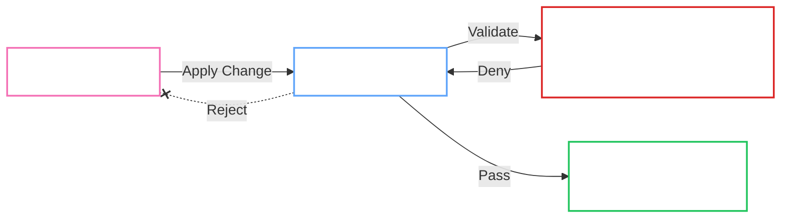

# Admission Policies

!!! abstract "Concept"
    The Operator uses Kubernetes `ValidatingAdmissionPolicy` (CEL) to enforce security invariants at the API level. This provides **Defense-in-Depth** by rejecting invalid or insecure configurations *before* they are persisted to etcd, supplementing the Operator's runtime reconciliation loops.

## Enforcement Flow

The following diagram illustrates how the Operator's policies intercept GitOps syncs:

## Policy Inventory

The Operator ships with a suite of policies to enforce "Least Privilege" and "GitOps Safety":

| Policy Name | Target | Enforcement | Description |
| :--- | :--- | :--- | :--- |
| `lock-managed-resource-mutations` | `StatefulSet`, `Service`, `Secret` | **Block** | Prevents users/GitOps from modifying resources managed by the Operator (labeled `app.kubernetes.io/managed-by=openbao-operator`). |
| `lock-controller-statefulset-mutations` | `StatefulSet` (Controller) | **Block** | Self-protection: prevents the Controller from modifying its own sensitive fields (volumes, args). |
| `validate-openbaocluster` | `OpenBaoCluster` | **Validate** | Enforces spec invariants (e.g., Hardened profile requirements, TLS configs). |
| `restrict-provisioner-delegate` | `Role`, `RoleBinding` | **Restrict** | Limits the Provisioner Delegate to creating only specific, pre-approved RBAC roles. |

## Provisioner Delegate Hardening

The `restrict-provisioner-delegate` policy is a defense-in-depth control that applies to RBAC mutations performed by the impersonated Provisioner Delegate identity.

**Key guarantees:**

- Only specific Role/RoleBinding names are allowed (tenant + secrets allowlist roles).
- RoleBindings are restricted to known ServiceAccount subjects (prevents backdoor bindings).
- Dangerous verbs and wildcards are denied (`impersonate`, `bind`, `escalate`, `*`).
- Secret permissions are only allowed via the dedicated secrets allowlist Roles, and those Roles must be name-scoped (`resourceNames`) and non-enumerating (no `list`/`watch`).

## Configuration Ownership

The Operator ensures that user intent (`spec.configuration`) is respected while enforcing mandatory platform settings.

=== ":material-robot: Operator Owned"

    These stanzas are **Always Overwritten** by the Operator to ensure correctness and security:

    -   `listener "tcp"`: TLS settings are mandatory based on `spec.tls`.
    -   `storage "raft"`: Peer discovery is managed by the Operator.
    -   `seal`: Auto-unseal configuration is derived from `spec.unseal`.
    -   `api_addr`, `cluster_addr`: Networking identity is fixed.

=== ":material-account-cog: User Tunable"

    These areas are safe for user customization via `spec.configuration`:

    -   `telemetry`: Metrics and tracing.
    -   `log_level`: Observability tuning.
    -   `plugin_directory`: Custom plugin paths.
    -   `ui`: Dashboard enablement.

## See Also

- [:material-account-lock: RBAC Architecture](rbac.md)
- [:material-shield-check: Security Profiles](../fundamentals/profiles.md)
