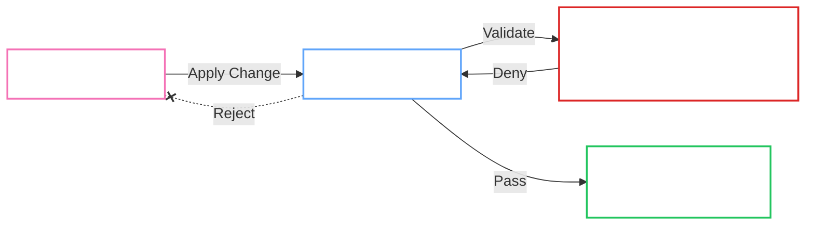

# Admission Policies

!!! abstract "Concept"
    The Operator uses Kubernetes `ValidatingAdmissionPolicy` (CEL) to enforce security invariants at the API level. This provides **Defense-in-Depth** by rejecting invalid or insecure configurations *before* they are persisted to etcd, supplementing the Operator's runtime reconciliation loops.

## Enforcement Flow

The following diagram illustrates how the Operator's policies intercept GitOps syncs:

```mermaid
graph LR
    User["GitOps Pipeline"]
    API["Kubernetes API"]
    VAP["ValidatingAdmissionPolicy<br/>(openbao-lock-managed-resource-mutations)"]
    Res["Managed Resource<br/>(StatefulSet)"]

    User --"Apply Change"--> API
    API --"Validate"--> VAP
    VAP --"Deny"--> API
    API -.-x|"Reject"| User
    
    API --"Pass"--> Res

    %% Style Guide Compliant
    classDef git fill:transparent,stroke:#f472b6,stroke-width:2px,color:#fff;
    classDef read fill:transparent,stroke:#60a5fa,stroke-width:2px,color:#fff;
    classDef security fill:transparent,stroke:#dc2626,stroke-width:2px,color:#fff;
    classDef write fill:transparent,stroke:#22c55e,stroke-width:2px,color:#fff;

    class User git;
    class API read;
    class VAP security;
    class Res write;
```

## Policy Inventory

The Operator ships with a suite of policies to enforce "Least Privilege" and "GitOps Safety":

| Policy Name | Binding Name | Target | Enforcement | Description |
| :--- | :--- | :--- | :--- | :--- |
| `openbao-lock-managed-resource-mutations` | `openbao-lock-managed-resource-mutations-binding` | Operator-managed resources (e.g. `StatefulSet`, `Service`, `Secret`, `Pod`) | **Block** | Prevents users/GitOps from modifying resources managed by the Operator (labeled `app.kubernetes.io/managed-by=openbao-operator`). Allows controlled exceptions for Kubernetes controllers and OpenBao service registration label updates. |
| `openbao-lock-controller-statefulset-mutations` | `openbao-lock-controller-statefulset-mutations-binding` | `StatefulSet` (Controller) | **Block** | Self-protection: prevents the Controller from modifying its own sensitive fields (volumes, args). |
| `openbao-validate-openbaocluster` | `openbao-validate-openbaocluster-binding` | `OpenBaoCluster` | **Validate** | Enforces spec invariants (e.g., Hardened profile requirements, TLS configs). |
| `openbao-validate-openbao-tenant` | `openbao-validate-openbao-tenant-binding` | `OpenBaoTenant` | **Validate** | Enforces tenant spec invariants and multi-tenant guardrails. |
| `openbao-validate-openbaorestore` | `openbao-validate-openbaorestore-binding` | `OpenBaoRestore` | **Validate** | Enforces restore spec invariants and safety checks. |
| `openbao-enforce-managed-image-digests` | `openbao-enforce-managed-image-digests-binding` | Operator-managed `StatefulSet` / `Job` | **Block** | Denies mutable tag-based image refs for workloads marked as requiring digest enforcement (Hardened-managed workloads by default). |
| `openbao-restrict-provisioner-rbac` | `openbao-restrict-provisioner-rbac-binding` | `Role`, `RoleBinding` | **Restrict** | Restricts the Provisioner ServiceAccount to a fixed set of tenant RBAC objects and contents (CREATE/UPDATE/DELETE), and blocks system namespaces. |
| `openbao-restrict-provisioner-namespace-mutations` | `openbao-restrict-provisioner-namespace-mutations-binding` | `Namespace` | **Restrict** | Restricts Provisioner Namespace updates to Pod Security Standards label enforcement only (restricted), and blocks system namespaces. |
| `openbao-restrict-controller-rbac` | `openbao-restrict-controller-rbac-binding` | `Role`, `RoleBinding` | **Restrict** | Restricts Controller RBAC writes to the narrow per-cluster pod discovery/service registration Role/RoleBinding pattern (prevents RBAC self-escalation). |

## Provisioner RBAC Hardening

The `openbao-restrict-provisioner-rbac` policy is a defense-in-depth control that applies to RBAC mutations performed by the Provisioner identity.

**Key guarantees:**

- Only specific Role/RoleBinding names are allowed (tenant + secrets allowlist roles).
- RoleBindings are restricted to known ServiceAccount subjects (prevents backdoor bindings).
- Dangerous verbs and wildcards are denied (`impersonate`, `bind`, `escalate`, `*`).
- Secret permissions are only allowed via the dedicated secrets allowlist Roles, and those Roles must be name-scoped (`resourceNames`) and non-enumerating (no `list`/`watch`).
- Deletion is restricted to the fixed tenant template Role/RoleBinding objects.
- RBAC mutations are blocked in system namespaces (at minimum: the Operator namespace, `kube-*`, and commonly provider-reserved namespaces like `openshift*` and `gke-*`).
- Provider-reserved namespaces are cluster-dependent. The Helm defaults include best-effort prefixes for common managed offerings (`openshift-*`, `gke-*`, `eks-*`, `aws-*`, `aks-*`, `azure-*`); tune these to match your platform add-ons.

!!! note "Helm: provider-reserved namespaces"
    When installing via Helm, you can extend the system namespace deny set with:

    - `admissionPolicies.provisionerRBAC.deniedNamespaces`
    - `admissionPolicies.provisionerRBAC.deniedNamespacePrefixes`

!!! note "Startup enforcement"
    The OpenBao Operator defaults to fail-closed startup (`--admission-enforcement=fail`), refusing to run unless required admission policies are installed and enforced.

    Required startup dependency set (Policy / Binding):

    - `openbao-validate-openbaocluster` / `openbao-validate-openbaocluster-binding`
    - `openbao-validate-openbao-tenant` / `openbao-validate-openbao-tenant-binding`
    - `openbao-validate-openbaorestore` / `openbao-validate-openbaorestore-binding`
    - `openbao-lock-controller-statefulset-mutations` / `openbao-lock-controller-statefulset-mutations-binding`
    - `openbao-restrict-provisioner-rbac` / `openbao-restrict-provisioner-rbac-binding`
    - `openbao-restrict-provisioner-namespace-mutations` / `openbao-restrict-provisioner-namespace-mutations-binding`
    - `openbao-restrict-controller-rbac` / `openbao-restrict-controller-rbac-binding`
    - `openbao-lock-managed-resource-mutations` / `openbao-lock-managed-resource-mutations-binding`
    - `openbao-enforce-managed-image-digests` / `openbao-enforce-managed-image-digests-binding`

!!! warning "Unsafe mode"
    Disabling admission policies is treated as **unsafe mode**. When installing via Helm with `admissionPolicies.enabled=false`, the chart sets `OPENBAO_UNSAFE_ADMISSION_DISABLED=true` so the operator can start without fail-closed admission dependency enforcement. This is intended only for development/break-glass scenarios.

!!! note "Optional runtime canary"
    The Provisioner supports an optional enforcement canary (`--admission-canary`) that performs a dry-run RBAC request which must be denied by the Provisioner RBAC policy. This provides stronger assurance that policy *enforcement* is active (not just policy presence/bindings).

!!! note "What This Does *Not* Do"
    This policy constrains RBAC mutations by the Provisioner. It does not replace Kubernetes RBAC review or cluster-wide policy governance.

## Provisioner Namespace Mutation Hardening

The `openbao-restrict-provisioner-namespace-mutations` policy constrains Namespace updates performed by the Provisioner.

**Key guarantees:**

- The Provisioner may not mutate system namespaces.
- Namespace updates are limited to enforcing the three Pod Security Standards labels:
  - `pod-security.kubernetes.io/enforce=restricted`
  - `pod-security.kubernetes.io/audit=restricted`
  - `pod-security.kubernetes.io/warn=restricted`
- No other changes are allowed (spec/status/annotations/finalizers/ownerReferences must remain unchanged).

## Controller RBAC Hardening

The `openbao-restrict-controller-rbac` policy constrains RBAC mutations performed by the Controller identity.

**Why this exists:**

- Some tenant-scoped operations require per-cluster ServiceAccounts and minimal RBAC (pod discovery and OpenBao service registration label updates).
- Without an admission-level guard, any bug or compromise in the controller process could use RBAC writes to broaden privileges inside tenant namespaces.

**Key guarantees:**

- Roles created/updated by the Controller are restricted to the `pods` resource and must match a narrow allowlist-style pattern.
- RoleBindings created/updated by the Controller must bind a ServiceAccount to its own `*-role` in the same namespace.

## Configuration Ownership

The Operator ensures that user intent (`spec.configuration`) is respected while enforcing mandatory platform settings.

=== ":material-robot: Operator Owned"

    These stanzas are **Always Overwritten** by the Operator to ensure correctness and security:

    -   `listener "tcp"`: TLS settings are mandatory based on `spec.tls`.
    -   `storage "raft"`: Peer discovery is managed by the Operator.
    -   `seal`: Auto-unseal configuration is derived from `spec.unseal`.
    -   `api_addr`, `cluster_addr`: Networking identity is fixed.

=== ":material-account-cog: User Tunable"

    These areas are safe for user customization via `spec.configuration`:

    -   `telemetry`: Metrics and tracing.
    -   `log_level`: Observability tuning.
    -   `plugin_directory`: Custom plugin paths.
    -   `ui`: Dashboard enablement.

## See Also

- [:material-account-lock: RBAC Architecture](rbac.md)
- [:material-shield-check: Security Profiles](../fundamentals/profiles.md)
