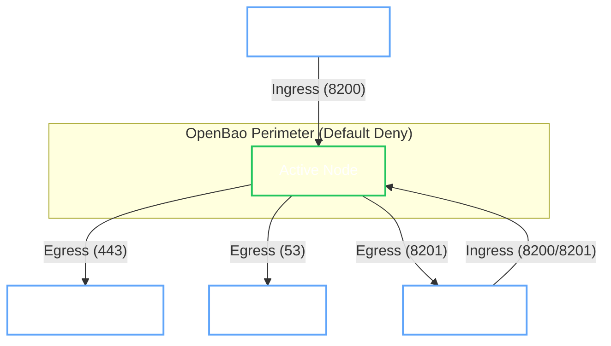

# Network Security

!!! abstract "Core Concept"
    The Operator enforces a **Default Deny** network posture for every OpenBao cluster. This means the OpenBao pods start in total isolation, and the Operator explicitly whitelists only the traffic required for clustering, monitoring, and management.

## Network Perimeter

The following diagram illustrates the trusted communication paths allowed through the NetworkPolicy firewall:

## Traffic Rules

=== ":material-login: Ingress (Incoming)"

    By default, **all** incoming traffic is blocked. The following exceptions are made to allow the cluster to function:

    | Source | Port | Reason |
    | :--- | :--- | :--- |
    | **Operator** | `8200` (HTTP) | Required for liveness probes, initialization checks, and status updates. |
    | **Raft Peers** | `8201` (TCP) | Required for Raft consensus and replication between pods in the StatefulSet. |
    | **Gateway** | `8200` (HTTP) | (Optional) Allowed only if `spec.gateway` is enabled, permitting traffic from the Gateway API namespace. |
    | **Kube System** | Any | Required for some CNI/DNS health checks from the system namespace. |

    !!! warning "Custom Ingress"
        You can allow additional traffic (e.g., from your application namespaces) via `spec.network.ingressRules`. These rules are **additive** and cannot disable the core operator rules.

=== ":material-logout: Egress (Outgoing)"

    Egress is strictly limited to prevent data exfiltration and restrict the blast radius of a compromised path:

    | Destination | Port | Reason |
    | :--- | :--- | :--- |
    | **Kubernetes API** | `443` | Required for **Service Registration** (updating Pod labels) and **Peer Discovery**. |
    | **CoreDNS** | `53` (UDP/TCP) | Required for resolving external services and peer addresses. |
    | **Raft Peers** | `8201` (TCP) | Required for replication traffic. |

    !!! note "Backup Jobs"
        Backup and Restore jobs are **excluded** from this restrictive policy. They run as separate pods that need broad access to reach external object storage (S3, GCS, Azure).

## Controller Network Security

The OpenBao Operator Controller itself runs in a highly restricted network environment to minimize its attack surface.

=== ":material-shield-lock: Ingress"

    **Default Deny:** All incoming traffic to the controller is blocked by default.

    | Source | Port | Reason |
    | :--- | :--- | :--- |
    | **Monitoring** | `8080` / `8443` | Metrics endpoint (Prometheus). |
    | **Kubelet** | `8081` | healthz/readyz probes. |
    | **Webhook**| `9443` | Kubernetes API Server admission (validating/mutating) webhook requests. |

=== ":material-logout: Egress"

    The controller is permitted to initiate connections only to essential services:

    | Destination | Reason |
    | :--- | :--- |
    | **Kubernetes API** | Watching and reconciling resources. |
    | **Webhooks** | Self-calls for admission webhooks (if applicable). |

## See Also

- [:material-network-outline: Network Configuration](../../user-guide/openbaocluster/configuration/network.md)
- [:material-policy: Admission Policies](admission-policies.md)
