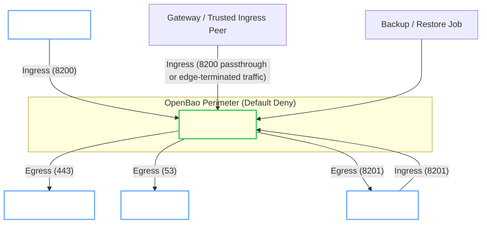

# Network Security

!!! abstract "Core Concept"
    The Operator enforces a **Default Deny** network posture for every OpenBao cluster. OpenBao Pods and day-2 Jobs start from explicit allowlists, and the operator only opens the traffic required for clustering, management, and configured integrations.

## Network Perimeter

The following diagram illustrates the trusted communication paths allowed through the NetworkPolicy firewall:

```mermaid
flowchart TB
    %% External Actors
    Operator["Operator Pod"]
    K8sAPI["Kubernetes API"]
    DNS["CoreDNS"]
    Peer["Raft Peers"]

    %% The OpenBao Cluster
    subgraph Cluster ["OpenBao Perimeter (Default Deny)"]
        Yield["Active Node"]
    end

    %% Ingress Rules
    Operator --"Ingress (8200)"--> Yield
    Peer --"Ingress (8201)"--> Yield
    Ingress["Gateway / Trusted Ingress Peer"] --"Ingress (8200 passthrough or edge-terminated traffic)"--> Yield
    Jobs["Backup / Restore Job"] --> Yield

    %% Egress Rules
    Yield --"Egress (443)"--> K8sAPI
    Yield --"Egress (53)"--> DNS
    Yield --"Egress (8201)"--> Peer

    classDef read fill:transparent,stroke:#60a5fa,stroke-width:2px,color:#fff;
    classDef write fill:transparent,stroke:#22c55e,stroke-width:2px,color:#fff;

    class Operator,K8sAPI,DNS,Peer read;
    class Yield write;
```

## Traffic Rules

=== ":material-login: Ingress (Incoming)"

    By default, **all** incoming traffic is blocked. The following exceptions are made to allow the cluster to function:

    | Source | Port | Reason |
    | :--- | :--- | :--- |
    | **Operator** | `8200` | Required for probes, initialization checks, and status updates. |
    | **Raft Peers** | `8201` (TCP) | Required for Raft consensus and replication between pods in the StatefulSet. |
    | **Gateway / trusted ingress peer** | `8200` | Allowed only if `spec.gateway` is enabled or `spec.network.trustedIngressPeers` is set. Prefer passthrough; edge termination is optional. |
    | **Kube System** | Any | Required for some CNI/DNS health checks from the system namespace. |

    !!! warning "Custom Ingress"
        You can allow additional traffic via:

        - `spec.network.ingressRules` for explicit additive peer rules
        - `spec.network.trustedIngressPeers` for user-managed ingress or passthrough proxies

=== ":material-logout: Egress (Outgoing)"

    Egress is strictly limited to prevent data exfiltration and restrict the blast radius of a compromised path:

    | Destination | Port | Reason |
    | :--- | :--- | :--- |
    | **Kubernetes API** | `443` | Required for **Service Registration** (updating Pod labels) and **Peer Discovery**. |
    | **CoreDNS** | `53` (UDP/TCP) | Required for resolving external services and peer addresses. |
    | **Raft Peers** | `8201` (TCP) | Required for replication traffic. |

    !!! note "Backup and Restore Jobs"
        Backup and restore use a separate Job NetworkPolicy, not the main workload policy. In Hardened clusters, they also require explicit `spec.network.egressRules` to reach object storage or external identity systems.

## Security Checkpoints

Use these conditions when network behavior is not clear from the manifests alone:

- `APIServerNetworkReady` for Kubernetes API reachability assumptions
- `GatewayIntegrationReady` for Gateway listener/controller compatibility
- `BackupConfigurationReady` and `RestoreConfigurationReady` for day-2 Job egress and identity assumptions

## Controller Network Security

The OpenBao Operator Controller itself uses restrictive **ingress** policies when operator network policies are enabled.

=== ":material-shield-lock: Ingress"

    **Default Deny:** All incoming traffic to controller pods is blocked by default, then explicit allow rules are added.

    | Source | Port | Reason |
    | :--- | :--- | :--- |
    | **Monitoring** | `8080` / `8443` | Metrics endpoint (Prometheus). |
    | **Kubelet** | `8081` | healthz/readyz probes. |

=== ":material-logout: Egress"

    No dedicated controller egress-deny policy is currently shipped by default.
    In practice, controller traffic is primarily to essential control-plane services:

    | Destination | Reason |
    | :--- | :--- |
    | **Kubernetes API** | Watching and reconciling resources. |

## See Also

- [:material-network-outline: Network Configuration](../../user-guide/openbaocluster/configuration/network.md)
- [:material-policy: Admission Policies](admission-policies.md)
