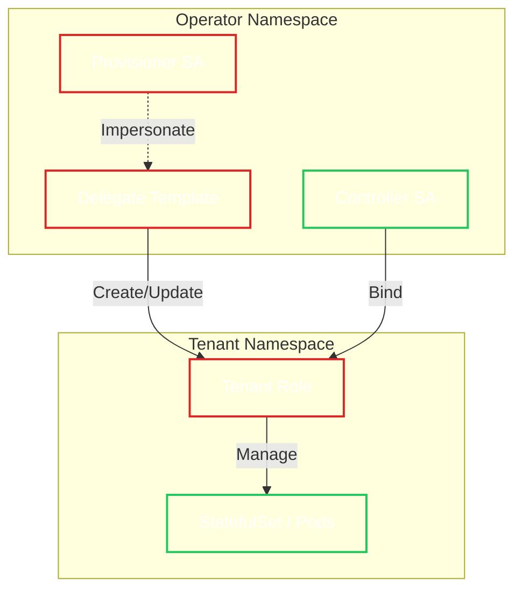

# RBAC Architecture

!!! abstract "Core Concept"
    The Operator implements a **Zero Trust** security model by splitting responsibilities between two distinct ServiceAccounts: a **Provisioner** (cluster-wide permission manager) and a **Controller** (namespace-scoped workload manager). This ensures that a compromise of the workload controller does not grant cluster-wide administrative access.

## Architecture Diagram

The "Split-Controller Model" ensures that broad permissions are never held by the long-running controller process.

## ServiceAccount Permissions

=== ":material-account-cog: Provisioner"

    The **Provisioner** is responsible for "Day 1" setup. It provisions tenant RBAC by impersonating a dedicated **Delegate** ServiceAccount.

    !!! note "Blind Write Pattern"
        The Provisioner creates Roles in tenant namespaces but does not grant *itself* permission to use them. It delegates these permissions to the Controller. This prevents the Provisioner from inspecting tenant data.

    | Resource | Verbs | Rationale |
    | :--- | :--- | :--- |
    | `Namespace` | `get`, `update`, `patch` | Manage namespace labels/annotations. **No `list`** (prevents discovery). |
    | `OpenBaoTenant` | `get`, `list`, `watch` | Watch for new tenant requests. |
    | `Role / RoleBinding` | *(none directly)* | RBAC objects are created/updated/deleted via the **Delegate** ServiceAccount through impersonation. |
    | `ServiceAccount` | `impersonate` | Use the "Delegate" to safely elevate privileges for Role creation. |

=== ":material-account-switch: Delegate (Impersonated)"

    The **Delegate** ServiceAccount is never used directly by a controller. It exists only to provide a tightly scoped identity that the Provisioner can impersonate for RBAC management.

    !!! warning "Defense In Depth"
        The Delegate is additionally constrained by the `restrict-provisioner-delegate` ValidatingAdmissionPolicy, which limits the RBAC objects it can create/update and enforces strict Secret allowlist Roles.

=== ":material-controller: Controller"

    The **Controller** is responsible for "Day 2" operations. It has high privileges within tenant namespaces but **zero** privileges outside them.

    !!! success "Isolation"
        The Controller cannot even *list* namespaces. It is entirely dependent on the Provisioner to "introduce" it to a tenant namespace via a RoleBinding.

    **Cluster Scope:**
    
    | Resource | Verbs | Rationale |
    | :--- | :--- | :--- |
    | `OpenBaoCluster` | `get`, `list`, `watch` | Global watch for CRD events. |
    | `TokenReview` | `create` | Authenticate metrics requests. |
    | `ValidatingAdmissionPolicy` | `get` | Verify security policy existence. |

    **Tenant Scope (via RoleBinding):**

    | Resource | Verbs | Rationale |
    | :--- | :--- | :--- |
    | `StatefulSet` | `*` | Manage OpenBao pods. |
    | `Service`, `Ingress` | `*` | Manage network access. |
    | `Secret` | *(allowlisted)* | Secret access is limited by name (dedicated reader/writer Roles). No `list`/`watch`. |
    | `ConfigMap` | `*` | Manage configuration and TLS metadata. |
    | `Job` | `*` | Run snapshots and upgrades. |
    | `Gateway` ... | `*` | (Optional) Manage Gateway API resources if enabled. |

## Security Guarantees

1. **No Secret Enumeration:** Neither ServiceAccount has `list` permissions on Secrets cluster-wide.
2. **No Topology Discovery:** Neither ServiceAccount has `list` permissions on Namespaces (Provisioner knows only what you tell it via CRs).
3. **Privilege Separation:** The account that *writes* the permissions (Provisioner) cannot *use* them, and the account that *uses* them (Controller) cannot *change* them.
4. **Name-Scoped Secrets:** Tenant Secret access is restricted to explicit Secret name allowlists and enforced by admission policy (no Secrets wildcards or enumeration).

## See Also

- [:material-policy: Admission Policies](admission-policies.md)
- [:material-lan-check: Network Security](network-security.md)
