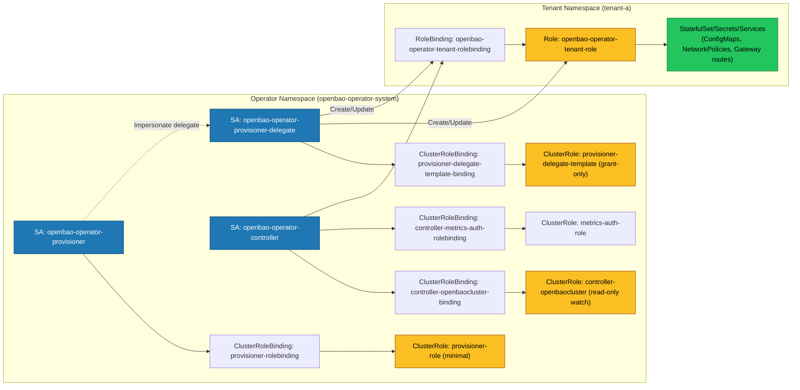

# RBAC Architecture

The Operator implements a **least-privilege RBAC model** using separate ServiceAccounts to minimize the attack surface and enforce strict tenant isolation. This architecture ensures that the operator cannot access resources unrelated to OpenBao in tenant namespaces.

## 1. Separate ServiceAccounts (Least-Privilege Model)

The Operator uses two distinct ServiceAccounts with different privilege levels:

### 1.1 Provisioner ServiceAccount (`openbao-operator-provisioner`)

The Provisioner ServiceAccount has **minimal cluster-wide permissions**:

- **Namespace Access:** Permissions to `get`, `update`, and `patch` namespaces (no `list` or `watch`). The Provisioner only accesses namespaces that are explicitly declared via `OpenBaoTenant` CRDs, eliminating the ability to survey the cluster topology.
- **OpenBaoTenant CRD Management:** Permissions to `get`, `list`, `watch`, `update`, and `patch` `OpenBaoTenant` resources, which explicitly declare target namespaces for provisioning.
- **RBAC Management:** Permissions to create, update, patch, and delete Roles and RoleBindings in tenant namespaces.
- **Impersonation + Grant-Only Template:** The Provisioner impersonates a dedicated delegate ServiceAccount that is bound to a “tenant template” ClusterRole (`openbao-operator-tenant-template`). This template exists to satisfy Kubernetes RBAC escalation checks while generating tenant-scoped Roles; the Provisioner itself is not granted broad workload permissions.

**Security Benefit:** Even if the Provisioner is compromised, it cannot read or modify workload resources in tenant namespaces. It can only create Roles/RoleBindings. Additionally, the Provisioner cannot enumerate namespaces to discover cluster topology, as it only accesses namespaces explicitly declared in `OpenBaoTenant` CRDs.

### 1.2 OpenBaoCluster Controller ServiceAccount (`openbao-operator-controller`)

The OpenBaoCluster Controller ServiceAccount has **very limited cluster-wide permissions**:

- **Cluster-wide watch on `OpenBaoCluster`:** A ClusterRole grants `get;list;watch` on `openbaoclusters` so the controller can establish a shared cache for the primary CRD.
- **Admission Dependency Reads:** A ClusterRole grants `get` on `validatingadmissionpolicies` / `validatingadmissionpolicybindings` so the controller can verify required security dependencies.
- **Metrics Auth (Cluster-wide):** A ClusterRole grants `create` on `tokenreviews` and `subjectaccessreviews` to support the protected metrics endpoint.
- **Tenant-scoped writes and all child resources:** All write operations on `OpenBaoCluster` and all managed child resources (Secrets, StatefulSets, Services, Jobs, etc.) are namespace-scoped via Roles created by the Provisioner in tenant namespaces.
- **Namespace Isolation:** Can only access resources in namespaces where the Provisioner has created a tenant Role and RoleBinding.

**Security Benefit:** The OpenBaoCluster controller cannot access any resources outside of tenant namespaces, and cannot access non-OpenBao resources within tenant namespaces (unless explicitly granted by the tenant Role).

### 1.3 RBAC & Zero-Trust Topology

The following diagram shows how the Provisioner, Controller, and tenant
namespaces interact under the least‑privilege, zero‑trust model:

## 2. RBAC Components

**Provisioner ClusterRole:**

- Namespace access permissions (`get`, `update`, `patch` only - no `list` or `watch`)
- OpenBaoTenant CRD management permissions
- RBAC management permissions (Roles, RoleBindings)
- Delegate template ClusterRole holds the “grant-only” union of tenant permissions (used via impersonation)

**Controller Permissions:**

- Cluster-wide read/watch on `openbaoclusters` (shared cache) and `get` for admission policy dependencies
- Cluster-wide `create` on `tokenreviews`/`subjectaccessreviews` (protected metrics auth)
- Receives all write permissions for cluster child resources via namespace-scoped tenant Roles
- Tenant Roles grant permissions for:
  - OpenBaoCluster management
  - Workload infrastructure (StatefulSets, Services, ConfigMaps, ServiceAccounts)
  - Limited Secret permissions (excludes `list` and `watch` to prevent enumeration)
  - Networking resources (Ingresses, NetworkPolicies, Gateway API resources)
  - Service discovery (Endpoints, EndpointSlices)

**Security Note:** The tenant Role explicitly excludes `list` and `watch` verbs on Secrets to prevent secret enumeration attacks. The operator uses direct `GET` requests for specific secrets it needs to access.
