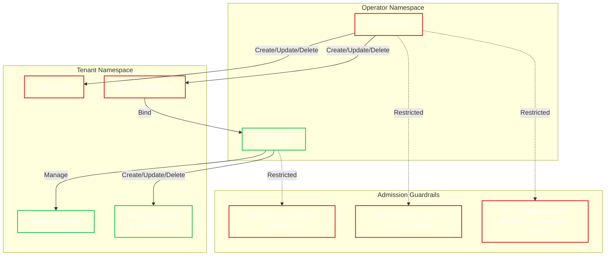

# RBAC Architecture

!!! abstract "Core Concept"
    The Operator implements a **Zero Trust** security model by splitting responsibilities between two distinct ServiceAccounts: a **Provisioner** (cluster-wide permission manager) and a **Controller** (namespace-scoped workload manager). This ensures that a compromise of the workload controller does not grant cluster-wide administrative access.

## Architecture Diagram

The "Split-Controller Model" ensures that broad permissions are never held by the long-running controller process.

```mermaid
flowchart TB
    subgraph OperatorNS ["Operator Namespace"]
        Prov["Provisioner SA"]
        Ctrl["Controller SA"]
    end

    subgraph TenantNS ["Tenant Namespace"]
        TRole["Tenant Role"]
        TRB["Tenant RoleBinding"]
        CRBAC["Per-Cluster RBAC<br/>(pods discovery)"]
        Workload["StatefulSet / Pods"]
    end

    subgraph Policies ["Admission Guardrails"]
        PVAP["VAP: openbao-restrict-provisioner-rbac"]
        NVAP["VAP: openbao-restrict-provisioner-namespace-mutations"]
        CVAP["VAP: openbao-restrict-controller-rbac"]
    end

    %% Provisioner Flow
    Prov --"Create/Update/Delete"--> TRole
    Prov --"Create/Update/Delete"--> TRB
    Prov -. "Restricted" .-> PVAP
    Prov -. "Restricted" .-> NVAP

    %% Controller Flow
    TRB --"Bind"--> Ctrl
    Ctrl --"Manage"--> Workload
    Ctrl --"Create/Update/Delete"--> CRBAC
    Ctrl -. "Restricted" .-> CVAP

    %% Styling
    classDef security fill:transparent,stroke:#dc2626,stroke-width:2px,color:#fff;
    classDef write fill:transparent,stroke:#22c55e,stroke-width:2px,color:#fff;
    classDef read fill:transparent,stroke:#60a5fa,stroke-width:2px,color:#fff;

    class Prov,TRole,TRB,PVAP,NVAP,CVAP security;
    class Ctrl,Workload write;
    class CRBAC write;
```

## ServiceAccount Permissions

!!! note "Projected Kubernetes API token audience"
    The OpenBao Operator disables default token auto-mounting (`automountServiceAccountToken: false`) and mounts an explicit projected ServiceAccount token for Kubernetes API access (TTL: 3600s). By default, the Kubernetes API token does not set an explicit audience (the API server selects the default). If you want to pin the audience, set `serviceAccountToken.kubernetesAudience` (Helm) or patch the `audience` field in `config/manager/controller.yaml` and `config/manager/provisioner.yaml` (Kustomize/YAML installs). An incorrect audience typically results in 401s for in-cluster API calls.

!!! warning "Unsafe mode"
    Installing with admission policies disabled (Helm: `admissionPolicies.enabled=false`) is treated as **unsafe mode**. The chart sets `OPENBAO_UNSAFE_ADMISSION_DISABLED=true` so the operator can run without fail-closed admission dependency enforcement and without reconciliation gating. This materially weakens the operator's defense-in-depth controls.

=== ":material-account-cog: Provisioner"

    The **Provisioner** is responsible for Day 0 tenant onboarding. It provisions tenant-scoped RBAC directly and is constrained by a `ValidatingAdmissionPolicy` that restricts the exact RBAC objects it can create/update/delete.

    !!! note "Blind Write Pattern"
        The Provisioner creates tenant-scoped Roles/RoleBindings but does not grant *itself* permission to use tenant Secrets or workloads. It binds the resulting permissions to the Controller ServiceAccount. This prevents the Provisioner identity from inspecting tenant data.

    | Resource | Verbs | Rationale |
    | :--- | :--- | :--- |
    | `Namespace` | `get`, `update`, `patch` | Enforce Pod Security Standards labels during onboarding. **No `list`** (prevents discovery). Admission policy restricts Namespace updates to the three PSS label keys and blocks system namespaces. |
    | `OpenBaoTenant` | `get`, `list`, `watch` | Watch for new tenant requests. |
    | `ResourceQuota`, `LimitRange` | `create`, `get`, `patch` | Apply the fixed tenant guardrail quota/limits during onboarding (Server-Side Apply). `get`/`patch` are name-scoped to the operator-managed objects. **No `list`** (prevents discovery). |
    | `Role / RoleBinding` | `create`, `get`, `patch`, `delete` | Create and reconcile the tenant template RBAC objects (Server-Side Apply). Delete/patch are name-scoped; CREATE is guarded by admission policy. No `list`/`watch` (prevents discovery). |
    | `Role` | `bind`, `escalate` | Required by Kubernetes RBAC to create RoleBindings to specific, operator-defined Roles without holding tenant permissions directly. Guarded by admission policy. |

=== ":material-controller: Controller"

    The **Controller** is responsible for "Day 1 and 2" operations. It has high privileges within tenant namespaces but **zero** privileges outside them.

    !!! success "Isolation"
        The Controller cannot even *list* namespaces. It is entirely dependent on the Provisioner to "introduce" it to a tenant namespace via a RoleBinding.

    **Cluster Scope:**
    
    | Resource | Verbs | Rationale |
    | :--- | :--- | :--- |
    | `OpenBaoCluster` | `get`, `list`, `watch` | Global watch for CRD events. |
    | `TokenReview` | `create` | Authenticate metrics requests. |
    | `ValidatingAdmissionPolicy` | `get` | Verify security policy existence. |
    | `Gateway`, `GatewayClass` | `get` | Verify the referenced `spec.gateway.gatewayRef` and controller capabilities. Deterministic-name reads only; no `list`/`watch`. |

    **Tenant Scope (via RoleBinding):**

    | Resource | Verbs | Rationale |
    | :--- | :--- | :--- |
    | `StatefulSet` | `*` | Manage OpenBao pods. |
    | `Service`, `Ingress` | `*` | Manage network access. |
    | `Secret` | *(allowlisted)* | Secret access is limited by name (dedicated reader/writer Roles). No `list`/`watch`. |
    | `ConfigMap` | `*` | Manage configuration and TLS metadata. |
    | `Job` | `*` | Run snapshots and upgrades. |
    | `Gateway` ... | `*` | (Optional) Manage Gateway API resources if enabled. |
    | `ServiceAccount` | *(restricted)* | Create the main OpenBao ServiceAccount plus backup, restore, and upgrade executor ServiceAccounts. Admission policy restricts writes to operator-managed ServiceAccount shapes and names. |
    | `Role / RoleBinding` | *(restricted)* | Create minimal per-cluster pod discovery RBAC for OpenBao service accounts. Admission policy restricts RBAC writes to a narrow, allowlisted pattern (prevents RBAC self-escalation). |
    
    The Controller tenant Role does not manage `ResourceQuota` or `LimitRange`. Those namespace guardrails remain provisioner-owned Day 0 resources.

## Security Guarantees

1. **No Secret Enumeration:** Neither ServiceAccount has `list` permissions on Secrets cluster-wide.
2. **No Topology Discovery:** Neither ServiceAccount has `list` permissions on Namespaces (Provisioner knows only what you tell it via CRs).
3. **Privilege Separation:** The account that *writes* the permissions (Provisioner) cannot *use* them, and the account that *uses* them (Controller) cannot *change* them. Admission policies provide defense-in-depth by constraining both RBAC writes and Namespace mutations.
4. **Blind Create, Name-Scoped Mutate:** Tenant Secret writer roles use Kubernetes' blind-create pattern for `create` plus name-scoped `get`/`patch`/`update`/`delete` for fixed Secret names. Admission policy constrains operator-managed Secret writes so this does not expand into arbitrary tenant Secret mutation.

## See Also

- [:material-shield: Admission Policies](admission-policies.md)
- [:material-lan-check: Network Security](network-security.md)
