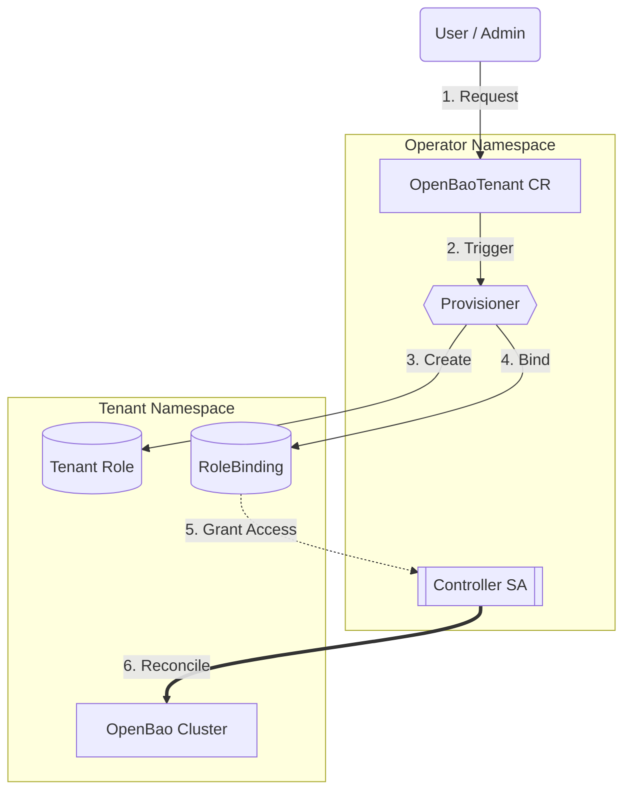

# Tenant Isolation (Namespace Provisioner)

!!! abstract "Governance Engine"
    The **Provisioner** controller is the enforcement engine for multi-tenancy. It watches for `OpenBaoTenant` requests and responsibly "onboards" namespaces by creating strict, limited RBAC bindings for the workload controller.

## Governance Models

The Operator supports two distinct onboarding models depending on your organization's trust level:

=== ":material-account-check: Self-Service (Recommended)"

    Ideal for autonomous platform teams where reliability is the main goal.

    -   **Mechanism:** Namespace admins create an `OpenBaoTenant` CR in their *own* namespace.
    -   **Constraint:** `spec.targetNamespace` **MUST** match `metadata.namespace`.
    -   **Security:** Prevents users from provisioning RBAC in namespaces they do not own.

    ```yaml
    apiVersion: operator.openbao.org/v1alpha1
    kind: OpenBaoTenant
    metadata:
      name: my-tenant
      namespace: team-a # <--- Source
    spec:
      targetNamespace: team-a # <--- MUST Match Source
    ```

=== ":material-security: Centralized Admin"

    Ideal for strict compliance environments where only a central platform team can vend database-as-a-service.

    -   **Mechanism:** Cluster admins create an `OpenBaoTenant` CR in the *Operator's* namespace.
    -   **Capability:** Can target *any* namespace.
    -   **Security:** Rely on Kubernetes RBAC to prevent normal users from creating CRs in the operator namespace.

    ```yaml
    apiVersion: operator.openbao.org/v1alpha1
    kind: OpenBaoTenant
    metadata:
      name: team-a-onboarding
      namespace: openbao-operator-system # <--- Admin Namespace
    spec:
      targetNamespace: team-a # <--- Target Any Namespace
    ```

## Provisioning Flow

This diagram illustrates how the **Provisioner** (Cluster Scope) safely grants permission to the **Controller** (Namespace Scope) without ever possessing those permissions itself.



1. **Request:** User creates `OpenBaoTenant`.
2. **Verify:** Provisioner checks if the request is valid (Self-Service constraint).
3. **Create:** Provisioner creates a `Role` in the target namespace (permissions to manage StatefulSets, Services, etc.).
4. **Bind:** Provisioner creates a `RoleBinding`, connecting the **Controller ServiceAccount** to that **Role**.
    * *Note:* The Provisioner does not grant *itself* access. It performs a **Blind Write**.
5. **Reconcile:** The Controller now has permission to manage resources in that namespace.

## Security Guarantees

The architecture provides the following immutable security properties:

| Property | Description |
| :--- | :--- |
| **No Topology Discovery** | The Controller cannot `list` namespaces. It literally does not know other tenants exist. |
| **No Cross-Talk** | Namespace A's RoleBinding does not grant access to Namespace B. |
| **Privilege Separation** | The component that *grants* access (Provisioner) cannot *use* access. The component that *uses* access (Controller) cannot *grant* access. |
| **Namespace Hardening** | The Provisioner automatically labels tenant namespaces with `pod-security: restricted`, preventing insecure workloads. |

## Threat Mitigation Checklist

| Threat | Mitigation Strategy | Control |
| :--- | :--- | :--- |
| **Tenant A reads Tenant B's Keys** | **RBAC Scoping** | Controller has no cluster-wide Secret access. |
| **Tenant A DoS attack on Node** | **Resource Quotas** | Namespace Quotas + Controller Rate Limiting. |
| **Tenant A attacks Tenant B's Pods** | **Network Isolation** | Default Deny NetworkPolicy. |
| **Tenant A spoofs Admin** | **Role Restrictions** | Self-Service mode enforces `targetNamespace == namespace`. |
