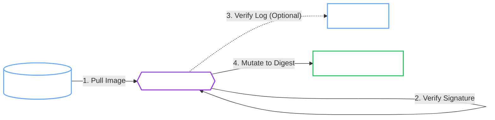

# Supply Chain Security

!!! abstract "Immutable Assurance"
    The Operator implements container image signature verification to protect against compromised registries, man-in-the-middle attacks, and TOCTOU (Time-of-Check to Time-of-Use) vulnerabilities.

## Verification Flow

The Operator intercepts Pod creation requests and verifies the image signature against a trusted public key and (optionally) the Rekor transparency log.



## Configuration

=== ":material-signature-freehand: Image Verification"

    The Operator uses **[Cosign](https://github.com/sigstore/cosign){:target="_blank"}** to verify signatures.

    -   **Public Key:** You provide the public key; the Operator uses it to verify signatures found in the registry.
    -   **Private Registry:** Supports `imagePullSecrets` for authenticated verification.
    -   **Caching:** Results are cached in-memory by digest to prevent performance impact.

    !!! danger "Private Keys"
        The Operator **never** requires your private key. Signing happens in your CI/CD pipeline; the Operator only needs the *public* key for verification.

    ```yaml
    spec:
      imageVerification:
        enabled: true
        publicKey: |
          -----BEGIN PUBLIC KEY-----
          ...
          -----END PUBLIC KEY-----
    ```

=== ":material-pin: Digest Pinning"

    To prevent **TOCTOU** (Time-of-Check to Time-of-Use) attacks, the Operator mutates image tags to immutable digests.

    -   **Attack Vector:** An attacker pushes a malicious image to `1.2.3` *after* the admission controller checks it but *before* the Kubelet pulls it.
    -   **Mitigation:** The Operator resolves `openbao:1.2.3` to `openbao@sha256:abc...` during verification and forces the Pod to use the digest.

    !!! success "Immutability"
        This ensures that the *exact* bits that were verified are the ones that run in your cluster.

## Rekor Transparency Log

By default, the Operator verifies signatures against the [Sigstore Rekor](https://docs.sigstore.dev/rekor/overview/){:target="_blank"} transparency log.

- **Non-Repudiation:** Ensures that the signature was actually created by the signer at a specific time.
- **Auditability:** Publicly meaningful event log of all signing activity.

!!! note "Air-Gapped Environments"
    In disconnected environments where reaching the public Rekor log is impossible, you can disable this check:
    ```yaml
    spec:
      imageVerification:
        ignoreTlog: true
    ```

## Failure Policies

| Policy | Behavior | Use Case |
| :--- | :--- | :--- |
| **Block** (Default) | **Prevents** the Pod from starting. Sets `ConditionDegraded=True`. | Production environments requiring strict security. |
| **Warn** | Logs an error but **allows** the Pod to start using the original tag. | Testing or during initial rollout of signing infrastructure. |

## Verified Workloads

Verification applies to all images managed by the Operator:

| Image | Config Field | Description |
| :--- | :--- | :--- |
| **OpenBao Server** | `spec.imageVerification` | The main OpenBao binary |
| **Init Container** | `spec.operatorImageVerification` | Helper for config rendering |
| **Backup/Restore Jobs** | `spec.operatorImageVerification` | Snapshot executors |
| **Upgrade Jobs** | `spec.operatorImageVerification` | Raft membership jobs |

## Separate Signers for OpenBao and Operator Images

The OpenBao main image (`openbao/openbao`) is signed by the **OpenBao project**, while helper images (init container, backup/restore executors, upgrade jobs) are signed by the **operator project**. Use `operatorImageVerification` to specify different signing credentials:

```yaml
spec:
  # Main OpenBao image (signed by openbao/openbao)
  image: "openbao/openbao:2.4.4"
  imageVerification:
    enabled: true
    issuer: "https://token.actions.githubusercontent.com"
    subject: "https://github.com/openbao/openbao/.github/workflows/release.yml@refs/tags/v2.4.4"
    failurePolicy: Block

  # Operator images (signed by dc-tec/openbao-operator)
  operatorImageVerification:
    enabled: true
    issuer: "https://token.actions.githubusercontent.com"
    subject: "https://github.com/dc-tec/openbao-operator/.github/workflows/release.yml@refs/tags/1.2.4"
    failurePolicy: Block

  initContainer:
    image: "ghcr.io/dc-tec/openbao-init:1.2.4"
  backup:
    image: "ghcr.io/dc-tec/openbao-backup:1.1.0"
```

!!! important "No Fallback Behavior"
    `operatorImageVerification` and `imageVerification` are completely independent configurations.
    If `operatorImageVerification` is not configured, helper images are **not verified** (even if `imageVerification` is set).
    This prevents confusing failures when the main image and helper images have different signers.

## Release Supply Chain

The operator project publishes release artifacts with a "build once, promote by digest" model:

- Images are built and tested under a `build-<sha>` tag.
- Stable/prerelease tags (for example `0.1.0`, `0.2.0-rc.1`) are promoted **by digest** (no rebuild).
- Images and charts are signed keylessly with Sigstore.
- SBOMs are generated and checksummed; the checksums file is signed as a blob.

=== ":material-check-decagram: Verify Operator Images"

    ```sh
    cosign verify \
      --certificate-identity-regexp "https://github.com/dc-tec/openbao-operator/.github/workflows/release.yml" \
      --certificate-oidc-issuer "https://token.actions.githubusercontent.com" \
      ghcr.io/dc-tec/openbao-operator:0.1.0
    ```

=== ":material-chart-bubble: Verify Helm Chart (OCI)"

    ```sh
    crane digest ghcr.io/dc-tec/charts/openbao-operator:0.1.0

    cosign verify \
      --certificate-identity-regexp "https://github.com/dc-tec/openbao-operator/.github/workflows/release.yml" \
      --certificate-oidc-issuer "https://token.actions.githubusercontent.com" \
      ghcr.io/dc-tec/charts/openbao-operator@sha256:...
    ```

=== ":material-file-lock: Verify Release Checksums"

    ```sh
    cosign verify-blob \
      --certificate checksums.txt.crt \
      --signature checksums.txt.sig \
      --certificate-identity-regexp "https://github.com/dc-tec/openbao-operator/.github/workflows/release.yml" \
      --certificate-oidc-issuer "https://token.actions.githubusercontent.com" \
      checksums.txt
    ```
