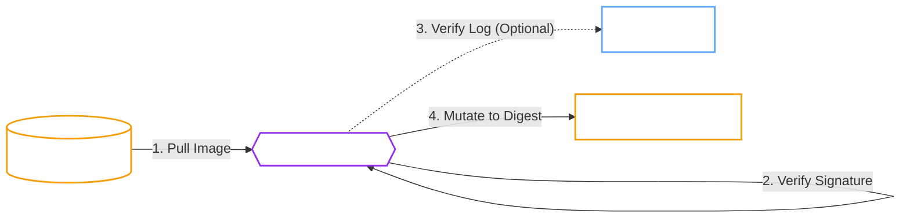

# Supply Chain Security

!!! abstract "Immutable Assurance"
    The Operator implements container image signature verification to protect against compromised registries, man-in-the-middle attacks, and TOCTOU (Time-of-Check to Time-of-Use) vulnerabilities.

## Verification Flow

The Operator intercepts Pod creation requests and verifies the image signature against a trusted public key and (optionally) the Rekor transparency log.



## Configuration

=== ":material-signature-freehand: Image Verification"

    The Operator uses **[Cosign](https://github.com/sigstore/cosign){:target="_blank"}** to verify signatures.

    -   **Public Key:** You provide the public key; the Operator uses it to verify signatures found in the registry.
    -   **Private Registry:** Supports `imagePullSecrets` for authenticated verification.
    -   **Caching:** Results are cached in-memory by digest to prevent performance impact.

    !!! danger "Private Keys"
        The Operator **never** requires your private key. Signing happens in your CI/CD pipeline; the Operator only needs the *public* key for verification.

    ```yaml
    spec:
      imageVerification:
        enabled: true
        publicKey: |
          -----BEGIN PUBLIC KEY-----
          ...
          -----END PUBLIC KEY-----
    ```

=== ":material-pin: Digest Pinning"

    To prevent **TOCTOU** (Time-of-Check to Time-of-Use) attacks, the Operator mutates image tags to immutable digests.

    -   **Attack Vector:** An attacker pushes a malicious image to `v1.2.3` *after* the admission controller checks it but *before* the Kubelet pulls it.
    -   **Mitigation:** The Operator resolves `openbao:v1.2.3` to `openbao@sha256:abc...` during verification and forces the Pod to use the digest.

    !!! success "Immutability"
        This ensures that the *exact* bits that were verified are the ones that run in your cluster.

## Rekor Transparency Log

By default, the Operator verifies signatures against the [Sigstore Rekor](https://docs.sigstore.dev/rekor/overview/){:target="_blank"} transparency log.

- **Non-Repudiation:** Ensures that the signature was actually created by the signer at a specific time.
- **Auditability:** Publicly meaningful event log of all signing activity.

!!! info "Air-Gapped Environments"
    In disconnected environments where reaching the public Rekor log is impossible, you can disable this check:
    ```yaml
    spec:
      imageVerification:
        ignoreTlog: true
    ```

## Failure Policies

| Policy | Behavior | Use Case |
| :--- | :--- | :--- |
| **Block** (Default) | **Prevents** the Pod from starting. Sets `ConditionDegraded=True`. | Production environments requiring strict security. |
| **Warn** | Logs an error but **allows** the Pod to start using the original tag. | Testing or during initial rollout of signing infrastructure. |

## Verified Workloads

Verification applies to all images managed by the Operator:

- [x] **OpenBao Server** (`spec.image`)
- [x] **Init Container** (`spec.initContainer.image`)
- [x] **Sentinel Sidecar** (`spec.sentinel.image`)
- [x] **Backup Jobs** (`spec.backup.executorImage`)
- [x] **Upgrade/Restore Jobs**
