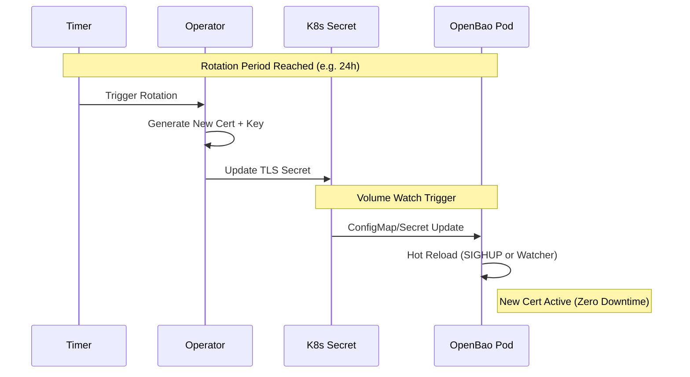

# TLS & Identity

!!! abstract "Encryption in Transit"
    The Operator ensures that all internal and external communication is encrypted via TLS. It supports three distinct modes of operation to fit different security architectures: **Operator Managed**, **External**, and **ACME**.

## Certificate Rotation Flow

In the default **Operator Managed** mode, the operator handles the full lifecycle of the certificates, including rotation and hot-reloading.



## TLS Modes

=== ":material-cog-refresh: Operator Managed (Default)"

    This is the "batteries included" mode. The Operator acts as an internal Certificate Authority (CA).

    -   **Automated PKI:** Generates a self-signed Root CA and ephemeral leaf certificates.
    -   **Strict Identity:** Certificates use strict **SANs** (Subject Alternative Names) matching the Service and Pod DNS.
    -   **Rotation:** Automatically rotates certificates before expiry (configurable via `spec.tls.rotationPeriod`).
    -   **Gateway Support:** Automatically manages a CA ConfigMap for ingress controllers.

    ```yaml
    spec:
      tls:
        mode: OperatorManaged
        rotationPeriod: 24h
    ```

=== ":material-cloud-key: External Provider"

    In this mode, the Operator delegates certificate management to an external system, such as **[cert-manager](https://cert-manager.io/){:target="_blank"}** or a corporate PKI.

    -   **BYO-PKI:** Integrates with existing infrastructure.
    -   **Expectation:** The Operator expects Secrets named `<cluster>-tls-ca` and `<cluster>-tls-server` to exist in the namespace.
    -   **Hot Reload:** The Operator monitors these Secrets and triggers hot-reloads when the external provider updates them.

    !!! tip "Cert-Manager Integration"
        You can use `cert-manager` to issue certificates signed by Let's Encrypt or Vault, and the Operator will consume them seamlessly.

    ```yaml
    spec:
      tls:
        mode: External
    ```

=== ":material-lock-check: ACME (Native)"

    OpenBao uses its built-in ACME client to fetch certificates directly from a provider like Let's Encrypt.

    -   **Zero Trust:** The Operator **never** sees the private key. It is generated in-memory by the OpenBao process.
    -   **No Secrets:** No Kubernetes Secrets are created for the server certificate.
    -   **Automatic Rotation:** OpenBao handles its own rotation via the ACME protocol.

    ```yaml
    spec:
      tls:
        mode: ACME
        acme:
          email: "admin@example.com"
          domain: "bao.example.com"
          directoryURL: "https://acme-v02.api.letsencrypt.org/directory"
    ```

## Comparison Matrix

| Feature | Operator Managed | External Provider | ACME (Native) |
| :--- | :--- | :--- | :--- |
| **Generator** | Operator (Internal CA) | External (e.g., cert-manager) | OpenBao (Built-in) |
| **Rotation** | Automatic | External responsibility | Automatic |
| **Private Key** | Kubernetes Secret | Kubernetes Secret | **In-Memory** (Secure) |
| **Best For** | Development, Simple Prod | Enterprise PKI Integration | Zero Trust, Public Facing |

## See Also

- [:material-docker: Pod Security](workload-security.md)
- [:material-signature: Supply Chain](supply-chain.md)
